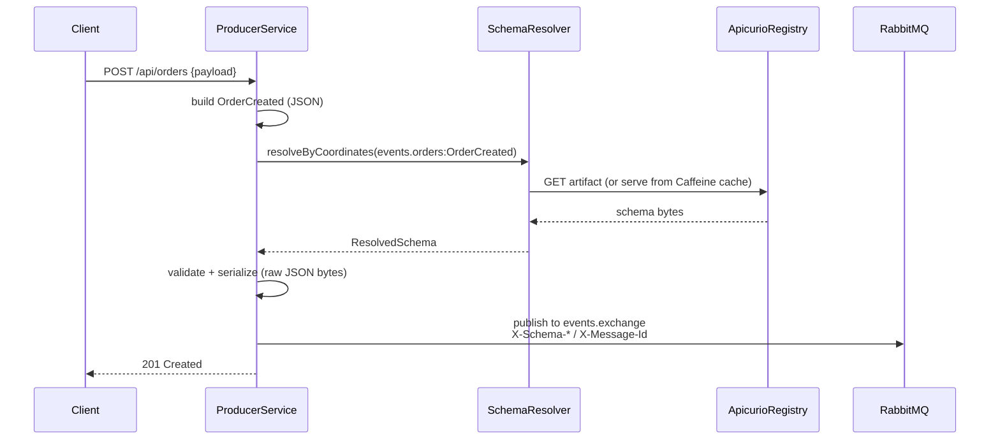
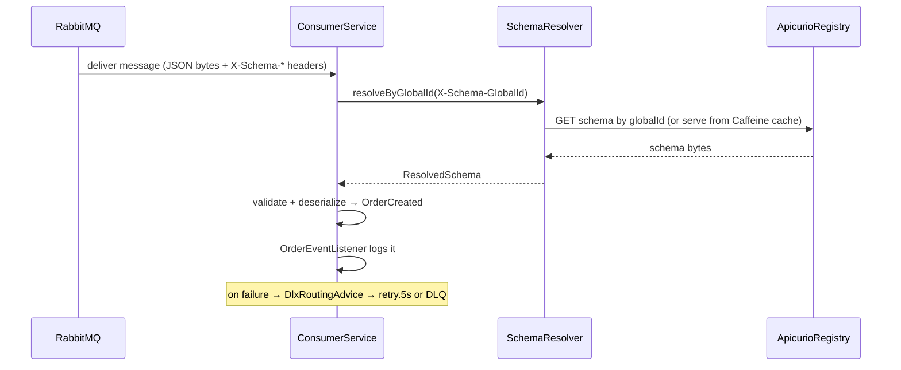
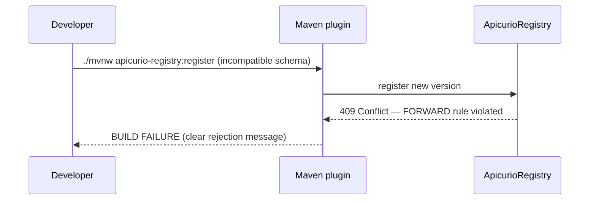

# Schema Registry POC (minimal) — Apicurio + RabbitMQ + Spring Boot 4.0

End-to-end schema-governed messaging, stripped to the thinnest version that still demonstrates
all three core ideas: **Apicurio Registry 3.2.0** as the schema source of truth, **RabbitMQ** as
transport, two **Spring Boot 4.0** services on **Java 25**.

This is the **minimal-poc** cut: one message type (`OrderCreated`), one 5s retry tier, real
infrastructure. For the full step-by-step walkthrough with seed data, see
**[`minimal-poc-guide.md`](minimal-poc-guide.md)**.

## The three concepts

1. **Schema-governed flow** — the producer validates a payload against the registry schema,
   serializes it, and publishes with `X-Schema-*` headers; the consumer resolves the same
   schema, validates, and deserializes into a typed `OrderCreated`.
2. **Schema governance** — compatibility is enforced at **real registration time** by the
   Apicurio Maven plugin: with a FORWARD rule attached, the registry rejects an incompatible
   schema and the `register` goal fails. (`incompatible-demo` reproduces the rejection on demand.)
3. **Failure model** — permanent failures (validation, deserialization, type mismatch) go
   straight to the DLQ; transient failures (registry unavailable, schema-not-found, downstream
   error) are retried via a single 5s tier up to 3 attempts before the DLQ.

## Modules (4)

| Module | Role |
|---|---|
| `schema-messaging-core` | Domain-agnostic plumbing: `SchemaAwareMessageConverter`, `ApicurioClient`, `SchemaResolver` (Caffeine cache: TTL'd coordinates + immutable globalId cache + serve-stale-on-outage), `JsonSchemaStrategy`, `EventPublisher`, and the DLX/retry routing (`DlxMessageRecoverer` + `DlxRoutingAdvice`). |
| `order-contracts` | `OrderCreated` JSON Schema + generated POJO, AMQP topology (single retry tier), and the apicurio `register` / `compat-check` / `incompatible-demo` plugin config. |
| `producer-service` | REST `:8081` — `POST /api/orders` publishes; `POST /api/orders/poison` drives the DLQ demo. |
| `consumer-service` | `:8082` — `@RabbitListener` on `orders.created.queue`; declares the events/DLX/retry topology. |

## Quick start

```bash
./mvnw clean install -DskipTests       # build the 4 modules
docker compose up                      # Postgres + Apicurio (+UI) + RabbitMQ, wait for healthy
# register the schema + attach the FORWARD rule, run the services, then exercise the flow:
```

Follow **[`minimal-poc-guide.md`](minimal-poc-guide.md)** from step 4 — it has the exact
register command, the rule-attach curl, the run commands, and copy-paste seed payloads for the
happy path, the schema-violation 400, the poison→DLQ demo, the transient→retry demo, and both
governance cases.

## Inspecting the system

| UI / endpoint | URL | Credentials |
|---|---|---|
| Apicurio Registry UI | http://localhost:8888 | none |
| RabbitMQ management | http://localhost:15672 | guest / guest |
| Producer health | http://localhost:8081/actuator/health | none |
| Consumer health | http://localhost:8082/actuator/health | none |

## Wire format

The message body is the **raw serialized JSON document only** — no envelope. Schema identity
travels entirely in headers: `X-Schema-GlobalId` / `X-Schema-GroupId` / `X-Schema-ArtifactId` /
`X-Schema-Version` / `X-Schema-Type`, plus `X-Message-Id` / `X-Correlation-Id`. Content-type is
`application/json`.

## Sequence diagrams

### Produce



### Consume



### Governance — incompatible change rejected



## Running the tests

```bash
./mvnw test                              # unit tests only (Surefire, *Test.java — fast, no Docker)
./mvnw verify                            # unit + Testcontainers ITs (Failsafe, *IT.java)
./mvnw -pl schema-messaging-core test    # single module
```

The split is load-bearing: `*Test.java` is fast and mock-based; `*IT.java` spins up real
RabbitMQ via Testcontainers. Keep new tests on the correct side.

## Maven command reference

```bash
# Build
./mvnw clean install                               # full build + local install
./mvnw clean install -DskipTests                   # skip tests

# Schema governance (requires docker compose up)
./mvnw -pl order-contracts apicurio-registry:register \
       -Dapicurio.registry.url=http://localhost:8080      # real registration = the gate
./mvnw -pl order-contracts verify -Pincompatible-demo \
       -Dapicurio.registry.url=http://localhost:8080      # demonstrate rejection (must fail)
./mvnw -pl order-contracts verify -Pcompat-check \
       -Dapicurio.registry.url=http://localhost:8080      # optional dry-run pre-flight

# Run services
./mvnw -pl producer-service spring-boot:run        # :8081
./mvnw -pl consumer-service spring-boot:run        # :8082
```

## What was cut from the full POC

This branch is a teaching cut. Relative to the full POC it drops: the second message type
(customers), cache pre-warming, the registry health indicator, the `auto-register=OFF`
fail-fast startup validator and schema-version pinning, OIDC, the `SerializationStrategy` SPI
(folded into `JsonSchemaStrategy`), the in-memory idempotency/dedupe filter, the queue-depth
health indicator, and the 3-tier (5s/30s/5m) retry ladder (now a single 5s tier). The original
plan documents live in `docs/` as historical record.

> Note: the `SchemaResolver` Caffeine cache (TTL'd coordinate cache + immutable globalId cache +
> serve-stale-on-outage, tunable via `apicurio.cache.*`) was reinstated on top of the minimal
> cut — see the `schema-messaging-core` row above.
