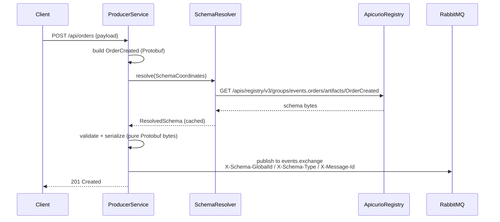
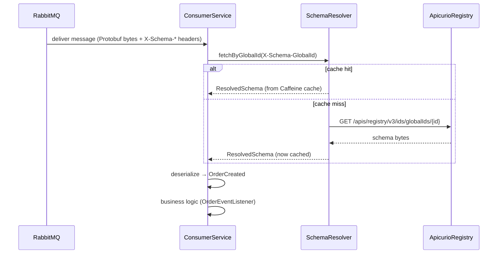
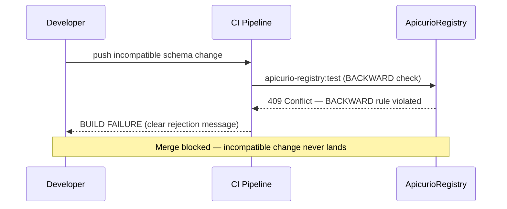
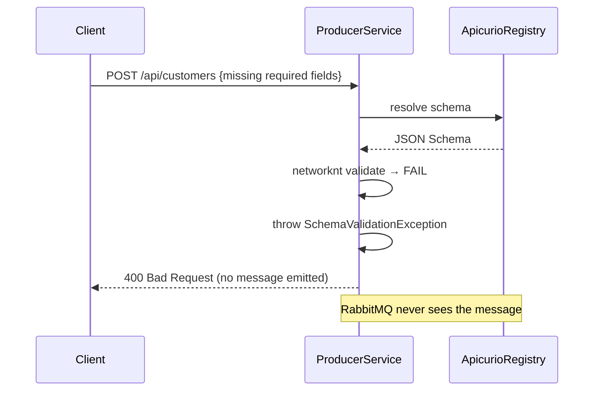

# Schema Registry POC — Apicurio + RabbitMQ + Spring Boot 4.0

End-to-end schema-governed messaging: **Apicurio Registry 3.2.0** as schema source of truth,
**RabbitMQ** as transport, two **Spring Boot 4.0** services on **Java 25**. Demonstrates Protobuf
and JSON Schema message flows, BACKWARD-compatibility governance as a CI merge gate, and a full
DLX/DLQ/retry failure topology.

---

## What this POC proves

| Spec §18 criterion | Demonstrated by |
|---|---|
| Cold `compose up` → all services healthy | `docker compose up`, healthchecks |
| Orders (Protobuf) + customers (JSON Schema) received & deserialized | Demo curls → consumer logs |
| Two artifacts with ≥2 versions, BACKWARD rule | `apicurio-registry:register` (v1 + v2) |
| Incompatible v3 rejected with clear error | `verify -Pincompatible-demo` |
| Malformed payload → correct DLQ, all `X-Failure-*` headers | `POST /api/orders/poison` |
| Registry down → cached processing, new messages fail gracefully | `SchemaResolver` last-known-good |
| `auto-register=OFF` + unregistered schema → fail to start | `StartupSchemaValidator` |
| `/actuator/prometheus` exposes all §15 metrics | Both service endpoints |
| README walkthrough on fresh clone in under 15 min | This file |

---

## Prerequisites

| Tool | Version |
|---|---|
| JDK | 25 (entry in `~/.m2/toolchains.xml`, vendor `oracle`, `id` `25-oracle`) |
| Docker + Docker Compose | Compose v2 (`docker compose`) |
| Maven | Provided via `./mvnw` (Maven Wrapper — **always use `./mvnw` not `mvn`**) |

No system Maven installation needed. The wrapper downloads Maven 3.9.11 automatically.

---

## Quick start (≤ 15 min)

### 1. Build all modules

```bash
./mvnw clean install -DskipTests
```

Compiles all five modules, runs code generation (Protobuf + jsonschema2pojo), and installs
JARs into the local Maven repository. Skip tests for speed; run them later with `./mvnw verify`.

### 2. Start infrastructure

```bash
docker compose up
```

Starts (in dependency order, all with health checks):

| Service | Port(s) | Notes |
|---|---|---|
| `postgres` | 5432 | Apicurio SQL storage |
| `apicurio` | 8080 | Registry API |
| `apicurio-ui` | 8888 | Registry UI |
| `rabbitmq` | 5672 / 15672 | AMQP + management UI |
| `jaeger` | 4317/4318/16686 | OTLP receiver + tracing UI |
| `prometheus` | 9090 | Scrapes `/actuator/prometheus` from both services |
| `schema-registrar` | — | One-shot: registers both schemas then exits |

`schema-registrar` is the **prod-faithful registration path** (T-7.2): it runs
`apicurio-registry:register` against the live registry and exits with code 0 on success.
Wait until it exits before starting the services:

```bash
docker compose logs -f schema-registrar   # watch until "BUILD SUCCESS"
```

**Dev alternative** (skip the Docker registrar, register directly from host):

```bash
./mvnw -pl order-contracts,customer-contracts apicurio-registry:register \
       -Dapicurio.registry.url=http://localhost:8080
```

### 3. Start the services

Two separate terminals:

```bash
# Terminal 1 — producer (port 8081)
./mvnw -pl producer-service spring-boot:run

# Terminal 2 — consumer (port 8082)
./mvnw -pl consumer-service spring-boot:run
```

### 4. Demo: publish messages

```bash
# Publish an order event (Protobuf → events.orders)
curl -s -X POST http://localhost:8081/api/orders \
  -H "Content-Type: application/json" \
  -d '{"customerId":"cust-1","productId":"prod-42","quantity":2,"totalAmount":99.99,"currency":"USD"}'

# Publish a customer event (JSON Schema → events.customers)
curl -s -X POST http://localhost:8081/api/customers \
  -H "Content-Type: application/json" \
  -d '{"email":"alice@example.com","firstName":"Alice","lastName":"Smith","phoneNumber":"+15551234567"}'
```

Consumer logs confirm receipt and full deserialization. Check `X-Schema-*` headers in RabbitMQ
management UI → queues → `orders.created.queue` or `customers.registered.queue`.

### 5. Demo: schema validation failure (producer-side)

Publisher validates before sending. Missing required field returns `400`; no message is emitted.

```bash
# Missing required firstName / lastName → 400 Bad Request, nothing published
curl -s -X POST http://localhost:8081/api/customers \
  -H "Content-Type: application/json" \
  -d '{"email":"bad@example.com"}'
```

### 6. Demo: malformed payload → DLQ

```bash
# Publishes garbage Protobuf bytes with valid X-Schema-* headers
curl -s -X POST http://localhost:8081/api/orders/poison
```

Consumer fails deserialization → `DeserializationException` → **no retry** → `orders.created.dlq`.
In RabbitMQ management UI (http://localhost:15672, guest/guest) browse `orders.created.dlq` to
inspect all `X-Failure-*` headers (reason, message, stack trace truncated to 4 KB, original
routing key, failed-at, retry-count).

### 7. Demo: schema evolution — accept and reject

**Accepted (BACKWARD-compatible):** add an optional field (`promo_code` / `promoCode` already in v2).

```bash
# Register v2 (optional promo_code already present in order-created.proto)
./mvnw -pl order-contracts apicurio-registry:register \
       -Dapicurio.registry.url=http://localhost:8080

# ≥2 versions visible in Apicurio UI → events.orders / OrderCreated
```

**Rejected (incompatible):** field-number reuse / type change triggers a BACKWARD violation.

```bash
# Dry-run incompatible schema — BUILD FAILURE with Apicurio rejection message
./mvnw -pl order-contracts verify -Pincompatible-demo \
       -Dapicurio.registry.url=http://localhost:8080
```

Same CI gate for customers:

```bash
./mvnw -pl customer-contracts verify -Pincompatible-demo \
       -Dapicurio.registry.url=http://localhost:8080
```

---

## Inspecting the system

| UI / endpoint | URL | Credentials |
|---|---|---|
| Apicurio Registry UI | http://localhost:8888 | none |
| RabbitMQ management | http://localhost:15672 | guest / guest |
| Jaeger tracing | http://localhost:16686 | none |
| Prometheus | http://localhost:9090 | none |
| Producer metrics | http://localhost:8081/actuator/prometheus | none |
| Consumer metrics | http://localhost:8082/actuator/prometheus | none |
| Producer health | http://localhost:8081/actuator/health | none |
| Consumer health | http://localhost:8082/actuator/health | none |

---

## Sequence diagrams

### Produce



### Consume



### Evolution rejected



### Validation failed



---

## Running the test suite

```bash
./mvnw test           # unit tests only (fast, no Docker)
./mvnw verify         # unit + Testcontainers integration tests
./mvnw -pl schema-messaging-core test   # single-module
./mvnw -pl schema-messaging-core test -Dtest=SchemaResolverTest#cacheHit   # single test
```

Tests are split by convention: `*Test.java` → Surefire (unit, mock-based);
`*IT.java` → Failsafe (Testcontainers, real RabbitMQ + Apicurio). Keep new tests on the
correct side — the split is load-bearing.

---

## POC-only shortcuts

The following design decisions are intentional simplifications for a proof-of-concept.
They are not appropriate for production use as-is.

| Shortcut | POC rationale | Production path |
|---|---|---|
| In-memory idempotency (`IdempotencyFilter`, Caffeine ~10 K entries, TTL 1 h) | Avoids distributed state | Redis / database deduplication store keyed on `X-Message-Id` |
| Single-instance Apicurio Registry (no HA) | Simplifies compose topology | Multi-node Apicurio behind a load balancer, connection pooling |
| Cache TTL vs evolution latency | 300 s `refresh-after-write` means producers see new schemas within 5 min | Tune or use event-driven cache invalidation (registry webhooks) |
| OIDC disabled by default | No Keycloak setup needed for the demo | Enable via `RegistryClientOptions.oauth2(...)` in `SchemaMessagingAutoConfiguration` — see Javadoc for Keycloak token-url pattern |
| `schema-registrar` Docker service mounts `~/.m2` from the host | Avoids cold Maven download in the container | CI: run `apicurio-registry:register` as a dedicated Maven step with a populated cache layer |
| `apicurio.auto-register=ON` (default) | Services start without pre-registered schemas | Set `OFF` in production; `StartupSchemaValidator` then fails fast if a pinned schema is missing |

---

## Maven command reference

```bash
# Build
./mvnw clean install                               # full build + local install
./mvnw clean install -DskipTests                   # skip all tests
./mvnw -pl schema-messaging-core compile           # compile one module

# Test
./mvnw test                                        # unit tests (Surefire, *Test.java)
./mvnw verify                                      # unit + IT (Failsafe, *IT.java)
./mvnw -pl consumer-service verify                 # IT for one module

# Schema governance (requires docker compose up)
./mvnw -pl order-contracts,customer-contracts apicurio-registry:register \
       -Dapicurio.registry.url=http://localhost:8080

./mvnw -pl order-contracts,customer-contracts verify -Pcompat-check \
       -Dapicurio.registry.url=http://localhost:8080

# Incompatible change dry-run (CI gate demo)
./mvnw -pl order-contracts verify -Pincompatible-demo \
       -Dapicurio.registry.url=http://localhost:8080
./mvnw -pl customer-contracts verify -Pincompatible-demo \
       -Dapicurio.registry.url=http://localhost:8080

# Run services
./mvnw -pl producer-service spring-boot:run        # port 8081
./mvnw -pl consumer-service spring-boot:run        # port 8082

# Run with prod profile (structured JSON logging)
./mvnw -pl producer-service spring-boot:run -Dspring-boot.run.profiles=prod

# Version pinning demo (resolves exact schema version at startup)
SCHEMA_ORDERS_PINNED_VERSION=1 ./mvnw -pl producer-service spring-boot:run
```

---

## Gradle migration (deferred)

The POC uses Maven by design: `apicurio-registry-maven-plugin` provides first-class
`register` and `test` goals with no trusted Gradle equivalent. Migrating the build to Gradle
is explicitly out of scope for this POC and tracked as a future epic (spec §0.4).
