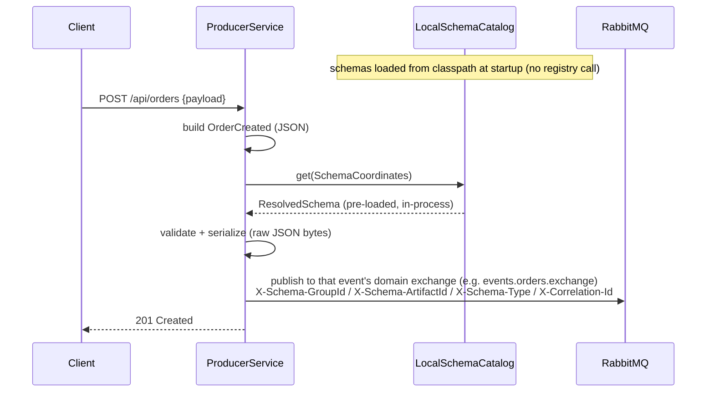
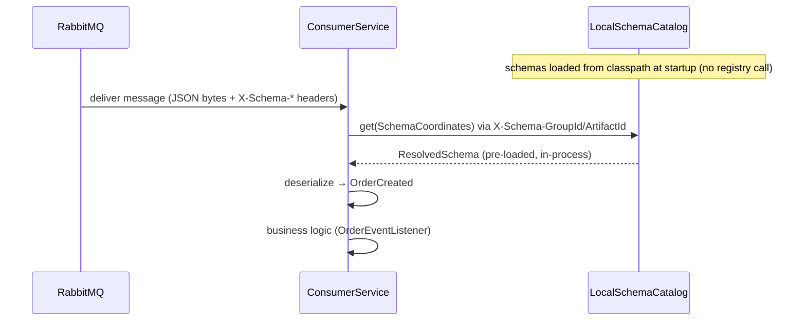
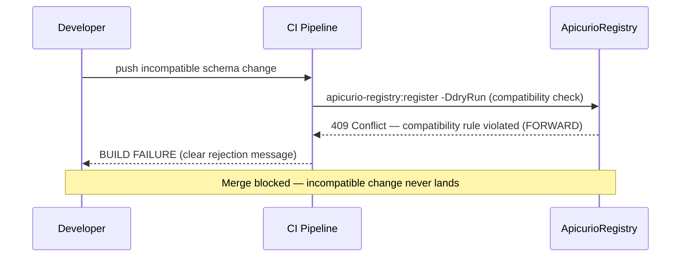
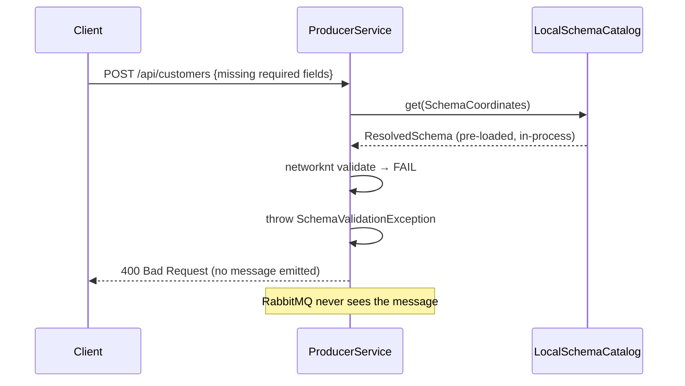

# Schema Registry POC — Apicurio + RabbitMQ + Spring Boot 4.1

End-to-end schema-governed messaging: **Apicurio Registry 3.2.0** as schema source of truth,
**RabbitMQ** as transport, two **Spring Boot 4.1** services on **Java 25**. Demonstrates JSON
Schema message flows (four order events + three customer events), schema-compatibility governance
as a CI merge gate (FORWARD — see §2 for why JSON Schema artifacts use FORWARD), and a full
DLX/DLQ/retry failure topology.

---

## What this POC proves

| Spec §18 criterion | Demonstrated by |
|---|---|
| Cold `compose up` → all services healthy | `docker compose up --build`, healthchecks |
| Orders + customers (both JSON Schema) received & deserialized | Demo curls → consumer logs (all seven events) |
| Seven artifacts with FORWARD compat rules | `apicurio-registry:register` + bootstrap workflow |
| Incompatible v3 rejected with clear error | `verify -Pincompatible-demo` |
| Malformed payload → correct DLQ, all `X-Failure-*` headers | `POST /api/orders/poison` |
| Missing/malformed local schema → service fails to start | `LocalSchemaCatalog` eager load (classpath validation) |
| Producer/consumer runtime has zero dependency on Apicurio | `docker compose up rabbitmq producer-service consumer-service` (no Apicurio/Postgres) still processes messages |
| README walkthrough on fresh clone in under 15 min | This file |

---

## Prerequisites

| Tool | Version |
|---|---|
| JDK | 25 (entry in `~/.m2/toolchains.xml`, vendor `oracle`, `id` `25-oracle`) |
| Docker + Docker Compose | Compose v2 (`docker compose`) |
| Maven | Provided via `./mvnw` (Maven Wrapper — **always use `./mvnw` not `mvn`**) |

No system Maven installation needed. The wrapper downloads Maven 3.9.11 automatically.

---

## Quick start (≤ 15 min)

### 1. Build all modules

```bash
./mvnw clean install -DskipTests
```

Compiles all seven modules, generates JSON Schemas from the code-first records via
`schema-gen-tools`, and installs JARs into the local Maven repository. Skip tests for speed;
run them later with `./mvnw verify`.

### 2. Start infrastructure and services

```bash
docker compose up --build
```

Starts (in dependency order, all with health checks) — the `--build` flag builds the
`producer-service`/`consumer-service` images from the jars produced in step 1, so run step 1
again after any code change before re-running this:

| Service | Port(s) | Notes |
|---|---|---|
| `postgres` | 5432 | Apicurio SQL storage |
| `apicurio` | 8080 | Registry API |
| `apicurio-ui` | 8888 | Registry UI |
| `rabbitmq` | 5672 / 15672 | AMQP + management UI |
| `producer-service` | 8081 | REST endpoints for all seven events |
| `consumer-service` | 8082 | `@BitsEventHandler` listeners + `/actuator/health` |

Schema registration is **not** a compose service — it's a host-Maven step. The contracts modules
already carry the `apicurio-registry-maven-plugin`, so once Apicurio is healthy you register both
schemas and attach their compatibility rules directly from the host.

Both artifacts are JSON Schema and use the **FORWARD** compatibility level — in Apicurio's
JSON Schema checker, adding a property (even an optional/permissive one) is classified as
`OBJECT_TYPE_PROPERTY_SCHEMAS_NARROWED` and is rejected under BACKWARD; it is only valid
under FORWARD.

```bash
# 1. Register all seven schemas (four orders + three customers — generated from code-first records)
./mvnw -pl order-contracts,customer-contracts apicurio-registry:register \
       -Dapicurio.registry.url=http://localhost:8080

# 2. Attach FORWARD compatibility rules (register does not do this)
#    Easiest: run the Schema Governance Bootstrap workflow, or POST each artifact:
for pair in \
  events.orders/OrderCreated \
  events.orders/OrderShipped \
  events.orders/OrderCancelled \
  events.orders/OrderFulfilled \
  events.customers/CustomerRegistered \
  events.customers/CustomerAddressAdded \
  events.customers/CustomerTierChanged; do
  group="${pair%/*}" artifact="${pair#*/}"
  curl -s -o /dev/null -X POST \
    "http://localhost:8080/apis/registry/v3/groups/${group}/artifacts/${artifact}/rules" \
    -H 'Content-Type: application/json' \
    -d '{"ruleType":"COMPATIBILITY","config":"FORWARD"}'
done
```

Step 2 can also be run via the **Schema Governance Bootstrap** GitHub workflow
(`.github/workflows/schema-governance-bootstrap.yml`).

### 3. Start the services

Already running as of step 2 (`producer-service`/`consumer-service` containers). For a faster
local dev loop — code change → restart without rebuilding an image — run either service directly
instead, in its own terminal (stop the equivalent compose container first to free the port):

```bash
# Terminal 1 — producer (port 8081)
./mvnw -pl producer-service spring-boot:run

# Terminal 2 — consumer (port 8082)
./mvnw -pl consumer-service spring-boot:run
```

### 4. Demo: publish messages

All seven events have REST endpoints on the producer (:8081). Each maps a request DTO to the
code-first record and publishes via `EventPublisher.publish(event)` — exchange and routing key
come from the event's `TypeMapping`; `SchemaAwareMessageConverter` validates before send.

```bash
# --- Orders (events.orders) ---
curl -s -X POST http://localhost:8081/api/orders \
  -H "Content-Type: application/json" \
  -d '{"customerId":"11111111-1111-1111-1111-111111111111","productId":"22222222-2222-2222-2222-222222222222","quantity":2,"totalAmount":99.99,"currency":"USD"}'

curl -s -X POST http://localhost:8081/api/orders/ship \
  -H "Content-Type: application/json" \
  -d '{"orderId":"33333333-3333-3333-3333-333333333333","trackingNumber":"1Z999AA10123456784","carrier":"UPS"}'

curl -s -X POST http://localhost:8081/api/orders/cancel \
  -H "Content-Type: application/json" \
  -d '{"orderId":"33333333-3333-3333-3333-333333333333","reason":"Customer request","refundAmount":49.99}'

curl -s -X POST http://localhost:8081/api/orders/fulfill \
  -H "Content-Type: application/json" \
  -d '{"orderId":"33333333-3333-3333-3333-333333333333","buyer":{"customerId":"11111111-1111-1111-1111-111111111111","email":"buyer@example.com","displayName":"Jane Doe"},"shipping":{"line1":"221B Baker Street","line2":null,"city":"London","postalCode":"NW1 6XE","countryCode":"GB"},"payment":{"method":"CARD","amount":149.99,"currency":"GBP"}}'

# --- Customers (events.customers) ---
curl -s -X POST http://localhost:8081/api/customers \
  -H "Content-Type: application/json" \
  -d '{"email":"alice@example.com","firstName":"Alice","lastName":"Smith","phoneNumber":"+15551234567"}'

curl -s -X POST http://localhost:8081/api/customers/address \
  -H "Content-Type: application/json" \
  -d '{"customerId":"44444444-4444-4444-4444-444444444444","address":{"line1":"221B Baker Street","city":"London","postalCode":"NW1 6XE","countryCode":"GB"}}'

curl -s -X POST http://localhost:8081/api/customers/tier \
  -H "Content-Type: application/json" \
  -d '{"customerId":"44444444-4444-4444-4444-444444444444","previousTier":"BRONZE","newTier":"GOLD"}'
```

Consumer logs confirm receipt and full deserialization. Check `X-Schema-*` headers in RabbitMQ
management UI → queues → `orders.created.consumer-service.queue` or
`customers.registered.consumer-service.queue`. Queues are **per service**: each is named
`{routingKey}.{serviceName}.queue` (`serviceName` = `spring.application.name`) and is declared only
for events the service actually handles with a `@BitsEventHandler`, so several services can each get
their own copy of the same event with independent DLQ/retry ladders.

### 5. Demo: schema validation failure (producer-side)

Publisher validates before sending. Missing required field returns `400`; no message is emitted.

```bash
# Missing required firstName / lastName → 400 Bad Request, nothing published
curl -s -X POST http://localhost:8081/api/customers \
  -H "Content-Type: application/json" \
  -d '{"email":"bad@example.com"}'
```

### 6. Demo: malformed payload → DLQ

```bash
# Publishes garbage JSON bytes with valid X-Schema-* headers
curl -s -X POST http://localhost:8081/api/orders/poison
```

Consumer fails to parse the JSON → `DeserializationException` → **no retry** →
`orders.created.consumer-service.dlq`. In RabbitMQ management UI (http://localhost:15672,
guest/guest) browse `orders.created.consumer-service.dlq` to inspect all `X-Failure-*` headers
(reason, message, stack trace truncated to 4 KB, original routing key, failed-at, retry-count).

### 7. Demo: schema evolution — accept and reject

**Accepted:** add an optional property to a record — FORWARD-compatible for all seven artifacts.
Regenerate the schema (`./mvnw -pl order-contracts,customer-contracts -am process-classes`), commit, then register.

```bash
# After adding an optional field to OrderCreated and regenerating the schema:
./mvnw -pl order-contracts apicurio-registry:register \
       -Dapicurio.registry.url=http://localhost:8080
```

**Rejected (incompatible):** changing an existing property's type (`quantity` integer → string)
violates every compatibility level.

```bash
# Dry-run incompatible schema — BUILD FAILURE with Apicurio rejection message
./mvnw -pl order-contracts verify -Pincompatible-demo \
       -Dapicurio.registry.url=http://localhost:8080
```

Same CI gate for customers:

```bash
./mvnw -pl customer-contracts verify -Pincompatible-demo \
       -Dapicurio.registry.url=http://localhost:8080
```

---

## Inspecting the system

| UI / endpoint | URL | Credentials |
|---|---|---|
| Apicurio Registry UI | http://localhost:8888 | none |
| RabbitMQ management | http://localhost:15672 | guest / guest |
| Producer health | http://localhost:8081/actuator/health | none |
| Consumer health | http://localhost:8082/actuator/health | none |

---

## Sequence diagrams

### Produce



### Consume



### Evolution rejected



### Validation failed



---

## Topology ownership & broker permissions

AMQP topology declaration is split by **ownership cardinality** — each domain is published by
exactly one service and consumed by many, so ownership is unambiguous (see
[ADR-0008](docs/adr/ADR-0008-publisher-owned-messaging-topology.md)):

| Topology | Owner | Declared by |
|---|---|---|
| Domain **exchanges** (main / `.dlx` / `.retry.exchange`) | the **one** publisher | the opt-in `*PublisherTopology` config, `@Import`-ed only by `producer-service` — **not** auto-loaded, so a contracts jar alone declares no exchanges |
| Per-service **queues** + DLQs + retry ladders + **bindings** | **each** consumer | `ServiceQueueTopologyAutoConfiguration` in `schema-messaging-core`, from the `@BitsEventHandler` scan — binds to (never declares) the publisher-owned exchanges |

This maps onto **least-privilege broker credentials**. RabbitMQ grants three per-vhost permission
verbs (`configure` = declare/delete a resource, `write` = publish / bind-destination, `read` =
consume / bind-source), so each role can be scoped to exactly what it touches:

| Principal | Domain exchanges | Own private queues (`{routingKey}.{service}.queue` / `.dlq` / `.retry.*`) |
|---|---|---|
| **Publisher** (`producer-service`) | `configure` + `write` (declare + publish) | — declares no queues |
| **Consumer** (`consumer-service`) | `read` only (bind source) — **no `configure`, no `write`** | `configure` + `write` + `read` (declare + bind + consume) |

The consumer never needs `configure` on any exchange; the publisher never needs `read`. This POC
runs on `guest`/`guest` (full access), so the split is not *enforced* here — it is what makes such
scoped credentials **expressible**. Because ownership is split, a consumer may boot before its
publisher; its `RabbitAdmin` uses `ignoreDeclarationExceptions(true)`, so a binding to a
not-yet-declared exchange self-heals on reconnect instead of failing startup (no message loss — the
publisher cannot emit before declaring its own exchanges).

---

## Running the test suite

```bash
./mvnw test           # unit tests only (fast, no Docker)
./mvnw verify         # unit + Testcontainers integration tests
./mvnw -pl schema-messaging-core test   # single-module
./mvnw -pl schema-messaging-core test -Dtest=JsonSchemaStrategyTest#schemaType_isJson   # single test
```

Tests are split by convention: `*Test.java` → Surefire (unit, mock-based);
`*IT.java` → Failsafe (Testcontainers, real RabbitMQ). Schema validation is local
(classpath) in both, so no Apicurio container is needed for either suite. Keep new tests on the
correct side — the split is load-bearing.

---

## Upgrading a persistent RabbitMQ broker (per-service queue migration)

Queue naming moved from **shared per-domain** (`orders.created.queue`) to **per-service**
(`orders.created.consumer-service.queue`). Docker Compose in this repo uses an ephemeral broker
with no volume, so a fresh `docker compose up` never carries the old queues. A **persistent**
broker — staging/production, or any RabbitMQ instance whose data directory survives restarts —
may still have the old durable queues bound to domain exchanges with plain routing keys.

Those orphaned queues keep absorbing a duplicate copy of every published event. Nothing drains
them after deploy.

**Automatic decommission (default):** On startup, any service with `@BitsEventHandler` listeners
deletes the legacy shared-domain queue set for each event type it handles — main queue, DLQ, and
three retry-tier queues — via `RabbitAdmin.deleteQueue`, **before** declaring its per-service
topology. The operation is idempotent: missing queues are a no-op on a fresh broker.

Legacy names for one routing key (e.g. `orders.created`):

| Role | Legacy queue name |
|---|---|
| Main | `orders.created.queue` |
| DLQ | `orders.created.dlq` |
| Retry tier 0 | `orders.created.retry.5s` |
| Retry tier 1 | `orders.created.retry.30s` |
| Retry tier 2 | `orders.created.retry.5m` |

**Operator checklist for persistent-broker upgrades:**

1. Deploy the per-service queue build to every service that consumes events (at minimum
   `consumer-service`). Producer-only services declare no queues and do not run decommission.
2. Restart consumers so `ServiceQueueTopologyAutoConfiguration` runs against the live broker.
3. Confirm legacy queues are gone in the RabbitMQ management UI (Queues tab) or via
   `rabbitmqadmin list queues`.
4. Optional: disable auto-decommission to drain or archive messages first:
   `events.topology.decommission-legacy-queues=false` — re-enable after manual cleanup.

**Data loss note:** `deleteQueue` discards any messages still sitting in a legacy queue. Drain or
replay them before deploy if that matters for your environment.

---

## POC-only shortcuts

The following design decisions are intentional simplifications for a proof-of-concept.
They are not appropriate for production use as-is.

| Shortcut | POC rationale | Production path |
|---|---|---|
| No consumer-side deduplication (honest at-least-once delivery) | Keeps the consumer stateless; no distributed dedup store | Redis / database deduplication store keyed on a producer-supplied message id |
| Single-instance Apicurio Registry (no HA) | Simplifies compose topology; Apicurio is CI/governance-only, not a runtime dependency | Multi-node Apicurio behind a load balancer, connection pooling |
| No schema hot-swap without redeploy | Schemas are baked into the contracts JAR at build time (`LocalSchemaCatalog`) | If live schema updates are needed, reintroduce a registry-backed resolution path with appropriate caching |
| Schema registration is a manual host-Maven step after `docker compose up` | Keeps the build single-source (no second Maven toolchain in a container) | CI: run `apicurio-registry:register` + rule attachment as a dedicated post-deploy Maven step with a populated cache layer |

---

## Maven command reference

```bash
# Build
./mvnw clean install                               # full build + local install
./mvnw clean install -DskipTests                   # skip all tests
./mvnw -pl schema-messaging-core compile           # compile one module

# Test
./mvnw test                                        # unit tests (Surefire, *Test.java)
./mvnw verify                                      # unit + IT (Failsafe, *IT.java)
./mvnw -pl consumer-service verify                 # IT for one module

# Schema governance (requires docker compose up)
./mvnw -pl order-contracts,customer-contracts apicurio-registry:register \
       -Dapicurio.registry.url=http://localhost:8080

./mvnw -pl order-contracts,customer-contracts verify -Pcompat-check \
       -Dapicurio.registry.url=http://localhost:8080

# Incompatible change dry-run (CI gate demo)
./mvnw -pl order-contracts verify -Pincompatible-demo \
       -Dapicurio.registry.url=http://localhost:8080
./mvnw -pl customer-contracts verify -Pincompatible-demo \
       -Dapicurio.registry.url=http://localhost:8080

# Run services — all-in-one via docker compose (rebuilds images from target/*.jar above)
docker compose up --build                          # producer :8081, consumer :8082 + infra

# Run services — fast local dev loop (no image rebuild)
./mvnw -pl producer-service spring-boot:run        # port 8081
./mvnw -pl consumer-service spring-boot:run        # port 8082

# Run with prod profile (structured JSON logging)
./mvnw -pl producer-service spring-boot:run -Dspring-boot.run.profiles=prod
```

---

## Gradle migration (deferred)

The POC uses Maven by design: `apicurio-registry-maven-plugin` provides first-class
`register` and `test` goals with no trusted Gradle equivalent. Migrating the build to Gradle
is explicitly out of scope for this POC and tracked as a future epic (spec §0.4).
