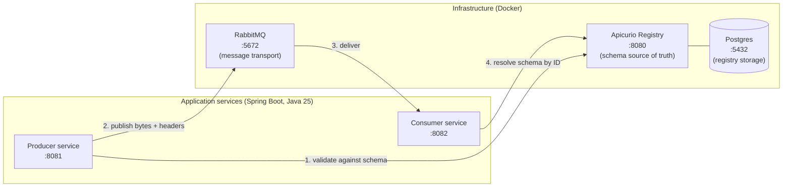
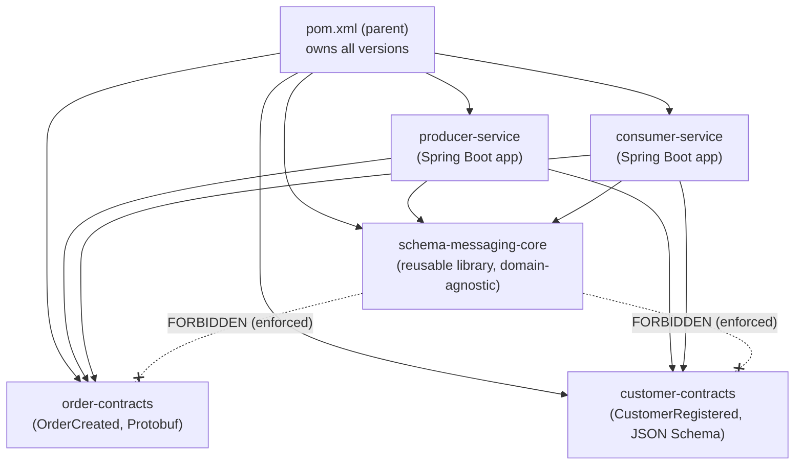
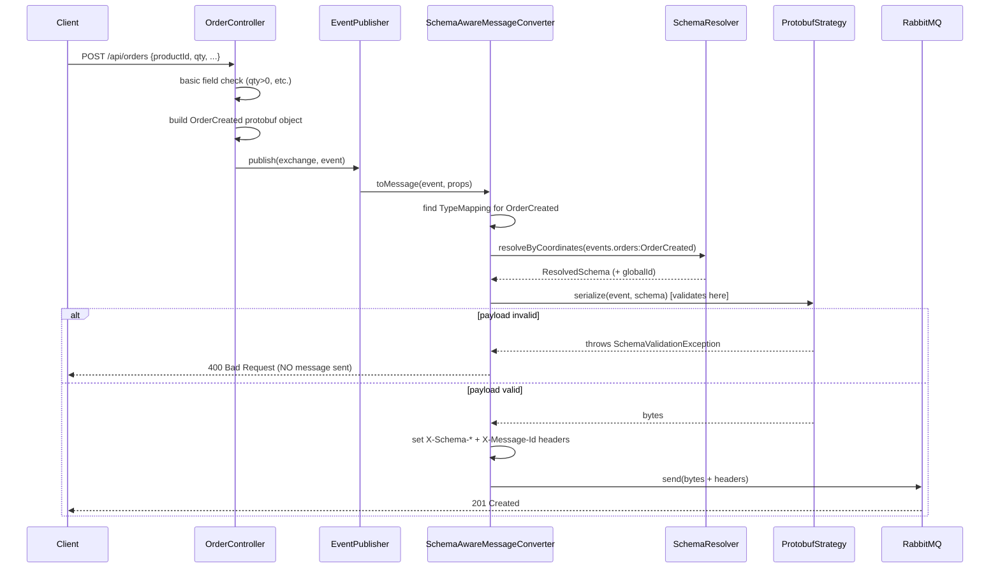
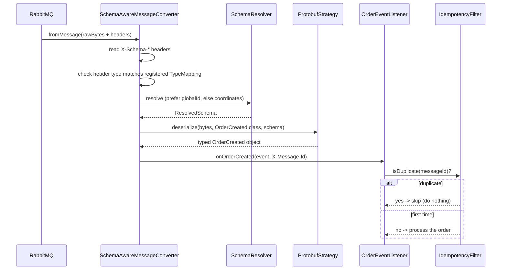
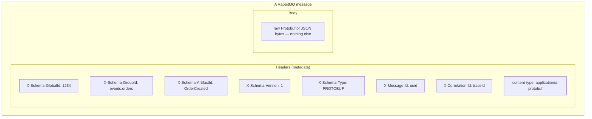
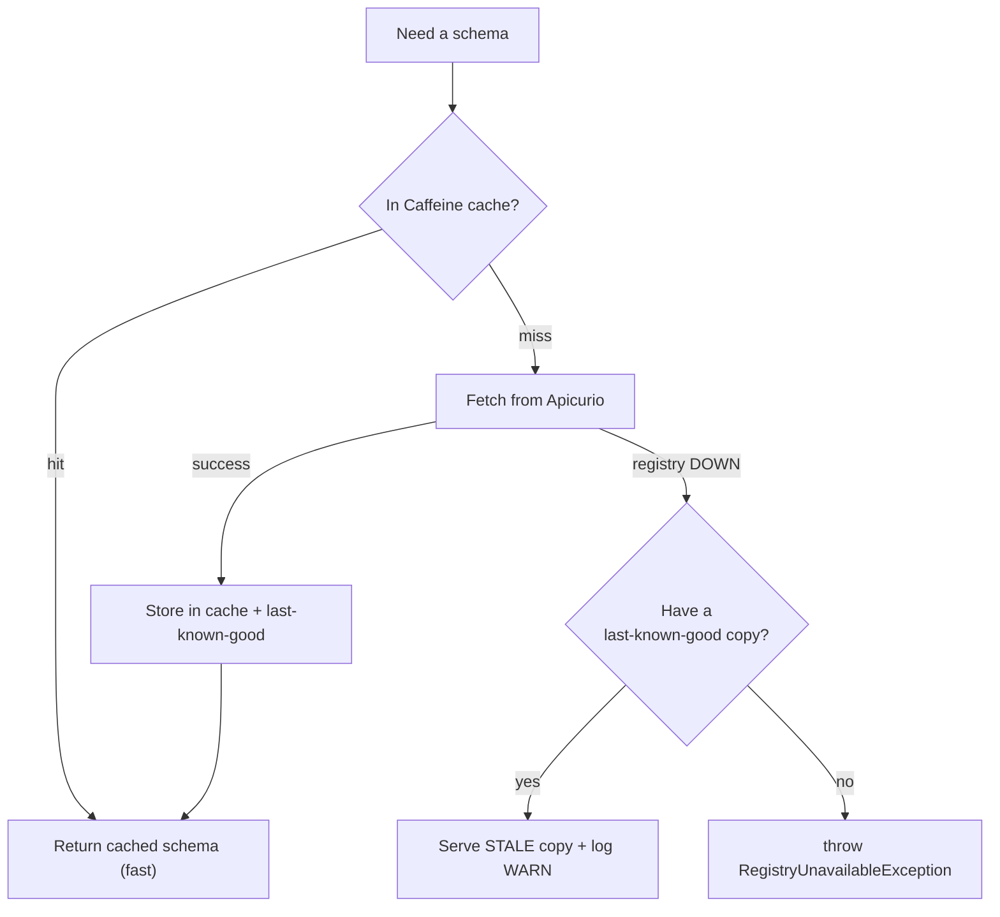
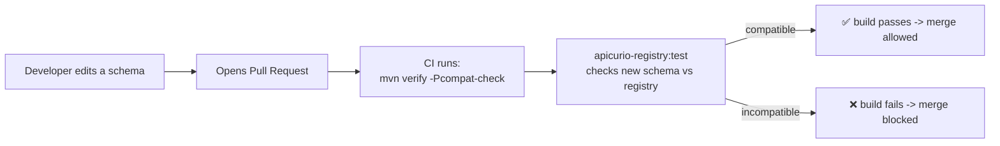
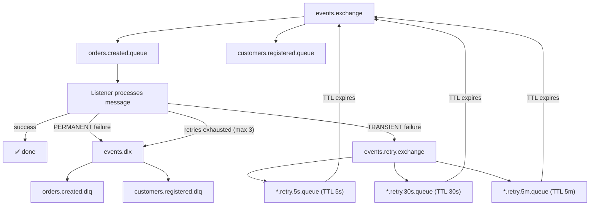
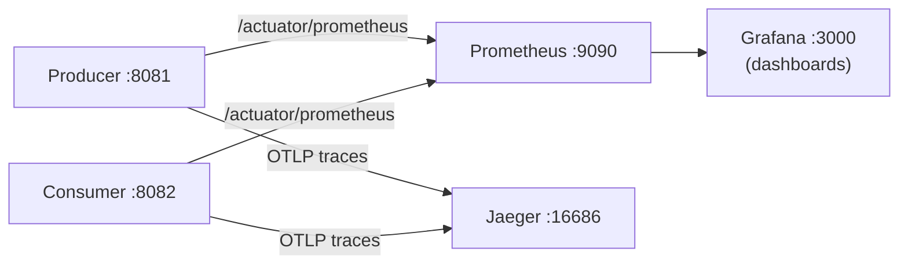

# Technical Report: Schema-Governed Messaging (Beginner's Guide)

> **Audience:** Developers new to message queues, schema registries, or this codebase.
> **Goal:** Explain *what* this project does, *why* it exists, and *how* every piece fits
> together — using plain language, analogies, diagrams, and concrete examples.
>
> Diagrams are written in [Mermaid](https://mermaid.js.org/) and render automatically on
> GitHub, in VS Code (with a Mermaid extension), and in most Markdown viewers.

---

## Table of contents

1. [The problem in one paragraph](#1-the-problem-in-one-paragraph)
2. [Key vocabulary (read this first)](#2-key-vocabulary-read-this-first)
3. [The 10,000-foot view](#3-the-10000-foot-view)
4. [The actors: who talks to whom](#4-the-actors-who-talks-to-whom)
5. [The Maven modules (how the code is organized)](#5-the-maven-modules-how-the-code-is-organized)
6. [A message's life: producing an order](#6-a-messages-life-producing-an-order)
7. [A message's life: consuming an order](#7-a-messages-life-consuming-an-order)
8. [The wire format (what actually travels)](#8-the-wire-format-what-actually-travels)
9. [Schema resolution and caching](#9-schema-resolution-and-caching)
10. [Schema governance: stopping bad changes before they merge](#10-schema-governance-stopping-bad-changes-before-they-merge)
11. [When things go wrong: the failure topology](#11-when-things-go-wrong-the-failure-topology)
12. [Observability: how we watch the system](#12-observability-how-we-watch-the-system)
13. [How to run it yourself](#13-how-to-run-it-yourself)
14. [Glossary recap](#14-glossary-recap)

---

## 1. The problem in one paragraph

Imagine two programs that need to talk to each other by sending **messages** (like passing
notes). Program A (the **producer**) writes a note describing "a new order was created" and
Program B (the **consumer**) reads it and reacts. This works fine — until someone changes the
*shape* of the note. Maybe A starts sending `qty` instead of `quantity`, or removes a field B
depends on. B breaks, often silently, in production. This project demonstrates a disciplined
way to prevent that: every message must match a **registered schema** (a strict contract for
the note's shape), a central **Schema Registry** is the single source of truth for those
contracts, and a **compatibility rule** blocks anyone from changing a contract in a way that
would break existing readers.

This is a **POC** (Proof of Concept) — its job is to *prove the pattern works end-to-end*, not
to be a production system.

---

## 2. Key vocabulary (read this first)

| Term | Plain-English meaning | Analogy |
|------|----------------------|---------|
| **Schema** | A formal description of a message's structure (field names, types, which are required). | A form with labeled, typed blanks. |
| **Schema Registry** | A server that stores all schemas and assigns each one an ID and version. Here: **Apicurio Registry**. | A library that owns the official copy of every form. |
| **Message broker** | A server that ferries messages between programs. Here: **RabbitMQ**. | A post office. |
| **Producer** | The program that creates and sends messages. | Person mailing a letter. |
| **Consumer** | The program that receives and processes messages. | Person reading the letter. |
| **Serialization** | Turning a Java object into bytes for transport. | Folding a letter into an envelope. |
| **Deserialization** | Turning bytes back into a Java object. | Opening the envelope and reading. |
| **Protobuf** | A compact binary serialization format (Google's Protocol Buffers). | A shorthand only the right decoder ring can read. |
| **JSON Schema** | A way to describe and validate JSON documents. | A checklist for a plain-text form. |
| **BACKWARD compatibility** | A new schema version can still read messages written with the old version. | A new form still accepts old submissions. |
| **DLQ** | Dead Letter Queue — where messages go when they can't be processed. | The "undeliverable mail" bin. |

---

## 3. The 10,000-foot view

Three infrastructure servers and two application services cooperate:



The flow in words:

1. The producer looks up the schema for the message it wants to send and **validates** the
   payload against it.
2. If valid, it serializes to bytes and publishes them to RabbitMQ, attaching headers that say
   *which* schema was used.
3. RabbitMQ routes the message to the consumer.
4. The consumer reads the schema-identity headers, fetches the matching schema (usually from a
   local cache), and deserializes the bytes back into a typed Java object.

If validation fails in step 1, **no message is ever sent** — the bad data is stopped at the
door.

---

## 4. The actors: who talks to whom

| Actor | Role | Port(s) | Notes |
|-------|------|---------|-------|
| **Apicurio Registry 3.2.0** | Stores schemas, assigns IDs/versions, enforces compatibility rules. | 8080 (API), 8888 (UI) | The "source of truth." |
| **Postgres 17** | Persistent storage behind Apicurio. | 5432 | Registry data survives restarts. |
| **RabbitMQ 3.13** | Message broker (transport). | 5672 (AMQP), 15672 (UI) | Moves bytes; knows nothing about schemas. |
| **Producer service** | REST API that publishes events. | 8081 | Spring Boot app. |
| **Consumer service** | Listens for events and processes them. | 8082 | Spring Boot app. |
| **schema-registrar** | One-shot container that registers both schemas on startup. | — | Exits after registering. |
| **Prometheus / Grafana / Jaeger** | Metrics + dashboards + distributed tracing. | 9090 / 3000 / 16686 | Observability. |

A subtle but important point: **RabbitMQ does not understand schemas.** It just moves bytes.
All the schema intelligence lives in the application code (the `schema-messaging-core` library)
and in Apicurio. This separation is deliberate and is what makes the pattern reusable.

---

## 5. The Maven modules (how the code is organized)

The project is a **Maven multi-module** build: one parent project containing five child
modules. Think of the parent as a table of contents that pins all library versions in one
place, so the children never disagree about which version of anything to use.



| Module | What it is | Depends on |
|--------|-----------|-----------|
| `schema-messaging-core` | The reusable plumbing: schema resolution, caching, serialization strategies, the message converter, failure routing, metrics. **Knows nothing about orders or customers.** | Spring AMQP, Apicurio SDK, Caffeine, Micrometer |
| `order-contracts` | The `OrderCreated` **Protobuf** schema and its generated Java classes. | `protobuf-java` only |
| `customer-contracts` | The `CustomerRegistered` **JSON Schema** and its generated POJOs. | Jackson only |
| `producer-service` | A Spring Boot app exposing REST endpoints that publish events. | core + both contracts |
| `consumer-service` | A Spring Boot app that listens to queues and processes events. | core + both contracts |

### Why "core must not depend on contracts" is *machine-enforced*

The core library is meant to be **domain-agnostic** — reusable for *any* message type, not just
orders and customers. If a developer accidentally made `core` import `order-contracts`, the
library would be permanently tied to orders, defeating the purpose. To prevent this, the build
uses the Maven **enforcer plugin** with a `bannedDependencies` rule: if `core` ever depends on a
`*-contracts` module, **the build fails**. This is an example of encoding an architectural rule
into the tooling so it can't be violated by accident.

> **Beginner note:** "domain-agnostic" means the code doesn't bake in any knowledge of the
> business concepts (orders, customers). Instead, each contracts module *plugs in* its own
> knowledge via a `TypeMapping` bean. That is the **plugin pattern**.

---

## 6. A message's life: producing an order

Let's trace a real request: someone calls `POST /api/orders` on the producer.



The key code path (simplified from `SchemaAwareMessageConverter.toMessage`):

```java
// 1. Which schema does this Java type map to?
TypeMapping mapping = typeMappingRegistry.findByJavaType(object.getClass()) ... ;

// 2. Resolve the schema (from cache or registry).
ResolvedSchema schema = schemaResolver.resolveByCoordinates(mapping.coordinates());

// 3. Validate + serialize. A validation failure throws here -> no message is emitted.
byte[] bytes = strategy.serialize(object, schema);

// 4. Stamp identity headers so the consumer knows what it's reading.
SchemaMessageHeaders.setSchemaHeaders(props, schema.globalId(), mapping.coordinates(), mapping.schemaType());

return new Message(bytes, props);
```

**The most important guarantee here:** validation happens *before* the message is created.
If the data doesn't match the schema, `SchemaValidationException` is thrown and the message is
never published. Bad data cannot enter the pipe.

> **Try it:** there's also a `POST /api/orders/poison` endpoint that *deliberately* bypasses the
> converter and publishes garbage bytes (with valid-looking headers). It exists to demonstrate
> what happens when a malformed message reaches the consumer — see §11.

---

## 7. A message's life: consuming an order

On the other side, the consumer's `OrderEventListener` is annotated with
`@RabbitListener(queues = "orders.created.queue")`. When a message arrives, Spring AMQP hands
the raw message to the **same** `SchemaAwareMessageConverter`, this time calling `fromMessage`.



Two beginner-friendly details:

- **The fast path:** if the message carries an `X-Schema-GlobalId` header, the resolver fetches
  by that single numeric ID directly — no need to look up by group/artifact/version. This is
  cheaper, so it's preferred.
- **Idempotency:** networks sometimes deliver the *same* message twice. The `IdempotencyFilter`
  remembers recently-seen `X-Message-Id` values (in an in-memory cache) and skips duplicates, so
  processing the same order twice does no harm. *(This is POC-grade — a real system would use a
  shared store like Redis, not in-memory.)*

---

## 8. The wire format (what actually travels)

This project uses a **strict, minimal wire format**. The message *body* is **nothing but the
raw serialized bytes** — pure Protobuf or pure JSON. No magic byte, no length prefix, no
wrapper. All the schema identity lives in **headers**.



| Header | Purpose |
|--------|---------|
| `X-Schema-GlobalId` | The registry's unique numeric ID for this exact schema (enables the fast path). |
| `X-Schema-GroupId` / `X-Schema-ArtifactId` / `X-Schema-Version` | The schema's "coordinates" — its address in the registry. |
| `X-Schema-Type` | `PROTOBUF` or `JSON` — tells the consumer which deserializer to use. |
| `X-Message-Id` | Unique per message; used for deduplication. |
| `X-Correlation-Id` | Links related messages/traces together (the OpenTelemetry trace ID, if present). |
| `content-type` | `application/x-protobuf` or `application/json`. |

> **Why keep identity in headers instead of the body?** It keeps the body a clean, standard
> payload that any tool can parse, and it lets the broker route or inspect messages without
> decoding them. It's a clean separation of *metadata* (headers) from *data* (body).

### Two message types, two strategies

The system supports two serialization formats side by side, via a small interface called
`SerializationStrategy` (an **SPI** — Service Provider Interface, i.e. a plug-in point):

- `ProtobufStrategy` handles `OrderCreated` (compact binary).
- `JsonSchemaStrategy` handles `CustomerRegistered` (human-readable JSON).

The converter picks the right strategy based on `X-Schema-Type`. Adding a third format later
would mean writing one new strategy class — the rest of the system wouldn't change.

Here are the two actual contracts in the repo:

**`OrderCreated` (Protobuf):**
```protobuf
message OrderCreated {
  string order_id     = 1;
  string customer_id  = 2;
  string product_id   = 3;
  int32  quantity     = 4;
  double total_amount = 5;
  string currency     = 6;
  string created_at   = 7;
  optional string promo_code = 8;  // v2: backward-compatible addition
}
```

**`CustomerRegistered` (JSON Schema):**
```json
{
  "title": "CustomerRegistered",
  "type": "object",
  "properties": {
    "customerId":   { "type": "string" },
    "email":        { "type": "string" },
    "firstName":    { "type": "string" },
    "lastName":     { "type": "string" },
    "phoneNumber":  { "type": "string" },
    "registeredAt": { "type": "string" },
    "promoCode":    { "type": "string" }
  },
  "required": ["customerId", "email", "firstName", "lastName"]
}
```

---

## 9. Schema resolution and caching

Fetching a schema from the registry over the network on *every single message* would be slow
and would make the registry a single point of failure. So `schema-messaging-core` puts a
**cache** in front of it, implemented with the [Caffeine](https://github.com/ben-manes/caffeine)
library.



Key behaviors of `SchemaResolver`:

- **Two caches:** one keyed by coordinates (group/artifact/version), one keyed by global ID.
- **TTL + refresh-after-write:** entries expire after a time-to-live, and are refreshed in the
  background so reads stay fast.
- **Pre-warming:** on startup, the known schemas are loaded into the cache proactively (via
  `CachePreWarmer`), so the first real message doesn't pay a cache-miss penalty.
- **Graceful degradation:** if Apicurio is **down**, the resolver serves the **last known good**
  schema from memory and logs a warning. It only gives up (throws `RegistryUnavailableException`)
  when it has *nothing* cached. This means a registry outage doesn't immediately halt messaging.

> **Beginner takeaway:** caching is not just a speed optimization here — it's also a
> **resilience** feature. The cache lets the system keep working through a registry hiccup.

---

## 10. Schema governance: stopping bad changes before they merge

This is the heart of "schema *governance*." Both schemas are registered in Apicurio under a
**BACKWARD** compatibility rule:

- `OrderCreated` → group `events.orders`
- `CustomerRegistered` → group `events.customers`

**BACKWARD compatibility** means: *a consumer using the new schema can still read messages that
were produced with the old schema.* In practice this allows safe changes (like **adding an
optional field** — notice `promo_code` was added as field 8 in Protobuf, and `promoCode` was
added as a non-required property in JSON Schema) but forbids breaking changes (like removing a
field or renaming one).

### The CI merge gate

The clever part: this rule is wired into the build as a **merge gate** using the
`compat-check` Maven profile.



So if someone tries to merge a change that would break existing message readers, **the build
fails and the merge is blocked** — automatically, before the bad change can ever reach
production. The repo even ships deliberately-broken schemas
(`*-incompatible.proto` / `*-incompatible.json`) and an `incompatible-demo` profile so you can
*watch* the registry reject a bad change.

Run the gate yourself:
```bash
# Passes for compatible changes, fails for incompatible ones:
./mvnw -pl order-contracts,customer-contracts verify -Pcompat-check

# Watch a rejection happen (needs a running registry):
./mvnw -pl order-contracts apicurio-registry:test -Pincompatible-demo \
  -Dapicurio.registry.url=http://localhost:8080
```

### Version pinning and fail-fast

Producers can **pin** a specific schema version (via `schema.orders.pinned-version` /
`schema.customers.pinned-version` in `application.yml`). With auto-registration **off**, if a
producer pins a version that isn't registered, the app **fails to start** (via
`StartupSchemaValidator`) instead of failing later at runtime. Failing early and loudly is
safer than failing mysteriously in production.

---

## 11. When things go wrong: the failure topology

Not every message can be processed successfully. The consumer builds a full RabbitMQ topology
to handle failures intelligently, distinguishing **transient** problems (probably fixable by
trying again) from **permanent** ones (retrying will never help).



### Transient vs. permanent — how the decision is made

`EventConsumerSupport.classify()` walks the exception's cause chain and decides:

| Exception | Classification | Where it goes |
|-----------|---------------|---------------|
| `SchemaValidationException` | **Permanent** | Straight to DLQ |
| `DeserializationException` | **Permanent** | Straight to DLQ |
| `SerializationException` | **Permanent** | Straight to DLQ |
| `IncompatibleSchemaTypeException` | **Permanent** | Straight to DLQ |
| `RegistryUnavailableException` | **Transient** | Retry ladder |
| `SchemaNotFoundException` | **Transient** | Retry ladder |
| *anything else* | **Transient** (conservative default) | Retry ladder |

**Why this split?** A validation or deserialization error means the *message itself* is bad —
trying again will fail identically forever, so we don't waste effort; it goes straight to the
DLQ for a human to inspect. A "registry unavailable" error is probably temporary, so we retry
with increasing delays (5 seconds → 30 seconds → 5 minutes, max 3 attempts) before giving up.

### The retry "TTL ladder" trick

RabbitMQ doesn't have a native "retry in 30 seconds" button. The project achieves delayed
retries with a neat trick: a message is sent to a **retry queue** that has a **TTL**
(time-to-live). When the TTL expires, RabbitMQ automatically **dead-letters** the message back
to the main `events.exchange`, where it gets re-delivered to the listener. Three retry queues
with TTLs of 5s, 30s, and 5m form the escalating ladder.

### Forensics on the DLQ

Every message landing on a DLQ carries a full set of `X-Failure-*` headers so you can debug
*why* it failed without re-running anything:

| Header | Contents |
|--------|----------|
| `X-Failure-Reason` | `DLQ_DIRECT` (permanent) or `RETRY` (exhausted) |
| `X-Failure-Message` | The exception message (truncated to 512 bytes) |
| `X-Failure-StackTrace` | The stack trace (truncated to **4 KB**) |
| `X-Failure-Original-Routing-Key` | Where the message was originally headed |
| `X-Failure-Failed-At` | ISO-8601 timestamp |
| `X-Failure-Retry-Count` | How many retries were attempted |

> **Try it:** `POST /api/orders/poison` publishes garbage bytes with valid headers. The
> consumer fails deserialization → that's a **permanent** failure → the message lands directly
> on `orders.created.dlq` with all the headers above filled in. Open the RabbitMQ UI at
> http://localhost:15672 to inspect it.

---

## 12. Observability: how we watch the system

A system you can't observe is a system you can't operate. Three tools provide visibility:



- **Metrics (Prometheus + Grafana):** `SchemaMessagingMetrics` records counters and timers —
  messages published/consumed, validation failures, cache hits/misses, registry fetch latency.
  Prometheus scrapes these from each service's `/actuator/prometheus` endpoint; Grafana
  visualizes them (the Prometheus datasource is auto-provisioned, so no manual setup).
- **Tracing (Jaeger):** services emit OpenTelemetry traces. The `X-Correlation-Id` header
  carries the trace ID across the message boundary, so you can follow one logical operation from
  producer to consumer in the Jaeger UI.
- **Health checks (Spring Boot Actuator):** `RegistryHealthIndicator` reports whether Apicurio
  is reachable; `QueueDepthHealthIndicator` reports queue backlog on the consumer.

---

## 13. How to run it yourself

> Requires Docker, and a JDK-25 toolchain entry in `~/.m2/toolchains.xml` for compiling.
> Always use the committed Maven wrapper `./mvnw`, not a system `mvn`.

**Step 1 — start the infrastructure (cold start must reach all-healthy):**
```bash
docker compose up
```
This brings up Postgres, Apicurio (+ UI), RabbitMQ, Prometheus, Grafana, and Jaeger. The
one-shot `schema-registrar` container registers both schemas and applies the BACKWARD rule,
then exits.

**Step 2 — run the services (in two terminals):**
```bash
./mvnw -pl producer-service spring-boot:run   # http://localhost:8081
./mvnw -pl consumer-service spring-boot:run    # http://localhost:8082
```

**Step 3 — send a valid order and watch the consumer log it:**
```bash
curl -X POST http://localhost:8081/api/orders \
  -H 'Content-Type: application/json' \
  -d '{"customerId":"c-1","productId":"p-1","quantity":2,"totalAmount":19.99,"currency":"USD"}'
```

**Step 4 — trigger a DLQ landing:**
```bash
curl -X POST http://localhost:8081/api/orders/poison
# Then open http://localhost:15672 -> Queues -> orders.created.dlq
```

**Useful build commands:**
```bash
./mvnw clean install   # full build, all modules
./mvnw test            # fast unit tests only (*Test.java, mock-based)
./mvnw verify          # unit + Testcontainers integration tests (*IT.java)
```

**Useful UIs once everything is up:**

| URL | What |
|-----|------|
| http://localhost:8888 | Apicurio Registry UI (browse schemas) |
| http://localhost:15672 | RabbitMQ management (guest/guest) |
| http://localhost:3000 | Grafana (admin/admin) |
| http://localhost:16686 | Jaeger tracing UI |

> **Testing note:** the test split is load-bearing. `*Test.java` files run under Surefire on
> `mvn test` and must stay fast and mock-based. `*IT.java` files run under Failsafe on
> `mvn verify` and spin up real infrastructure with Testcontainers. Keep new tests on the
> correct side.

---

## 14. Glossary recap

- **Schema** — the strict shape of a message.
- **Schema Registry (Apicurio)** — the central store and authority for schemas.
- **Coordinates** — a schema's address: group + artifact + version (e.g.
  `events.orders : OrderCreated : 1`).
- **Global ID** — a single number uniquely identifying one schema version; enables the fast
  resolution path.
- **TypeMapping** — the plug-in bean that links a Java class ↔ schema coordinates ↔ format ↔
  routing key. Each contracts module contributes one.
- **SerializationStrategy** — the plug-in that knows how to validate/serialize/deserialize one
  format (Protobuf or JSON).
- **BACKWARD compatibility** — new schema can read old messages; the basis of the merge gate.
- **DLQ / DLX** — Dead Letter Queue / Exchange: where unprocessable messages end up.
- **Transient vs. permanent failure** — retry-worthy vs. hopeless; drives routing.
- **Idempotency** — processing the same message twice causes no extra effect.

---

### One-sentence summary

> This project proves that you can put a **schema contract** between two services, enforce it at
> **publish time** (bad data never ships), keep it fast and resilient with a **cache**, block
> breaking changes at **merge time** with a compatibility gate, and handle the messages that
> still fail with a disciplined **retry/DLQ** topology — all while watching the whole thing
> through metrics and traces.
