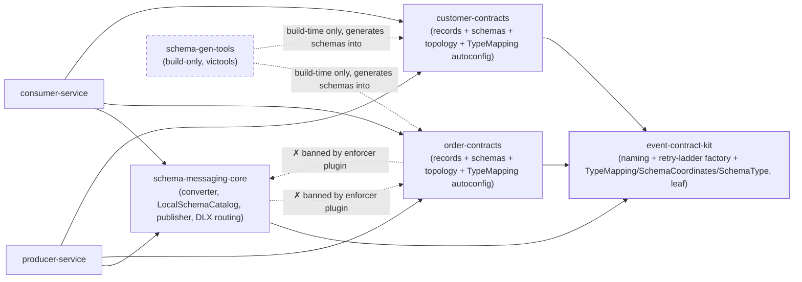
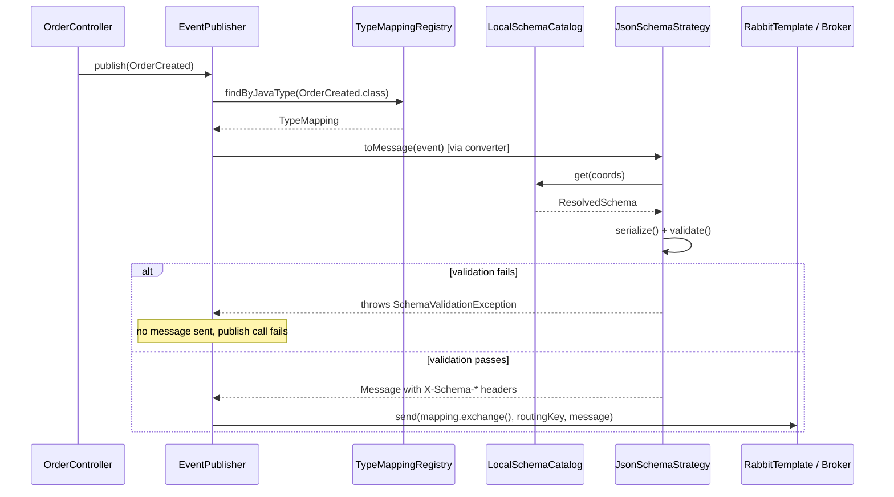
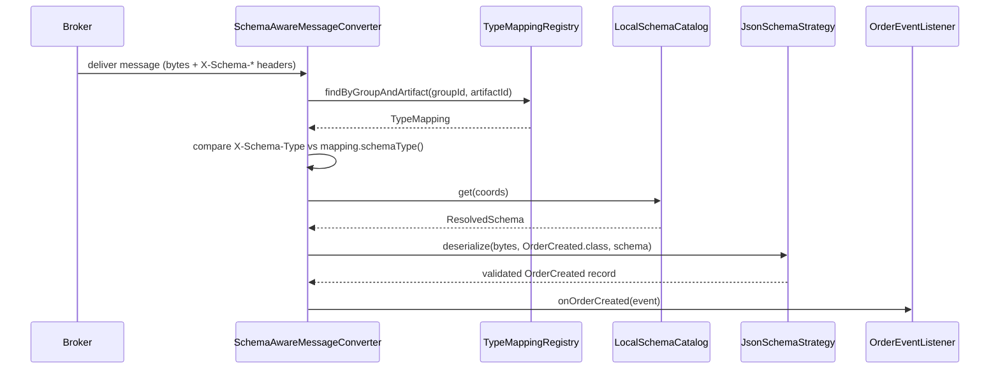
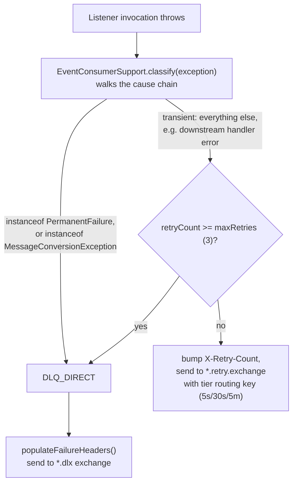

# Tutorial: How This Codebase Works

This is an onboarding tutorial for a new engineer joining this repo. It assumes you
already know Java, Spring Boot, Maven, and general messaging concepts — it does not
re-teach those. What it teaches is *this codebase*: how the modules fit together, and
how one event actually travels from an HTTP request to a consumer, file by file.

| Doc | Answers |
|-----|---------|
| **`docs/TUTORIAL.md`** (this file) | How is the codebase organized, and how does one event flow through it? |
| [`README.md`](../README.md) | How do I build and run it in 15 minutes? |
| [`CONTEXT.md`](../CONTEXT.md) | What do these domain terms mean? |
| [`docs/TESTING-GUIDE.md`](TESTING-GUIDE.md) | How do I manually exercise every scenario end to end? |
| [`docs/adr/0001-code-first-schema-generation.md`](adr/0001-code-first-schema-generation.md), [`spec/code-first-schema.md`](../spec/code-first-schema.md) | Why is the Java record the source of truth instead of the schema? |
| [`docs/adr/0002-contract-owned-amqp-topology.md`](adr/0002-contract-owned-amqp-topology.md), [`spec/contract-owned-amqp-topology.md`](../spec/contract-owned-amqp-topology.md) | Why does each `*-contracts` module own its own AMQP topology? |
| [`docs/adr/0007-typemapping-carries-exchange.md`](adr/0007-typemapping-carries-exchange.md) | Why does `TypeMapping` carry the AMQP exchange, and why is publish single-arg? |
| [`docs/adr/0008-bitsevenhandler-programmatic-listener-registration.md`](adr/0008-bitsevenhandler-programmatic-listener-registration.md) | Why `@BitsEventHandler` instead of `@RabbitListener(queues = ...)`? |

Read this document once, in order. Section 2 gives you the map; section 4 walks one
event through every file it touches; section 5 tells you the other six events are the
same walk with different names.

## 1. Orientation

This repo demonstrates **schema-governed messaging**: a producer and a consumer that
share **no compile-time dependency** on each other, only a runtime contract enforced by
classpath JSON Schemas (generated at build time) and a shared message converter. Apicurio
Registry is the CI/governance tool (register + compat-check), not a runtime dependency
(ADR-0004). Neither service imports the other's code. What keeps them compatible is:

1. Both depend on the same `*-contracts` module (e.g. `order-contracts`), which is the
   single source of truth for an event's shape (a Java **record**) and its generated
   JSON Schema.
2. Every message is validated against that schema on the way out (producer) and,
   depending on config, on the way back in (consumer) — a `SchemaAwareMessageConverter`
   in `schema-messaging-core` does this for every event, not per-event glue code.
3. Schema evolution is gated in CI: an incompatible change to a record fails the build
   before it ever reaches the registry.

The rest of this doc: section 2 is the module map (what depends on what, and why some
dependencies are actually forbidden). Section 4 is the main event — a single event
(`OrderCreated`) traced through every file it touches, from the controller to the
consumer's `@BitsEventHandler`, including what happens when something goes wrong.

## 2. Module Map

The parent POM aggregates 7 submodules:

| Module | Type | Depends on | Forbidden from depending on | Runtime or build-only |
|---|---|---|---|---|
| `schema-messaging-core` | domain-agnostic library | Spring AMQP, Jackson, networknt, `event-contract-kit` (ADR-0006) | `*-contracts` (enforced by `maven-enforcer-plugin`) | runtime |
| `event-contract-kit` (formerly `amqp-topology-kit`) | domain-agnostic library (leaf) | Spring AMQP only | `schema-messaging-core`, `*-contracts` | runtime |
| `schema-gen-tools` | build-only schema generator (victools) | victools only (dependency-free w.r.t. `*-contracts`, ADR-0003) | — | **build-only**, never on a service classpath |
| `order-contracts` | contract module | Jackson, jakarta.validation, `spring-rabbit`, `spring-boot-autoconfigure`, `event-contract-kit` | `schema-messaging-core` (enforced by `maven-enforcer-plugin`, ADR-0006) | runtime |
| `customer-contracts` | contract module (mirror of `order-contracts`) | same as above | same as above | runtime |
| `producer-service` | Spring Boot app | `schema-messaging-core`, `order-contracts`, `customer-contracts` | — | runtime |
| `consumer-service` | Spring Boot app | `schema-messaging-core`, `order-contracts`, `customer-contracts` | — | runtime |



### Core libraries

`schema-messaging-core` holds everything reusable and domain-agnostic: the
`SchemaAwareMessageConverter`, `LocalSchemaCatalog` (classpath schema load), `EventPublisher`,
and the consumer-side DLX/retry machinery (`EventConsumerSupport`, `DlxMessageRecoverer`,
`DlxRoutingAdvice`). It knows nothing about orders or customers.

`event-contract-kit` (formerly `amqp-topology-kit`) is a pure leaf module: `EventTopologyFactory`
(builds the queue/DLQ/retry-ladder `Declarable`s for one routing key) and `TopologyNaming` (the
naming convention: `<routingKey>.queue`, `<routingKey>.dlq`, retry tier suffixes
`5s`/`30s`/`5m`). It's a library the contracts modules call, not a Spring auto-config
itself. Since [ADR-0006](adr/0006-typemapping-relocated-to-event-contract-kit.md) it also carries
the `TypeMapping`/`SchemaCoordinates`/`SchemaType` data types, which is why
`schema-messaging-core` now depends on it too.

### Build tooling

`schema-gen-tools` is a Maven-plugin-invoked generator (victools) that each `*-contracts`
module calls at `process-classes` via `exec-maven-plugin` — it has no Maven dependency on
any contracts module (ADR-0003). It reads compiled `@GenerateSchema`-annotated records and
writes their `*.schema.json` files. It is never a runtime dependency of any service — see
[ADR-0001](adr/0001-code-first-schema-generation.md) for why the record, not the schema,
is authored by hand.

### Contracts

`order-contracts` and `customer-contracts` each own four things for their domain: the
event records, the generated JSON Schemas, a
[ADR-0002](adr/0002-contract-owned-amqp-topology.md) `@AutoConfiguration` class
(`OrderTopologyAutoConfiguration` / `CustomerTopologyAutoConfiguration`) that declares that
domain's exchanges, queues, DLQs, and retry ladder, and — a pattern established by
[ADR-0005](adr/0005-contracts-may-depend-on-core.md) — a second `@AutoConfiguration` class
(`OrderTypeMappingAutoConfiguration` / `CustomerTypeMappingAutoConfiguration`) that registers
that domain's `TypeMapping` beans. `TypeMapping` itself lives in `event-contract-kit`, not core
(see [ADR-0006](adr/0006-typemapping-relocated-to-event-contract-kit.md)), so this needs no
dependency on `schema-messaging-core`. Nothing about AMQP topology or schema-mapping wiring lives
in the services themselves.

### Services

`producer-service` and `consumer-service` are thin: just controllers (producer) or
`@BitsEventHandler` methods (consumer). Per [ADR-0005](adr/0005-contracts-may-depend-on-core.md),
each domain's `*-contracts` module registers its own `TypeMapping` beans (one per event) via a
`*TypeMappingAutoConfiguration`, alongside its `*TopologyAutoConfiguration`. Topology, converter,
and `TypeMapping` wiring all arrive automatically via Spring Boot auto-configuration — there is
no per-service topology, converter, or schema-mapping glue to maintain.

**Wire format** (see [`spec/code-first-schema.md`](../spec/code-first-schema.md) §6 for
the full rationale): the AMQP message body is the raw serialized JSON bytes only, no
envelope. Schema identity travels entirely in `X-Schema-*` headers plus
`X-Correlation-Id`.

**Failure model** (see [ADR-0002](adr/0002-contract-owned-amqp-topology.md) and
[`spec/contract-owned-amqp-topology.md`](../spec/contract-owned-amqp-topology.md)):
transient failures retry through a 5s/30s/5m TTL ladder (max 3 tries) before landing on
the DLQ; permanent failures (validation, deserialization, type mismatch) go straight to
the DLQ. Section 4.8 shows exactly which code makes that decision.

## 3. Vocabulary You'll See in the Trace

CONTEXT.md's glossary covers business terms (Order, Customer, the seven events). This
table is the code-level vocabulary for section 4 — the classes the walkthrough keeps
naming, so you don't have to keep looking them up mid-trace.

| Class | Module | Role |
|---|---|---|
| `TypeMapping` / `SchemaCoordinates` / `SchemaType` | `event-contract-kit` (ADR-0006) | `TypeMapping` maps a Java type ↔ `SchemaCoordinates` ↔ `SchemaType` ↔ AMQP routing key ↔ exchange (ADR-0007). One `TypeMapping` bean per event. `SchemaCoordinates` is group/artifact; `SchemaType` is the wire format. |
| `TypeMappingRegistry` / `ResolvedSchema` | `schema-messaging-core` | `TypeMappingRegistry` indexes every `TypeMapping` bean for O(1) lookup; `ResolvedSchema` is the classpath-loaded schema bytes + type. |
| `SchemaAwareMessageConverter` | `schema-messaging-core` | The one Spring AMQP `MessageConverter` that does `toMessage`/`fromMessage` for every event — the single validation authority. |
| `LocalSchemaCatalog` | `schema-messaging-core` | Eagerly loads every mapping's JSON Schema from the classpath at startup; fails fast if missing. |
| `JsonSchemaStrategy` | `schema-messaging-core` | The `SerializationStrategy` implementation: validates (networknt, Draft-07) then (de)serializes with Jackson. |
| `EventPublisher` | `schema-messaging-core` | Producer-side wrapper: `TypeMapping` lookup → `messageConverter.toMessage()` → `rabbitTemplate.send(mapping.exchange(), mapping.routingKey(), ...)`. Caller supplies only the event (ADR-0007). |
| `BitsEventHandler` | `schema-messaging-core` (ADR-0008) | Marker on listener methods — no queue name or container factory. Queue resolved from the parameter type's `TypeMapping` at startup. |
| `BitsEventHandlerRegistrar` | `schema-messaging-core` (ADR-0008) | `RabbitListenerConfigurer` that registers `@BitsEventHandler` methods; derives queue via `TopologyNaming.queueName(mapping.routingKey())`. |
| `DlxRoutingAdvice` | `schema-messaging-core` | AOP advice wrapped around every listener invocation; catches exceptions and hands them to the recoverer. |
| `DlxMessageRecoverer` | `schema-messaging-core` | Decides DLQ vs. retry-exchange and actually sends the message there. |
| `EventConsumerSupport` | `schema-messaging-core` | `classify(Exception)` — the permanent-vs-transient decision, by cause-chain walk — and DLQ failure-header population. |
| `PermanentFailure` | `schema-messaging-core` | Marker interface implemented by every permanent exception; `classify()` checks `instanceof` this, not a hand-maintained set. |
| `EventTopologyFactory` / `TopologyNaming` | `event-contract-kit` | Builds the queue/DLQ/retry-tier `Declarable`s for one routing key, and supplies the naming convention. |
| `OrderTopologyAutoConfiguration` | `order-contracts` | Declares `events.orders.*` exchanges and calls the factory once per order routing key. |
| `OrderTypeMappingAutoConfiguration` | `order-contracts` | Registers this domain's `TypeMapping` beans (pattern established by ADR-0005) — one per order event. |

## 4. Deep Dive: `OrderCreated` End-to-End

We'll trace one event, `OrderCreated`, from an HTTP POST all the way to the consumer's
`@BitsEventHandler`, including the failure path. Every other event in this system
(`OrderShipped`, `OrderCancelled`, `OrderFulfilled`, and the three customer events) takes an identical
code path — see section 5.

Roadmap (each numbered step below is one hop):

1. HTTP request → `OrderController` builds the record and hands it to `EventPublisher`.
2. `EventPublisher.publish()` looks up the `TypeMapping`, calls the converter, sends via `RabbitTemplate`.
3. The `TypeMapping` bean itself, registered in `order-contracts` via `OrderTypeMappingAutoConfiguration`.
4. The converter's produce path (`toMessage`): catalog lookup → validate → serialize → stamp headers.
5. The AMQP topology that the message lands in — declared once at startup, not per-publish.
6. The consumer's listener container + `@BitsEventHandler`.
7. The converter's consume path (`fromMessage`): read headers → catalog lookup → validate → deserialize.
8. What happens when any of the above throws — the DLX/retry routing decision.

### 4.1 HTTP entrypoint

`producer-service/src/main/java/com/example/producer/controller/OrderController.java:50-62`:

```java
public void createOrder(@RequestBody CreateOrderRequest request) {
    ...
    eventPublisher.publish(event);
}
```

The controller builds the `OrderCreated` record from the request body and delegates
everything else — validation, serialization, header population, sending — to
`eventPublisher.publish()`. There's no manual field-checking here; validation happens
against the schema, not in the controller. The exchange is not passed at the call site —
`EventPublisher` reads it from the event's `TypeMapping` (ADR-0007).

### 4.2 Publish

`schema-messaging-core/src/main/java/com/example/messaging/core/publisher/EventPublisher.java:42-53`:

```java
public void publish(Object event) {
    TypeMapping mapping = typeMappingRegistry.findByJavaType(event.getClass())
            .orElseThrow(...);

    MessageProperties props = new MessageProperties();
    Message message = messageConverter.toMessage(event, props);

    rabbitTemplate.send(mapping.exchange(), mapping.routingKey(), message);
}
```

Three steps: look up the `TypeMapping` for this Java type, run it through the converter
(section 4.4 — this is where validation happens), send to the exchange and routing key
both taken from the `TypeMapping`.

### 4.3 Where the `TypeMapping` bean comes from

`order-contracts/src/main/java/com/example/contracts/orders/topology/OrderTypeMappingAutoConfiguration.java:31-36`:

```java
@Bean("orderCreatedMapping")
@ConditionalOnMissingBean(name = "orderCreatedMapping")
public TypeMapping orderCreatedMapping() {
    return new TypeMapping(OrderCreated.class, coords("OrderCreated"),
            SchemaType.JSON, OrderEventRouting.CREATED_ROUTING_KEY, OrderEventRouting.EXCHANGE);
}
```

One `@Bean` method per event, all in one self-activating `@AutoConfiguration` class shipped in
the `order-contracts` jar (ADR-0005) — not hand-registered per service. The `coords()` helper
builds a 2-arg `SchemaCoordinates(groupId, artifactId)` — no version pinning at runtime
(ADR-0004).

### 4.4 Convert: produce path

`schema-messaging-core/.../converter/SchemaAwareMessageConverter.java` (`toMessage`):

```java
public Message toMessage(Object object, MessageProperties messageProperties) {
    TypeMapping mapping = typeMappingRegistry.findByJavaType(type).orElseThrow(...);
    ResolvedSchema schema = localSchemaCatalog.get(mapping.coordinates());
    SerializationStrategy strategy = strategyFor(mapping.schemaType());
    byte[] bytes = strategy.serialize(object, schema);
    SchemaMessageHeaders.setSchemaHeaders(messageProperties, mapping.coordinates(),
            mapping.schemaType(), strategy.contentType());
    return new Message(bytes, messageProperties);
}
```

- `localSchemaCatalog.get()` returns the schema loaded at startup from
  `classpath:schemas/<kebab-name>.schema.json` — no network call.
- `strategy.serialize()` → `JsonSchemaStrategy.serialize()` Jackson-serializes the record,
  then validates (networknt, Draft-07). **If validation fails, `SchemaValidationException`
  is thrown and no message is ever sent** — the producer sees a 400.
- `SchemaMessageHeaders.setSchemaHeaders()` stamps identity headers:

  | Header | Purpose |
  |---|---|
  | `X-Schema-GroupId` / `X-Schema-ArtifactId` | Coordinates for consumer TypeMapping lookup |
  | `X-Schema-Type` | `JSON` today — the SPI exists for future formats (e.g. Avro) |
  | `X-Correlation-Id` | Generated if not already present |



### 4.5 Topology: how the queues got there

This didn't happen at publish time — it happened once, at consumer startup.
`order-contracts/.../topology/OrderTopologyAutoConfiguration.java:31-67` declares three
`TopicExchange` beans (`events.orders.exchange`, `.dlx`, `.retry.exchange`, lines 31-47),
then for each of the four order routing keys calls
`EventTopologyFactory.declarablesForEvent()` (line 63):

```java
for (String routingKey : List.of(
        OrderEventRouting.CREATED_ROUTING_KEY,
        OrderEventRouting.SHIPPED_ROUTING_KEY,
        OrderEventRouting.CANCELLED_ROUTING_KEY,
        OrderEventRouting.FULFILLED_ROUTING_KEY)) {
    declarables.addAll(EventTopologyFactory.declarablesForEvent(
            routingKey, ordersExchange, ordersDlx, ordersRetryExchange, tierTtls));
}
```

`EventTopologyFactory.declarablesForEvent()` (`event-contract-kit/.../EventTopologyFactory.java:36-59`)
builds, per routing key: the main queue + binding (`TopologyNaming.queueName`, e.g.
`orders.created.queue`), the DLQ + binding (`TopologyNaming.dlqName`, e.g.
`orders.created.dlq`), and three TTL retry queues + bindings (5s/30s/5m,
`TopologyNaming.retryRoutingKey`). This is `@AutoConfiguration` — no service writes any
topology code itself. The declared beans are picked up and idempotently applied to the
broker on startup by the shared `RabbitAdmin` bean
(`SchemaMessagingConsumerAutoConfiguration.java:47-51`).

`OrderEventRouting` no longer exposes `*_QUEUE` constants — queue names are derived at
listener registration time via `TopologyNaming.queueName(routingKey)` (ADR-0008). Adding a
fifth order event means adding one routing key to that `List.of(...)` — the
queue/DLQ/retry-ladder for it is generated automatically.

### 4.6 Consumer wiring

`SchemaMessagingConsumerAutoConfiguration.java:68-88` builds the
`rabbitListenerContainerFactory` bean, wiring in the *same*
`SchemaAwareMessageConverter` used on the producer side, plus a `DlxRoutingAdvice`
advice chain (section 4.8). It also registers `BitsEventHandlerRegistrar`, which
implements `RabbitListenerConfigurer` and programmatically binds every `@BitsEventHandler`
method to the queue named by its parameter type's `TypeMapping`.

`consumer-service/src/main/java/com/example/consumer/listener/OrderEventListener.java:25-28`:

```java
@BitsEventHandler
public void onOrderCreated(OrderCreated event) {
    log.info("Received OrderCreated orderId={} ...", event.orderId(), ...);
}
```

At startup, `BitsEventHandlerRegistrar` resolves `OrderCreated.class` → `TypeMapping` →
`TopologyNaming.queueName("orders.created")` → `orders.created.queue`, then registers
the method against the shared `rabbitListenerContainerFactory`. Spring AMQP calls
`fromMessage()` on the raw bytes *before* this method body ever runs — by the time
`onOrderCreated` executes, `event` is already a validated, typed `OrderCreated` record.

### 4.7 Convert: consume path

`SchemaAwareMessageConverter.fromMessage()`:

```java
public Object fromMessage(Message message) {
    String groupId = SchemaMessageHeaders.getGroupId(props);
    String artifactId = SchemaMessageHeaders.getArtifactId(props);
    String headerTypeName = SchemaMessageHeaders.getSchemaTypeName(props);

    requireHeader(groupId, ...); requireHeader(artifactId, ...); requireHeader(headerTypeName, ...);

    TypeMapping mapping = typeMappingRegistry.findByGroupAndArtifact(groupId, artifactId)
            .orElseThrow(() -> new UnknownSchemaArtifactException(groupId, artifactId));

    if (!headerTypeName.equalsIgnoreCase(mapping.schemaType().name())) {
        throw new IncompatibleSchemaTypeException(...);
    }

    ResolvedSchema schema = localSchemaCatalog.get(mapping.coordinates());
    return strategyFor(mapping.schemaType()).deserialize(message.getBody(), mapping.javaType(), schema);
}
```

Notable details:

- **Required headers:** missing/blank `X-Schema-GroupId` / `ArtifactId` / `Type` →
  `MissingSchemaHeadersException` (permanent → DLQ).
- **Type-mismatch guard:** raw `X-Schema-Type` vs mapping expectation →
  `IncompatibleSchemaTypeException` (permanent).
- **Unknown artifact:** no TypeMapping → `UnknownSchemaArtifactException` (permanent).
- Schema comes from `LocalSchemaCatalog` (already loaded at startup).
- `JsonSchemaStrategy.deserialize()` validates (default) then Jackson-deserializes.



### 4.8 What happens when it fails

If anything above throws — validation failure, deserialization failure, missing headers,
unknown artifact — `DlxRoutingAdvice.invoke()`
(`consumer/DlxRoutingAdvice.java`) is wrapped around the entire listener
invocation and catches it:

```java
try {
    return invocation.proceed();
} catch (Throwable t) {
    ...
    recoverer.recover(message, ex);
    return null; // suppress original exception → container ACKs the message
}
```

It delegates to `DlxMessageRecoverer.recover()` (`consumer/DlxMessageRecoverer.java:44-74`),
which asks `EventConsumerSupport.classify()`
(`schema-messaging-core/.../consumer/EventConsumerSupport.java:43-52`) for a routing decision.
`classify()` is not a hand-maintained exception list — it walks the full cause chain (so a
Spring AMQP wrapper like `ListenerExecutionFailedException` doesn't mask the real cause) and
checks each `Throwable` against one condition:

```java
public RoutingDecision classify(Exception e) {
    Throwable current = e;
    while (current != null) {
        if (current instanceof PermanentFailure || current instanceof MessageConversionException) {
            return RoutingDecision.DLQ_DIRECT;
        }
        current = current.getCause();
    }
    return RoutingDecision.RETRY;
}
```

| Exception | Classification |
|---|---|
| `SchemaValidationException`, `DeserializationException`, `SerializationException`, `IncompatibleSchemaTypeException`, `MissingSchemaHeadersException`, `UnknownSchemaArtifactException` — each implements the `PermanentFailure` marker interface | **PERMANENT** → `DLQ_DIRECT`, no retry |
| Spring's own `MessageConversionException` (e.g. an unmapped `SchemaType` in `strategyFor()`) — a converter failure can never succeed on retry | **PERMANENT** → `DLQ_DIRECT`, no retry |
| Everything else (e.g. downstream `RuntimeException`) | **TRANSIENT** → `RETRY` |

A new permanent exception type self-classifies simply by implementing `PermanentFailure` — no
second edit to `classify()` is needed. The contract is table-driven in
`EventConsumerSupportTest#exceptionToDecision` (schema-messaging-core), which keeps this table
honest.



`DlxMessageRecoverer.recover()` derives the domain's DLX/retry exchange names from the
message's *actual received exchange* (`props.getReceivedExchange()`, regex-stripping
`.exchange` → `.dlx` / `.retry.exchange`) rather than a hardcoded name — this is why the
one shared `DlxMessageRecoverer` bean in `schema-messaging-core` needs no dependency on
any `*-contracts` module (see [ADR-0002](adr/0002-contract-owned-amqp-topology.md)).

**Go run it yourself**: section 4 traced the code; to watch this happen against a live
broker, run [`docs/TESTING-GUIDE.md`](TESTING-GUIDE.md) §8 (happy path), §9 (validation
failure), §10 (DLQ), and §11 (retry ladder).

## 5. The Other Six Events

`OrderShipped`, `OrderCancelled`, `OrderFulfilled`, and the three customer events
(`CustomerRegistered`, `CustomerAddressAdded`, `CustomerTierChanged`) all go through
*exactly* the same classes traced in section 4. Only the record shape, routing key, and
exchange group differ:

| Event | Module | Routing key | Exchange group |
|---|---|---|---|
| `OrderCreated` | `order-contracts` | `orders.created` | `events.orders.exchange` |
| `OrderShipped` | `order-contracts` | `orders.shipped` | `events.orders.exchange` |
| `OrderCancelled` | `order-contracts` | `orders.cancelled` | `events.orders.exchange` |
| `OrderFulfilled` | `order-contracts` | `orders.fulfilled` | `events.orders.exchange` |
| `CustomerRegistered` | `customer-contracts` | `customers.registered` | `events.customers.exchange` |
| `CustomerAddressAdded` | `customer-contracts` | `customers.address-added` | `events.customers.exchange` |
| `CustomerTierChanged` | `customer-contracts` | `customers.tier-changed` | `events.customers.exchange` |

`OrderFulfilled` is the nested-object example: it carries three value objects
(`OrderBuyer`, `ShippingAddress`, `PaymentDetails`) inlined into the generated schema —
see `order-contracts/.../OrderFulfilled.java`.

`CustomerTopologyAutoConfiguration` is the exact mirror of
`OrderTopologyAutoConfiguration` (section 4.5) for the customer domain. If you
understand section 4, you understand all seven events — the only new code you'd write
for an eighth event is a new record (plus nested types if needed), a routing-key constant,
one `TypeMapping` bean, one line in the topology auto-configuration's routing-key list,
and one `@BitsEventHandler` method.

## 6. Where to Go Next

| Next step | Doc |
|---|---|
| Actually run the system | [`README.md`](../README.md) |
| Exercise every scenario manually (happy path, validation failure, DLQ, retry, pinning, evolution) | [`docs/TESTING-GUIDE.md`](TESTING-GUIDE.md) |
| Look up a domain term | [`CONTEXT.md`](../CONTEXT.md) |
| Understand why code-first schema generation was chosen | [ADR-0001](adr/0001-code-first-schema-generation.md), [`spec/code-first-schema.md`](../spec/code-first-schema.md) |
| Understand why contracts modules own their own AMQP topology | [ADR-0002](adr/0002-contract-owned-amqp-topology.md), [`spec/contract-owned-amqp-topology.md`](../spec/contract-owned-amqp-topology.md) |
