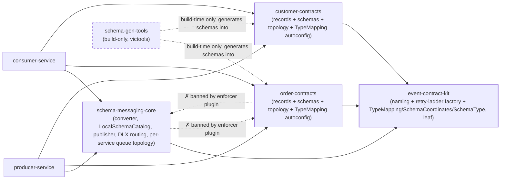
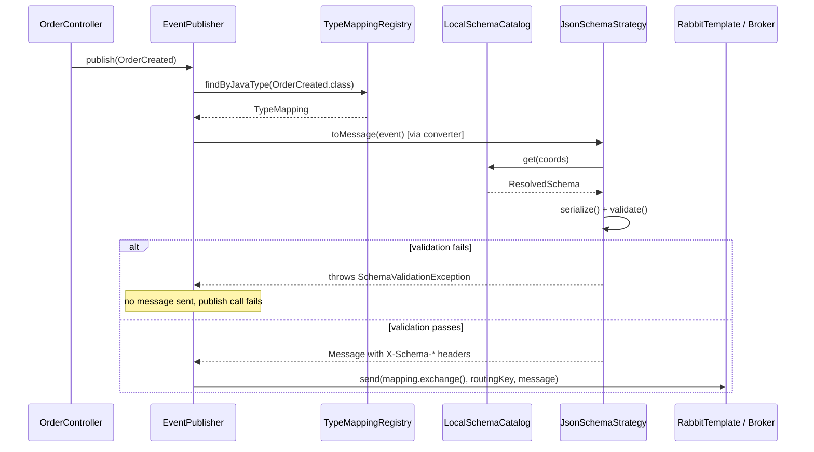
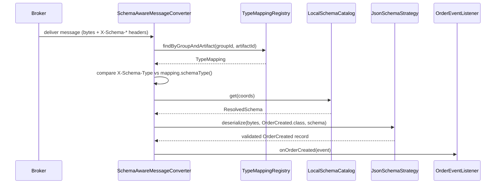
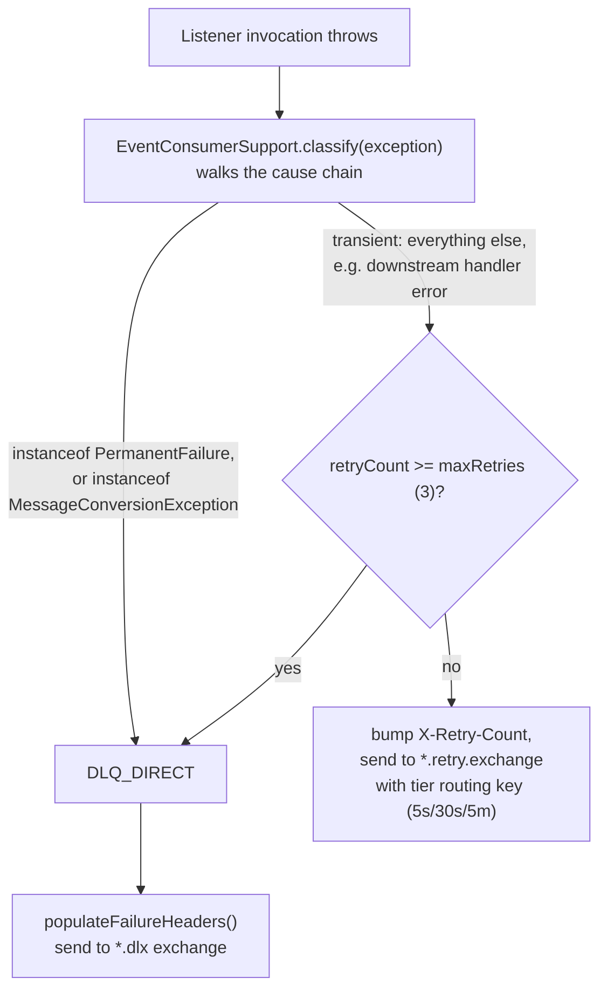

# Tutorial: How This Codebase Works

This is an onboarding tutorial for a new engineer joining this repo. It assumes you
already know Java, Spring Boot, Maven, and general messaging concepts — it does not
re-teach those. What it teaches is *this codebase*: how the modules fit together, and
how one event actually travels from an HTTP request to a consumer, file by file.

| Doc | Answers |
|-----|---------|
| **`docs/TUTORIAL.md`** (this file) | How is the codebase organized, and how does one event flow through it? |
| [`README.md`](../README.md) | How do I build and run it in 15 minutes? |
| [`CONTEXT.md`](../CONTEXT.md) | What do these domain terms mean? |
| [`docs/TESTING-GUIDE.md`](TESTING-GUIDE.md) | How do I manually exercise every scenario end to end? |
| [`docs/TUTORIAL.md`](TUTORIAL.md) §2, §4.5 | How is AMQP topology split between contracts (exchanges) and core (per-service queues)? |

Read this document once, in order. Section 2 gives you the map; section 4 walks one
event through every file it touches; section 5 tells you the other six events are the
same walk with different names.

## 1. Orientation

This repo demonstrates **schema-governed messaging**: a producer and a consumer that
share **no compile-time dependency** on each other, only a runtime contract enforced by
classpath JSON Schemas (generated at build time) and a shared message converter. Apicurio
Registry is the CI/governance tool (register + compat-check), not a runtime dependency
(local classpath validation via `LocalSchemaCatalog`). Neither service imports the other's code.
What keeps them compatible is:

1. Both depend on the same `*-contracts` module (e.g. `order-contracts`), which is the
   single source of truth for an event's shape (a Java **record**) and its generated
   JSON Schema.
2. Every message is validated against that schema on the way out (producer) and,
   depending on config, on the way back in (consumer) — a `SchemaAwareMessageConverter`
   in `schema-messaging-core` does this for every event, not per-event glue code.
3. Schema evolution is gated in CI: an incompatible change to a record fails the build
   before it ever reaches the registry.

The rest of this doc: section 2 is the module map (what depends on what, and why some
dependencies are actually forbidden). Section 4 is the main event — a single event
(`OrderCreated`) traced through every file it touches, from the controller to the
consumer's `@BitsEventHandler`, including what happens when something goes wrong.

## 2. Module Map

The parent POM aggregates 7 submodules:

| Module | Type | Depends on | Forbidden from depending on | Runtime or build-only |
|---|---|---|---|---|
| `schema-messaging-core` | domain-agnostic library | Spring AMQP, Jackson, networknt, `event-contract-kit` | `*-contracts` (enforced by `maven-enforcer-plugin`) | runtime |
| `event-contract-kit` (formerly `amqp-topology-kit`) | domain-agnostic library (leaf) | Spring AMQP only | `schema-messaging-core`, `*-contracts` | runtime |
| `schema-gen-tools` | build-only schema generator (victools) | victools only (dependency-free w.r.t. `*-contracts`) | — | **build-only**, never on a service classpath |
| `order-contracts` | contract module | Jackson, jakarta.validation, `spring-rabbit`, `spring-boot-autoconfigure`, `event-contract-kit` | `schema-messaging-core` (enforced by `maven-enforcer-plugin`) | runtime |
| `customer-contracts` | contract module (mirror of `order-contracts`) | same as above | same as above | runtime |
| `producer-service` | Spring Boot app | `schema-messaging-core`, `order-contracts`, `customer-contracts` | — | runtime |
| `consumer-service` | Spring Boot app | `schema-messaging-core`, `order-contracts`, `customer-contracts` | — | runtime |



### Core libraries

`schema-messaging-core` holds everything reusable and domain-agnostic: the
`SchemaAwareMessageConverter`, `LocalSchemaCatalog` (classpath schema load), `EventPublisher`,
the consumer-side DLX/retry machinery (`EventConsumerSupport`, `DlxMessageRecoverer`,
`DlxRoutingAdvice`), and the per-service queue wiring — `ServiceQueueTopologyAutoConfiguration`
(declares this service's own queues/DLQs/retry ladders), `BitsEventHandlerScanner` (shared
`@BitsEventHandler` discovery via non-instantiating `getType` scan), and
`HandledEventTypesCache` (runs that scan **once** at startup and shares the memoized handled
`TypeMapping` set with topology declaration and the queue-depth health indicator). Listener-only
beans are gated behind `events.consumer.enabled` (see Services below). It knows nothing about
orders or customers.

`event-contract-kit` (formerly `amqp-topology-kit`) is a pure leaf module: `EventTopologyFactory`
(builds the queue/DLQ/retry-ladder `Declarable`s for one routing key **and service name**) and
`TopologyNaming` (the naming convention: `<routingKey>.<serviceName>.queue`,
`<routingKey>.<serviceName>.dlq`, retry tier suffixes `5s`/`30s`/`5m`). It's a library that both
the contracts modules (for exchanges) and `schema-messaging-core` (for per-service queues) call,
not a Spring auto-config
itself. It also carries
the `TypeMapping`/`SchemaCoordinates`/`SchemaType` data types, which is why
`schema-messaging-core` now depends on it too.

### Build tooling

`schema-gen-tools` is a Maven-plugin-invoked generator (victools) that each `*-contracts`
module calls at `process-classes` via `exec-maven-plugin` — it has no Maven dependency on
any contracts module. It reads compiled `@GenerateSchema`-annotated records and
writes their `*.schema.json` files. It is never a runtime dependency of any service — the Java
record, not the schema, is authored by hand.

### Contracts

`order-contracts` and `customer-contracts` each own four things for their domain: the
event records, the generated JSON Schemas, an **opt-in** `@Configuration` class
(`OrderPublisherTopology` / `CustomerPublisherTopology`) that declares that
domain's three **exchanges** (main / DLX / retry), and an auto-loaded `@AutoConfiguration` class
(`OrderTypeMappingAutoConfiguration` / `CustomerTypeMappingAutoConfiguration`) that registers
that domain's `TypeMapping` beans.

Exchange ownership follows domain cardinality: only the **single service that publishes** a domain
declares its exchanges, by `@Import`-ing that domain's `*PublisherTopology`. These classes are
deliberately **not** in `AutoConfiguration.imports`, so a contracts jar on the classpath no longer
forces any service to declare exchanges. Consumers declare only their private *queues* and *bind*
to the publisher-owned exchanges — those per-service queues, DLQs, and retry ladders are declared
in `schema-messaging-core` by `ServiceQueueTopologyAutoConfiguration` from the `@BitsEventHandler`
scan (see Services below and §4.5).

The `*TypeMappingAutoConfiguration` classes stay auto-loaded — `TypeMapping` beans are plain data
both roles need, and `TypeMapping` itself lives in `event-contract-kit`, not core, so this needs no
dependency on `schema-messaging-core`. Nothing about AMQP topology or schema-mapping wiring lives
in the services themselves.

### Services

`producer-service` and `consumer-service` are thin: just controllers (producer) or
`@BitsEventHandler` methods (consumer). Each domain's `*-contracts` module registers its own
`TypeMapping` beans (one per event) via an auto-loaded `*TypeMappingAutoConfiguration`. Converter
and `TypeMapping` wiring therefore arrive automatically via Spring Boot auto-configuration.

`producer-service`, as the sole publisher of both domains, `@Import`s both
`*PublisherTopology` classes on its `@SpringBootApplication` and so declares all six exchanges at
startup. `consumer-service` imports no topology in production code — its queues are declared by
`schema-messaging-core`'s `ServiceQueueTopologyAutoConfiguration`, which reads the handled set from
`HandledEventTypesCache` and provisions one dedicated queue/DLQ/retry-ladder per handled event,
named `{routingKey}.{serviceName}.queue` (`serviceName` = `spring.application.name`), each bound to
the publisher-owned exchanges. A consumer that boots before the producer self-heals: its
`RabbitAdmin` is set to `ignoreDeclarationExceptions(true)`, so bindings to a not-yet-declared
exchange are retried on the next broker reconnect rather than failing context refresh.

Consumer-side auto-config is split by role: `SchemaMessagingConsumerAutoConfiguration` always
registers `RabbitAdmin` (applies queue/binding declarations from
`ServiceQueueTopologyAutoConfiguration`) and `HandledEventTypesCache`. Listener-only beans
(`rabbitListenerContainerFactory`, `BitsEventHandlerRegistrar`, `DlxRoutingAdvice`,
`DlxMessageRecoverer`) live in a gated inner `ListenerConfiguration`, active when
`events.consumer.enabled=true` (the default). `producer-service` sets
`events.consumer.enabled: false` — no listener stack, no per-service queues (empty handled set).
`PureProducerHandlerGuard` aborts startup if a service opts out of consuming yet still declares
`@BitsEventHandler` methods. There is still no per-service topology, converter, or schema-mapping
glue to hand-write.

**Wire format:** the AMQP message body is the raw serialized JSON bytes only, no
envelope. Schema identity travels entirely in `X-Schema-*` headers plus
`X-Correlation-Id`.

**Failure model:** transient failures retry through a 5s/30s/5m TTL ladder (max 3 tries,
bound once via `RetryTierProperties`) before landing on the DLQ; permanent failures (validation,
deserialization, type mismatch) go straight to the DLQ. Each per-service main queue also carries
a DLX argument as a safety net — if `recover()` itself fails or the message is rejected without
a successful recover, it still dead-letters to the service's DLQ instead of vanishing. On deploy,
`events.topology.decommission-legacy-queues` (default `true`) deletes the pre-per-service
shared-domain queue names. Section 4.8 shows exactly which code makes the routing decision.

## 3. Vocabulary You'll See in the Trace

CONTEXT.md's glossary covers business terms (Order, Customer, the seven events). This
table is the code-level vocabulary for section 4 — the classes the walkthrough keeps
naming, so you don't have to keep looking them up mid-trace.

| Class | Module | Role |
|---|---|---|
| `TypeMapping` / `SchemaCoordinates` / `SchemaType` | `event-contract-kit` | `TypeMapping` maps a Java type ↔ `SchemaCoordinates` ↔ `SchemaType` ↔ AMQP routing key ↔ exchange. One `TypeMapping` bean per event. `SchemaCoordinates` is group/artifact; `SchemaType` is the wire format. |
| `TypeMappingRegistry` / `ResolvedSchema` | `schema-messaging-core` | `TypeMappingRegistry` indexes every `TypeMapping` bean for O(1) lookup; `ResolvedSchema` is the classpath-loaded schema bytes + type. |
| `SchemaAwareMessageConverter` | `schema-messaging-core` | The one Spring AMQP `MessageConverter` that does `toMessage`/`fromMessage` for every event — the single validation authority. |
| `LocalSchemaCatalog` | `schema-messaging-core` | Eagerly loads every mapping's JSON Schema from the classpath at startup; fails fast if missing. |
| `JsonSchemaStrategy` | `schema-messaging-core` | The `SerializationStrategy` implementation: validates (networknt, Draft-07) then (de)serializes with Jackson. Parses each payload once — produce: `valueToTree` → validate → `writeValueAsBytes`; consume: `readTree` → validate → `convertValue`. |
| `EventPublisher` | `schema-messaging-core` | Producer-side wrapper: `TypeMapping` lookup → `messageConverter.toMessage()` → `rabbitTemplate.send(mapping.exchange(), mapping.routingKey(), ...)`. Caller supplies only the event. |
| `BitsEventHandler` | `schema-messaging-core` | Marker on listener methods — no queue name or container factory. Queue resolved from the parameter type's `TypeMapping` at startup. |
| `BitsEventHandlerRegistrar` | `schema-messaging-core` | `RabbitListenerConfigurer` (gated behind `events.consumer.enabled`) that registers `@BitsEventHandler` methods; uses `BitsEventHandlerScanner.discoverHandlerBindings` (non-instantiating) then `getBean()` only for beans that declare handlers; derives queue via `TopologyNaming.serviceQueueName(mapping.routingKey(), serviceName)`. |
| `BitsEventHandlerScanner` | `schema-messaging-core` | Shared `@BitsEventHandler` discovery via `applicationContext.getType(beanName)` — no blanket `getBean()`. Unwraps AOP proxies. Used by `HandledEventTypesCache`, `BitsEventHandlerRegistrar`, and `PureProducerHandlerGuard`. |
| `HandledEventTypesCache` | `schema-messaging-core` | Runs `BitsEventHandlerScanner.discoverHandledTypeMappings(...)` once at startup and memoizes the result. Shared by `ServiceQueueTopologyAutoConfiguration` and `QueueDepthHealthIndicator` so topology and health probes agree on the handled set without re-scanning. |
| `ServiceQueueTopologyAutoConfiguration` | `schema-messaging-core` | Declares this service's per-service queues/DLQs/retry ladders — one per handled event from `HandledEventTypesCache`, named `{routingKey}.{serviceName}.queue` — via `EventTopologyFactory`, binding to (never declaring) the publisher-owned exchanges. Decommissions legacy shared-domain queues when configured. Nothing declared if the service has no handlers. |
| `DlxRoutingAdvice` | `schema-messaging-core` | AOP advice wrapped around every listener invocation; catches exceptions and hands them to the recoverer. |
| `DlxMessageRecoverer` | `schema-messaging-core` | Decides DLQ vs. retry-exchange and actually sends the message there. |
| `EventConsumerSupport` | `schema-messaging-core` | `classify(Exception)` — the permanent-vs-transient decision, by cause-chain walk — and DLQ failure-header population. |
| `PermanentFailure` | `schema-messaging-core` | Marker interface implemented by every permanent exception; `classify()` checks `instanceof` this, not a hand-maintained set. |
| `EventTopologyFactory` / `TopologyNaming` | `event-contract-kit` | Builds the per-service queue/DLQ/retry-tier `Declarable`s for one routing key + service name (fan-out binding on the plain key + a private `routingKey.serviceName` binding), and supplies the naming convention. |
| `OrderPublisherTopology` | `order-contracts` | **Opt-in** (`@Import`-ed by the publisher, not auto-loaded). Declares the `events.orders.*` **exchanges** only (main / DLX / retry). The queues are declared per-service by `ServiceQueueTopologyAutoConfiguration`. |
| `OrderTypeMappingAutoConfiguration` | `order-contracts` | Registers this domain's `TypeMapping` beans — one per order event. |

## 4. Deep Dive: `OrderCreated` End-to-End

We'll trace one event, `OrderCreated`, from an HTTP POST all the way to the consumer's
`@BitsEventHandler`, including the failure path. Every other event in this system
(`OrderShipped`, `OrderCancelled`, `OrderFulfilled`, and the three customer events) takes an identical
code path — see section 5.

Roadmap (each numbered step below is one hop):

1. HTTP request → `OrderController` builds the record and hands it to `EventPublisher`.
2. `EventPublisher.publish()` looks up the `TypeMapping`, calls the converter, sends via `RabbitTemplate`.
3. The `TypeMapping` bean itself, registered in `order-contracts` via `OrderTypeMappingAutoConfiguration`.
4. The converter's produce path (`toMessage`): catalog lookup → validate → serialize → stamp headers.
5. The AMQP topology that the message lands in — declared once at startup, not per-publish.
6. The consumer's listener container + `@BitsEventHandler`.
7. The converter's consume path (`fromMessage`): read headers → catalog lookup → validate → deserialize.
8. What happens when any of the above throws — the DLX/retry routing decision.

### 4.1 HTTP entrypoint

`producer-service/src/main/java/com/example/producer/controller/OrderController.java:50-62`:

```java
public void createOrder(@RequestBody CreateOrderRequest request) {
    ...
    eventPublisher.publish(event);
}
```

The controller builds the `OrderCreated` record from the request body and delegates
everything else — validation, serialization, header population, sending — to
`eventPublisher.publish()`. There's no manual field-checking here; validation happens
against the schema, not in the controller. The exchange is not passed at the call site —
`EventPublisher` reads it from the event's `TypeMapping`.

### 4.2 Publish

`schema-messaging-core/src/main/java/com/example/messaging/core/publisher/EventPublisher.java:42-53`:

```java
public void publish(Object event) {
    TypeMapping mapping = typeMappingRegistry.findByJavaType(event.getClass())
            .orElseThrow(...);

    MessageProperties props = new MessageProperties();
    Message message = messageConverter.toMessage(event, props);

    rabbitTemplate.send(mapping.exchange(), mapping.routingKey(), message);
}
```

Three steps: look up the `TypeMapping` for this Java type, run it through the converter
(section 4.4 — this is where validation happens), send to the exchange and routing key
both taken from the `TypeMapping`.

### 4.3 Where the `TypeMapping` bean comes from

`order-contracts/src/main/java/com/example/contracts/orders/topology/OrderTypeMappingAutoConfiguration.java:31-36`:

```java
@Bean("orderCreatedMapping")
@ConditionalOnMissingBean(name = "orderCreatedMapping")
public TypeMapping orderCreatedMapping() {
    return new TypeMapping(OrderCreated.class, coords("OrderCreated"),
            SchemaType.JSON, OrderEventRouting.CREATED_ROUTING_KEY, OrderEventRouting.EXCHANGE);
}
```

One `@Bean` method per event, all in one self-activating `@AutoConfiguration` class shipped in
the `order-contracts` jar — not hand-registered per service. The `coords()` helper
builds a 2-arg `SchemaCoordinates(groupId, artifactId)` — no version pinning at runtime
(local classpath validation only).

### 4.4 Convert: produce path

`schema-messaging-core/.../converter/SchemaAwareMessageConverter.java` (`toMessage`):

```java
public Message toMessage(Object object, MessageProperties messageProperties) {
    TypeMapping mapping = typeMappingRegistry.findByJavaType(type).orElseThrow(...);
    ResolvedSchema schema = localSchemaCatalog.get(mapping.coordinates());
    SerializationStrategy strategy = strategyFor(mapping.schemaType());
    byte[] bytes = strategy.serialize(object, schema);
    SchemaMessageHeaders.setSchemaHeaders(messageProperties, mapping.coordinates(),
            mapping.schemaType(), strategy.contentType());
    return new Message(bytes, messageProperties);
}
```

- `localSchemaCatalog.get()` returns the schema loaded at startup from
  `classpath:schemas/<kebab-name>.schema.json` — no network call.
- `strategy.serialize()` → `JsonSchemaStrategy.serialize()` builds a single `JsonNode`
  (`valueToTree`), validates it (networknt, Draft-07), then writes bytes. **If validation
  fails, `SchemaValidationException` is thrown and no message is ever sent** — the producer
  sees a 400. One parse/serialize pass per message (same on consume: `readTree` → validate →
  `convertValue`).
- `SchemaMessageHeaders.setSchemaHeaders()` stamps identity headers:

  | Header | Purpose |
  |---|---|
  | `X-Schema-GroupId` / `X-Schema-ArtifactId` | Coordinates for consumer TypeMapping lookup |
  | `X-Schema-Type` | `JSON` today — the SPI exists for future formats (e.g. Avro) |
  | `X-Correlation-Id` | Generated if not already present |



### 4.5 Topology: how the queues got there

This didn't happen at publish time — it happened once, at consumer startup, and topology
declaration is **split by ownership cardinality**: the domain's **exchanges** are declared by its
single **publisher** (via the opt-in `*PublisherTopology` config that ships in the contracts
module), while each consumer declares only its own **queues** + bindings (via
`schema-messaging-core`).

**Exchanges (contracts, opt-in).** `order-contracts/.../topology/OrderPublisherTopology.java`
declares just the three `TopicExchange` beans for the domain — `events.orders.exchange`, `.dlx`,
and `.retry.exchange` — and nothing else. It is `@Import`-ed only by the publisher
(`producer-service`), not auto-loaded, so a contracts jar alone declares no exchanges.

**Per-service queues (core).** `schema-messaging-core/.../config/ServiceQueueTopologyAutoConfiguration.java`
runs as a `SmartInitializingSingleton` after the converter is wired. It reads the handled set
from `HandledEventTypesCache` (which already ran `BitsEventHandlerScanner.discoverHandledTypeMappings`
once — a non-instantiating scan via `applicationContext.getType(beanName)`, no blanket
`getBean()`), and for each handled `TypeMapping` calls:

```java
List<Declarable> declarables = EventTopologyFactory.declarablesForEvent(
        mapping.routingKey(), serviceName, mainExchange, dlx, retryExchange, tierTtls);
```

Before declaring new topology, if `events.topology.decommission-legacy-queues` is `true`
(default), it deletes the pre-per-service shared-domain queue names for each handled routing key
via `TopologyNaming.legacySharedDomainQueueNames(...)`. The `mainExchange`/`dlx`/`retryExchange`
objects above are built **locally** from the mapping's exchange *name*
(`DomainTopology.of(mapping.exchange())`) purely to feed the binding factory — core declares only
the resulting queues and bindings and **never** declares an exchange (`declareExchange` is called
zero times). A `Binding` holds only the exchange name, so binding to the publisher-owned exchange
needs no bean and no `configure` right on it.

`EventTopologyFactory.declarablesForEvent()` (`event-contract-kit/.../EventTopologyFactory.java`)
builds, per handled routing key + service name:

- the main queue (`TopologyNaming.serviceQueueName`, e.g. `orders.created.consumer-service.queue`)
  with a **DLX safety net** (`deadLetterExchange` → domain DLX, `deadLetterRoutingKey` →
  service-scoped DLQ key) so a reject that bypasses a successful `recover()` still lands on the
  DLQ, plus **two** bindings to the main exchange: the plain routing key `orders.created` (a
  **fan-out** binding, so every subscribed service gets its own copy of a freshly published event)
  and a private `orders.created.consumer-service` key (used only for retry redelivery — see §4.8);
- the DLQ (`orders.created.consumer-service.dlq`) bound to the DLX with the service-scoped key;
- three TTL retry queues (5s/30s/5m, `orders.created.consumer-service.retry.<tier>`), each of which
  dead-letters back to the main exchange with the service-scoped key on TTL expiry.

The `serviceName` is `spring.application.name` (`consumer-service` here). Because queues are keyed
per service and declared only for handled events, `producer-service` (`events.consumer.enabled:
false`, no `@BitsEventHandler` methods) declares **no** queues and carries **no** listener beans —
no orphan fan-out copies pile up on the exchange. The declared queues/bindings are applied
idempotently to the broker via the shared `RabbitAdmin` bean
(`SchemaMessagingConsumerAutoConfiguration`).

`OrderEventRouting` no longer exposes `*_QUEUE` constants — queue names are derived at
listener registration time via `TopologyNaming.serviceQueueName(routingKey, serviceName)`.
Adding a new order event means adding one `@BitsEventHandler` method and one
`TypeMapping` bean — its per-service queue/DLQ/retry-ladder is provisioned automatically from the
handler scan, with no topology list to edit.

**Why the split — least privilege + boot order.** Declaring exchanges only in the one publisher and
queues only in each consumer maps cleanly onto RabbitMQ's three permission verbs (`configure` =
declare, `write` = publish / bind-destination, `read` = consume / bind-source), so each role can run
on credentials scoped to exactly what it touches:

| Principal | Domain exchanges (`events.orders.exchange` / `.dlx` / `.retry.exchange`) | Own queues (`orders.created.consumer-service.queue` / `.dlq` / `.retry.*`) |
|---|---|---|
| **Publisher** (`producer-service`) | `configure` + `write` | — declares no queues |
| **Consumer** (`consumer-service`) | `read` only — **no `configure`, no `write`** | `configure` + `write` + `read` |

The consumer never needs `configure` on an exchange, and the publisher never needs `read`. (This
POC runs `guest`/`guest` with full access — the split is what makes such credentials *expressible*,
not something enforced here.) Because ownership is now split, boot order is no longer guaranteed: a
consumer can start before its publisher has declared the exchanges. The consumer `RabbitAdmin` is
set `ignoreDeclarationExceptions(true)`, so a binding that references a not-yet-declared exchange
does not fail context refresh — it self-heals on the next reconnect once the publisher is up. No
message can be lost, since the publisher cannot emit before declaring its own exchanges. See
ADR-0008.

### 4.6 Consumer wiring

`SchemaMessagingConsumerAutoConfiguration.ListenerConfiguration` (gated behind
`events.consumer.enabled=true`, the default) builds the `rabbitListenerContainerFactory` bean,
wiring in the *same* `SchemaAwareMessageConverter` used on the producer side, plus a
`DlxRoutingAdvice` advice chain (section 4.8). It also registers `BitsEventHandlerRegistrar`,
which implements `RabbitListenerConfigurer` and programmatically binds every `@BitsEventHandler`
method to the queue named by its parameter type's `TypeMapping`. A pure producer
(`events.consumer.enabled=false`) never loads this inner configuration.

`consumer-service/src/main/java/com/example/consumer/listener/OrderEventListener.java:25-28`:

```java
@BitsEventHandler
public void onOrderCreated(OrderCreated event) {
    log.info("Received OrderCreated orderId={} ...", event.orderId(), ...);
}
```

At startup, `BitsEventHandlerRegistrar` resolves `OrderCreated.class` → `TypeMapping` →
`TopologyNaming.serviceQueueName("orders.created", "consumer-service")` →
`orders.created.consumer-service.queue` (the exact queue `ServiceQueueTopologyAutoConfiguration`
declared for it in §4.5 — both agree via the shared `BitsEventHandlerScanner` algorithm and
`HandledEventTypesCache`), then registers the method against the shared
`rabbitListenerContainerFactory`. Spring AMQP calls `fromMessage()` on the raw bytes *before* this
method body ever runs — by the time `onOrderCreated` executes, `event` is already a validated,
typed `OrderCreated` record.

### 4.7 Convert: consume path

`SchemaAwareMessageConverter.fromMessage()`:

```java
public Object fromMessage(Message message) {
    String groupId = SchemaMessageHeaders.getGroupId(props);
    String artifactId = SchemaMessageHeaders.getArtifactId(props);
    String headerTypeName = SchemaMessageHeaders.getSchemaTypeName(props);

    requireHeader(groupId, ...); requireHeader(artifactId, ...); requireHeader(headerTypeName, ...);

    TypeMapping mapping = typeMappingRegistry.findByGroupAndArtifact(groupId, artifactId)
            .orElseThrow(() -> new UnknownSchemaArtifactException(groupId, artifactId));

    if (!headerTypeName.equalsIgnoreCase(mapping.schemaType().name())) {
        throw new IncompatibleSchemaTypeException(...);
    }

    ResolvedSchema schema = localSchemaCatalog.get(mapping.coordinates());
    return strategyFor(mapping.schemaType()).deserialize(message.getBody(), mapping.javaType(), schema);
}
```

Notable details:

- **Required headers:** missing/blank `X-Schema-GroupId` / `ArtifactId` / `Type` →
  `MissingSchemaHeadersException` (permanent → DLQ).
- **Type-mismatch guard:** raw `X-Schema-Type` vs mapping expectation →
  `IncompatibleSchemaTypeException` (permanent).
- **Unknown artifact:** no TypeMapping → `UnknownSchemaArtifactException` (permanent).
- Schema comes from `LocalSchemaCatalog` (already loaded at startup).
- `JsonSchemaStrategy.deserialize()` parses once (`readTree`), validates (default), then
  `convertValue`s to the target type.



### 4.8 What happens when it fails

If anything above throws — validation failure, deserialization failure, missing headers,
unknown artifact — `DlxRoutingAdvice.invoke()`
(`consumer/DlxRoutingAdvice.java`) is wrapped around the entire listener
invocation and catches it:

```java
try {
    return invocation.proceed();
} catch (Throwable t) {
    ...
    recoverer.recover(message, ex);
    return null; // suppress original exception → container ACKs the message
}
```

It delegates to `DlxMessageRecoverer.recover()` (`consumer/DlxMessageRecoverer.java:44-74`),
which asks `EventConsumerSupport.classify()`
(`schema-messaging-core/.../consumer/EventConsumerSupport.java:43-52`) for a routing decision.
`classify()` is not a hand-maintained exception list — it walks the full cause chain (so a
Spring AMQP wrapper like `ListenerExecutionFailedException` doesn't mask the real cause) and
checks each `Throwable` against one condition:

```java
public RoutingDecision classify(Exception e) {
    Throwable current = e;
    while (current != null) {
        if (current instanceof PermanentFailure || current instanceof MessageConversionException) {
            return RoutingDecision.DLQ_DIRECT;
        }
        current = current.getCause();
    }
    return RoutingDecision.RETRY;
}
```

| Exception | Classification |
|---|---|
| `SchemaValidationException`, `DeserializationException`, `SerializationException`, `IncompatibleSchemaTypeException`, `MissingSchemaHeadersException`, `UnknownSchemaArtifactException` — each implements the `PermanentFailure` marker interface | **PERMANENT** → `DLQ_DIRECT`, no retry |
| Spring's own `MessageConversionException` (e.g. an unmapped `SchemaType` in `strategyFor()`) — a converter failure can never succeed on retry | **PERMANENT** → `DLQ_DIRECT`, no retry |
| Everything else (e.g. downstream `RuntimeException`) | **TRANSIENT** → `RETRY` |

A new permanent exception type self-classifies simply by implementing `PermanentFailure` — no
second edit to `classify()` is needed. The contract is table-driven in
`EventConsumerSupportTest#exceptionToDecision` (schema-messaging-core), which keeps this table
honest.



`DlxMessageRecoverer.recover()` derives the domain's DLX/retry exchange names from the
message's *actual received exchange* (`props.getReceivedExchange()`, regex-stripping
`.exchange` → `.dlx` / `.retry.exchange`) rather than a hardcoded name — this is why the
one shared `DlxMessageRecoverer` bean in `schema-messaging-core` needs no dependency on
any `*-contracts` module. It's
injected with this service's `spring.application.name`, and targets the **service-scoped**
routing key — `serviceRetryRoutingKey(rk, serviceName, tier)` for a retry hop,
`serviceDlqRoutingKey(rk, serviceName)` for the DLQ — so a failure lands only on this
service's own retry/DLQ, never fanned out. A message that has already been retried once
arrives back via its private `rk.serviceName` binding, so `getReceivedRoutingKey()` carries
that suffix; the recoverer first `TopologyNaming.stripServiceRoutingKey(...)`s it back to the
plain key before re-deriving the next tier's key, or the `serviceName` would be appended twice.

**DLX safety net:** the main queue's broker-side DLX argument (§4.5) is the belt-and-suspenders
path — if `recover()` itself throws, or the container rejects the message without a successful
recover, RabbitMQ dead-letters it to the service-scoped DLQ key anyway instead of dropping it.

**Go run it yourself**: section 4 traced the code; to watch this happen against a live
broker, run [`docs/TESTING-GUIDE.md`](TESTING-GUIDE.md) §8 (happy path), §9 (validation
failure), §10 (DLQ), and §11 (retry ladder).

## 5. The Other Six Events

`OrderShipped`, `OrderCancelled`, `OrderFulfilled`, and the three customer events
(`CustomerRegistered`, `CustomerAddressAdded`, `CustomerTierChanged`) all go through
*exactly* the same classes traced in section 4. Only the record shape, routing key, and
exchange group differ:

| Event | Module | Routing key | Exchange group |
|---|---|---|---|
| `OrderCreated` | `order-contracts` | `orders.created` | `events.orders.exchange` |
| `OrderShipped` | `order-contracts` | `orders.shipped` | `events.orders.exchange` |
| `OrderCancelled` | `order-contracts` | `orders.cancelled` | `events.orders.exchange` |
| `OrderFulfilled` | `order-contracts` | `orders.fulfilled` | `events.orders.exchange` |
| `CustomerRegistered` | `customer-contracts` | `customers.registered` | `events.customers.exchange` |
| `CustomerAddressAdded` | `customer-contracts` | `customers.address-added` | `events.customers.exchange` |
| `CustomerTierChanged` | `customer-contracts` | `customers.tier-changed` | `events.customers.exchange` |

`OrderFulfilled` is the nested-object example: it carries three value objects
(`OrderBuyer`, `ShippingAddress`, `PaymentDetails`) inlined into the generated schema —
see `order-contracts/.../OrderFulfilled.java`.

`CustomerPublisherTopology` is the exact mirror of
`OrderPublisherTopology` (section 4.5) for the customer domain — it declares the
customer exchanges (and is `@Import`-ed by the publisher); the queues are provisioned per-service by
`ServiceQueueTopologyAutoConfiguration` just as for orders. If you understand section 4, you
understand all seven events — the only new code you'd write for an eighth event is a new record
(plus nested types if needed), a routing-key constant, one `TypeMapping` bean, and one
`@BitsEventHandler` method. There is **no** topology list to touch: the new event's per-service
queue/DLQ/retry-ladder is provisioned automatically the moment a handler for it exists (and only if
the exchange group is new do you add three exchange beans to the domain's
`*PublisherTopology`).

## 6. Where to Go Next

| Next step | Doc |
|---|---|
| Actually run the system | [`README.md`](../README.md) |
| Exercise every scenario manually (happy path, validation failure, DLQ, retry, pinning, evolution) | [`docs/TESTING-GUIDE.md`](TESTING-GUIDE.md) |
| Look up a domain term or topology ownership split | [`CONTEXT.md`](../CONTEXT.md) |
| Deep dive on exchanges vs per-service queues | This file, §2 and §4.5 |
