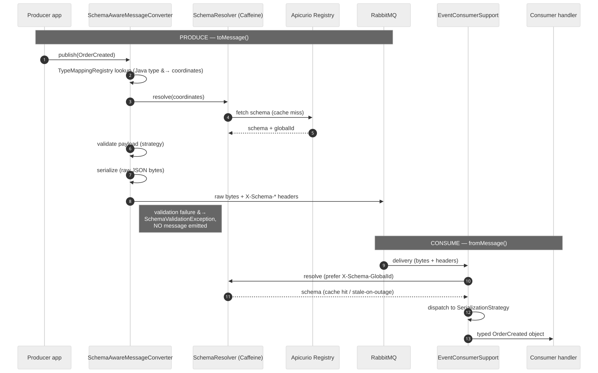

<!--
SPEAKER GUIDANCE (whole deck)
- Audience: architects + CTO. Depth is OK; lead each section with the "why".
- Rendering: this deck is Marp (`marp: true`). Render with:
    npx -y @marp-team/marp-cli docs/presentation/apicurio-schema-governance-deck.md --pdf --html --allow-local-files
  Diagrams are committed SVGs under diagrams/; Mermaid source for each lives in speaker notes
  and in docs/presentation/diagrams/*.mmd so they can be re-rendered or edited.
- It also reads top-to-bottom as plain markdown on GitHub.
-->

<!-- _class: lead -->

# Schema-Governed Messaging

### Apicurio Registry as the schema source-of-truth for **JSON Schema** contracts — enforced as a **CI merge gate** with GitHub Actions

<br/>

**A working POC:** Apicurio Registry 3.2.0 · RabbitMQ · Spring Boot 4.0 on Java 25

---

## The problem we're solving

A **producer** publishes `OrderCreated`; a **consumer** reads it. They agree on the shape *today*.

Then someone adds a field, renames one, or changes a type. With no enforced contract:

- The consumer **silently misreads** the message — or crashes in production.
- Coordination by Slack/docs/tribal knowledge **does not scale** and **fails quietly**.
- The breakage is discovered *at runtime*, in the consumer, often hours after the deploy.

> **The ask:** move the breaking-change detection **left** — to the pull request — and make a
> central registry the **single source of truth** for every message contract.

<!--
This is the CTO-facing framing. The cost of a schema break is a production incident + cross-team
firefight. We want to convert that into a red CI check on a PR that never merges.
-->

---

## What a schema registry is

**Apicurio Registry** is a central service that stores the official, **versioned** definition of
each message type, addressed as `group / artifact-id`, with a **compatibility rule** attached.

| Term | Meaning |
|------|---------|
| **Artifact** | A named schema (e.g. `OrderCreated`) |
| **Version** | One immutable snapshot of an artifact (v1, v2, …) |
| **Compatibility rule** | Policy attached to an artifact: *which changes are allowed?* |
| **Group** | A namespace for organizing artifacts (like a folder) |

This POC governs **two JSON Schema artifacts** in separate groups:

| Group | Artifact | Schema type | Rule |
|-------|----------|-------------|------|
| `events.orders` | `OrderCreated` | **JSON Schema** | **FORWARD** |
| `events.customers` | `CustomerRegistered` | **JSON Schema** | **FORWARD** |

<!--
FORWARD (not BACKWARD) is not arbitrary — it falls out of how Apicurio's JSON Schema
compatibility checker works. We get there in slides 10–12. Flag it now so it's not a surprise.
-->

---

## System architecture



<!--
SPEAKER: walk the three bands.
- Build-time: 5 Maven modules. Single source of versions in the parent POM (Spring Boot 4.0 BOM).
  `schema-messaging-core` is domain-agnostic; the `core ↛ contracts` rule is machine-enforced via
  maven-enforcer bannedDependencies — core can never depend on a contracts module.
- Runtime: producer :8081, consumer :8082 (Spring Boot 4 / Java 25, bytecode 69). Each contracts
  module is a Spring Boot starter that auto-configures its own AMQP topology, so the services carry
  no topology wiring of their own — depending on the module is enough.
- Infra: Apicurio :8080 (UI :8888) backed by Postgres; RabbitMQ :5672 (mgmt :15672). All via docker compose.

MERMAID SOURCE: diagrams/d1-architecture.mmd
-->

---

## One format, a format-agnostic core

The center of the design is `SchemaAwareMessageConverter` (a Spring AMQP `MessageConverter`).
Format-specific behavior lives behind a **`SerializationStrategy` SPI** — today with a single
built-in implementation:

| Detail | JSON Schema implementation |
|--------|--------------------------|
| Strategy | `JsonSchemaStrategy` (networknt Draft 2020-12 + Jackson) |
| Contracts modules | `order-contracts` · `customer-contracts` |
| Strategy depends on | Jackson only (no Spring, no core) |
| Content-type | `application/json` |

Each contracts module is a **self-contained Spring Boot starter**: it contributes its
**`TypeMapping` bean** (*Java type ↔ registry coordinates ↔ schema type ↔ routing key*) **and owns
its AMQP topology** — queues, DLQ, retry ladder, and bindings — via a `@AutoConfiguration`. Put
the module on a service's classpath and it wires both, with no hand-written config in the service.
Core stays domain-agnostic; adding a third format = a strategy + a mapping + a topology auto-config,
all in the new contracts module — **no converter and no service wiring changes**.

<!--
Architect takeaway: the format is a plug-in. The converter, resolver, cache, and failure routing
are all format-neutral. Adding another format (Avro, Protobuf) would be a strategy + mapping, no core changes.
The routing-config-separation refactor pushed topology ownership INTO the contracts modules
(OrderEventTopologyAutoConfiguration / CustomerEventTopologyAutoConfiguration), replacing the old
hand-written AmqpConfiguration in the services — so a contracts module is now a true starter.
-->

---

## The wire format (strict)

The message body is the **raw serialized bytes only** — the plain JSON document, no envelope.
**Schema identity travels entirely in headers.**

```text
┌─ AMQP message ────────────────────────────────────────────┐
│ headers:                                                   │
│   X-Schema-GlobalId   = 42        ← fast path for consumer │
│   X-Schema-Group      = events.orders                      │
│   X-Schema-Artifact   = OrderCreated                       │
│   X-Schema-Version    = 2                                  │
│   X-Message-Id / X-Correlation-Id                          │
│ content-type: application/json                              │
│ body: <raw serialized bytes — nothing else>               │
└────────────────────────────────────────────────────────────┘
```

> No vendor framing in the payload → any consumer (even non-Java) can read the bytes given the
> headers. The registry is the only place schema *content* lives.

<!--
Contrast with the Confluent wire format (magic byte + 4-byte schema id prefixed to the payload).
We deliberately keep identity in headers so the body stays a clean, portable JSON document.
-->

---

## A message's life: produce & consume



<!--
PRODUCE (toMessage): TypeMappingRegistry maps the Java type → coordinates → SchemaResolver fetches
the schema → strategy VALIDATES the payload → serializes → stamps X-Schema-* headers + content-type.
Validation failure throws SchemaValidationException and NO message is emitted (fail-closed).

CONSUME (fromMessage): read X-Schema-* headers → resolve schema (prefer X-Schema-GlobalId to skip
the coordinate lookup) → dispatch to the matching strategy → return the typed object.

MERMAID SOURCE: diagrams/d2-message-lifecycle.mmd
-->

---

## Schema resolution & caching

`SchemaResolver` sits between the converter and the registry, backed by a **Caffeine cache**
(`byGlobalId` + `byCoordinates`):

- **TTL + refresh-after-write** — hot schemas refresh in the background; reads stay fast.
- **Pre-warms on startup** — known coordinates resolved before the first message flows.
- **Serves stale on registry outage** — if Apicurio is down, cached schemas keep traffic moving.
- Throws `RegistryUnavailableException` **only when nothing is cached** — fail, but not eagerly.

> Design point: the registry is on the **control plane**, not the per-message hot path. A registry
> blip degrades to "serve from cache", not "stop processing".

<!--
This is the availability story for the CTO: the registry being a single source of truth does NOT
make it a single point of failure for message flow. Resolution is cached and outage-tolerant.
-->

---

<!-- _class: lead -->

# Compatibility governance
## The core of "schema-governed"

### Why JSON Schema artifacts need FORWARD — not BACKWARD

---

## Evolving OrderCreated — what passes, what fails

`OrderCreated` evolves by **adding optional properties** — v2 adds `promoCode`, `notes`,
`input1`, `userName`; the `required` list never changes.

```json
// v1 (required core fields)         // v2 — current: optional additions
"properties": { "orderId": ...,      "properties": { ...,
  "customerId": ..., "quantity":       "promoCode": { "type": "string" },
  { "type": "integer" }, ... },        "notes":     { "type": "string" },
"required": ["orderId","customerId",   "input1":    { "type": "string" },
  "productId","quantity",              "userName":  { "type": "string" } }
  "totalAmount","currency"]          // required: UNCHANGED
```

<span class="green">✅ Add an optional property</span> — old consumers (Jackson) ignore unknown fields.
<span class="red">❌ Change an existing property's type</span>:

```json
"quantity": { "type": "string" }   // WAS integer — breaks every reader → REJECTED at any level
```

<!--
Rule of thumb (JSON Schema): add optional properties OK; never change a property's type or grow
the required list. The incompatible demo file flips quantity integer→string, which fails under
every compatibility level (FORWARD, BACKWARD, FULL).
-->

---

## FORWARD — why not BACKWARD?

**Rule:** `FORWARD` = *old code must read new data* (**old code, new data → works**).

**The subtlety that trips everyone up:** in Apicurio's JSON Schema checker, adding **any** property
— even an optional one — is classified as `OBJECT_TYPE_PROPERTY_SCHEMAS_NARROWED`.

- **BACKWARD rejects** adding an optional property (sees it as "narrowing").
- **FORWARD accepts** it (old consumers using Jackson ignore unknown fields by default).

```json
// v3 — current: promoCode, input1 added as OPTIONAL → FORWARD-compatible
"properties": { ...,
  "promoCode": { "type": "string" },   // added v2
  "input1":    { "type": "string" } }, // added v3
"required": ["customerId","email","firstName","lastName"]   // unchanged
```

<span class="red">❌ FORWARD-incompatible</span>: add `accountType` **to `required`** — old code can't
satisfy a requirement it never knew about.

<!--
KEY ARCHITECT POINT: "use BACKWARD everywhere" is wrong advice for JSON Schema in Apicurio. The
most common evolution (add an optional field) ONLY validates under FORWARD. This is the single most
important nuance in the whole talk — it's why the two artifacts carry different rules.
Rule of thumb (JSON Schema + FORWARD): add optional props OK; never add/remove a required field or
change a type.
-->

---

## Compatibility modes at a glance

| Mode | Apicurio checks | Typical use |
|------|-----------------|-------------|
| `BACKWARD` | New schema reads **old** data | Binary formats (Protobuf/Avro) — consumers upgraded first |
| `FORWARD` | Old schema reads **new** data | JSON Schema — consumers may lag producers |
| `FULL` | Both directions hold | High-confidence environments |
| `NONE` | No checking | Dev / prototyping only |
| `*_TRANSITIVE` | Same, but vs **every** prior version | Long-lived schemas, many lagging consumers |

**This POC:** `OrderCreated` → **FORWARD** · `CustomerRegistered` → **FORWARD**.

> The rule is a **per-artifact policy** — you choose it to match how that format evolves and how
> your producers/consumers are deployed relative to each other.

---

## Governance via CI — three workflows



<!--
The three workflows form one pipeline:
1. bootstrap (manual, once) — attaches the rules. Without it, nothing is enforced.
2. compat-check (every PR) — read-only dry-run gate.
3. register (post-merge) — the write path.
All run on a self-hosted runner co-located with the standing registry at localhost:8080.

MERMAID SOURCE: diagrams/d3-ci-pipeline.mmd
-->

---

## Workflow 1 — bootstrap (once per environment)

`schema-governance-bootstrap.yml` · trigger: **manual** (`workflow_dispatch`)

Attaches the compatibility rules via the Apicurio REST API. **Idempotent**: a 409 (rule already
exists) is treated as success.

```bash
# Attach FORWARD to both JSON Schema artifacts
curl -X POST ".../v3/groups/events.orders/artifacts/OrderCreated/rules" \
  -H 'Content-Type: application/json' \
  -d '{"ruleType":"COMPATIBILITY","config":"FORWARD"}'

curl -X POST ".../v3/groups/events.customers/artifacts/CustomerRegistered/rules" \
  -H 'Content-Type: application/json' \
  -d '{"ruleType":"COMPATIBILITY","config":"FORWARD"}'
```

> **Without this step, the other two workflows have no rules to enforce** — schemas could change in
> any way and Apicurio would accept them silently.

---

## Workflow 2 — compat-check (the merge gate)

`schema-compat-check.yml` · trigger: **every PR** touching `order-contracts/**` or `customer-contracts/**`

```yaml
on:
  pull_request:
    paths: ['order-contracts/**', 'customer-contracts/**']
steps:
  - run: |
      ./mvnw -pl order-contracts,customer-contracts verify -Pcompat-check \
        -Dapicurio.registry.url=http://localhost:8080
```

The `-Pcompat-check` profile runs the official `apicurio-registry-maven-plugin` with
**`dryRun=true`** — it validates the PR's schema against the **real registered history** but
**writes nothing**.

- <span class="green">PASS</span> → `BUILD SUCCESS`, PR may proceed.
- <span class="red">FAIL</span> → `BUILD FAILURE` + `RuleViolationException`, **merge blocked**.

> Dry-run because registration is one-way — the gate must be safe to run on every PR without
> polluting the registry.

---

## Workflow 3 — register (post-merge write)

`schema-register.yml` · trigger: **push to `main`** touching the contracts modules

```yaml
on:
  push:
    branches: [main]
    paths: ['order-contracts/**', 'customer-contracts/**']
steps:
  - run: |
      ./mvnw -pl order-contracts,customer-contracts apicurio-registry:register \
        -Dapicurio.registry.url=http://localhost:8080
```

- Configured with `ifExists=FIND_OR_CREATE_VERSION` → **idempotent**; re-runs never create dupes.
- Runs **only on `main`** — by the time it runs, Workflow 2 already proved compatibility, so the
  write should always succeed.

> Net effect: the registry's contents are a **projection of `main`**. What's merged is what's
> registered — no manual registration drift.

---

## The gate in action — decision matrix

| Artifact | Change | Rule | Outcome |
|----------|--------|------|---------|
| `OrderCreated` | Add an **optional** property | FORWARD | <span class="green">✅ PASS</span> |
| `OrderCreated` | Change `quantity` type integer→string | FORWARD | <span class="red">❌ BLOCKED</span> |
| `CustomerRegistered` | Add an **optional** property | FORWARD | <span class="green">✅ PASS</span> |
| `CustomerRegistered` | Add a **required** property | FORWARD | <span class="red">❌ BLOCKED</span> |

**A blocked PR shows exactly this:**

```text
[ERROR] PUT .../artifacts/OrderCreated/versions?dryRun=true → HTTP 409
[ERROR] RuleViolationException: Incompatible schema change detected.
[INFO] BUILD FAILURE
```

> The developer sees the failure **on the PR**, with the offending change named — not a 2 a.m. page.

<!--
These four rows map 1:1 to the four real schema files in the repo (order-created.json +
order-created-incompatible.json; customer-registered.json + customer-registered-incompatible.json).
You can demo any of them live with `verify -Pincompatible-demo`.
-->

---

## Runner topology & cost model

All three workflows run on a **self-hosted runner** (`[self-hosted, apicurio-local]`, JDK 25 +
`toolchains.xml`) that **shares the machine** with the standing registry at `localhost:8080`.

| Aspect | With this setup |
|--------|-----------------|
| GitHub Actions minutes | **None consumed** — jobs run on your machine |
| Repo visibility | **Must be private** (fork-PR RCE risk on public) |
| Availability | If the machine is off, jobs **queue** — they don't fail |
| Speed | Fast — registry + `~/.m2` already warm, no per-job startup |
| Scaling | Move runner + registry to an always-on VM, same label & workflows |

> Why self-hosted: the dry-run gate needs to reach a **live registry with real history**. Co-locating
> the runner and the registry makes that a `localhost` call — no secrets, no tunnels.

---

## Failure model — the runtime safety net



<!--
Topology ownership (post routing-config-separation): the contracts-module auto-configurations
(OrderEventTopologyAutoConfiguration / CustomerEventTopologyAutoConfiguration) DECLARE the exchanges,
queues, DLQ, and retry ladder as beans; core's SchemaMessagingConsumerAutoConfiguration contributes
the RabbitAdmin that APPLIES all of them idempotently on startup, plus the DlxMessageRecoverer and
DlxRoutingAdvice. There is no service-local AmqpConfiguration anymore.
EventConsumerSupport.classify() walks the cause chain to decide transient vs permanent.
- PERMANENT (validation/deserialization/serialization/type-mismatch) → straight to DLQ, no retry.
- TRANSIENT (registry-unavailable/schema-not-found/other) → retry exchange.
Retry uses a TTL-ladder trick: a message sits in a retry queue with a TTL; on expiry RabbitMQ
dead-letters it back to events.exchange for redelivery. Ladder = 5s / 30s / 5m, max 3.

MERMAID SOURCE: diagrams/d4-failure-topology.mmd
-->

---

## Transient vs permanent — and forensics

The exception taxonomy **drives** the routing decision:

| Exception | Class | Goes to |
|-----------|-------|---------|
| `SchemaValidationException`, `DeserializationException`, `SerializationException`, `IncompatibleSchemaTypeException` | **Permanent** | straight to DLQ |
| `RegistryUnavailableException`, `SchemaNotFoundException`, *anything else* | **Transient** | retry ladder (5s/30s/5m, max 3) |

Every DLQ message carries `X-Failure-*` headers (reason, message, **stack trace truncated to 4 KB**,
original routing key, timestamp, retry count). Consumer dedupes on `X-Message-Id`.

**Live demo:** `POST /api/orders/poison` publishes garbage JSON bytes → `SchemaValidationException`
(permanent) → lands on `orders.created.dlq` fully annotated. Inspect at `http://localhost:15672`.

> Health: `RegistryHealthIndicator` (core) + `QueueDepthHealthIndicator` (consumer) at
> `/actuator/health` on both services.

---

## Why Maven (and not Gradle — yet)

- Schema registration and the compat gate use the **official `apicurio-registry-maven-plugin`** —
  there is **no trusted Gradle equivalent** for the dry-run/register goals.
- Maven is the POC build **by design**; a Gradle migration is **explicitly deferred post-POC**.
- Build conventions are **enforced**, not conventional:
  - Single source of versions in the parent POM (Spring Boot 4.0.x BOM); modules never re-declare.
  - Java 25 via `maven-toolchains-plugin` + `<release>25</release>` (bytecode 69).
  - `core ↛ contracts` enforced by `maven-enforcer-plugin` `bannedDependencies`.
- Test split is **load-bearing**: Surefire (`*Test.java`, fast, mock-based) vs Failsafe
  (`*IT.java`, Testcontainers, on `verify`).

<!--
If asked "why not Confluent Schema Registry?": Apicurio is open-source/Apache-2, supports JSON
Schema + Avro + Protobuf, has a first-class Maven plugin and REST API, and a v3 API we already
build on. The wire format here is registry-agnostic anyway (identity in headers).
-->

---

## Takeaways & adoption path

**What this POC proves**

1. One registry governs **every message contract** (JSON Schema artifacts) uniformly.
2. Breaking changes are caught **on the PR**, as a red check — not in production.
3. The rule is **per-artifact** and must match the format (**JSON Schema→FORWARD**, since Apicurio
   classifies JSON property additions as narrowing under BACKWARD).
4. Registry contents are a **projection of `main`**; resolution is **cached & outage-tolerant**.
5. Bad messages are **contained** (DLQ + retry ladder), not lost or silently dropped.

**How a team rolls this out**

- Stand up Apicurio (+ Postgres) → run **bootstrap** once per environment.
- Add the **compat-check** workflow + make it a **required status check** on `main`.
- Add **register** on merge. Pick each artifact's rule from how that format evolves.

---

<!-- _class: lead -->

# Appendix
## Command cheat sheet

---

## Command cheat sheet

```bash
# --- Infra (Postgres, Apicurio + UI, RabbitMQ) ---
docker compose up                       # cold start → all-healthy

# --- Register schemas + attach rules (host cold-start) ---
./mvnw -pl order-contracts,customer-contracts apicurio-registry:register \
  -Dapicurio.registry.url=http://localhost:8080
#   OrderCreated / CustomerRegistered (both JSON Schema) → FORWARD

# --- Compat gate (what a PR runs; read-only dry-run) ---
./mvnw -pl order-contracts,customer-contracts verify -Pcompat-check

# --- Incompatible-change demos (MUST fail with INCOMPATIBLE) ---
./mvnw -pl order-contracts    verify -Pincompatible-demo -Dapicurio.registry.url=http://localhost:8080
./mvnw -pl customer-contracts verify -Pincompatible-demo -Dapicurio.registry.url=http://localhost:8080

# --- Run services & exercise the DLQ ---
./mvnw -pl producer-service spring-boot:run     # :8081
./mvnw -pl consumer-service spring-boot:run     # :8082
curl -X POST http://localhost:8081/api/orders/poison   # → orders.created.dlq

# --- Render this deck ---
npx -y @marp-team/marp-cli docs/presentation/apicurio-schema-governance-deck.md \
  --pdf --html --allow-local-files
```

**UIs:** Apicurio `http://localhost:8888` · RabbitMQ `http://localhost:15672` (guest/guest) ·
health `:8081/actuator/health`, `:8082/actuator/health`

---

## Source material (in this repo)

This deck distills:

- `docs/short-tutorial.md` — compatibility-mode narrative + the three workflows
- `docs/CI-SCHEMA-TESTING-GUIDE.md` — change-type → outcome decision matrix + worked examples
- `docs/github_ci_steps.md` — workflow wiring, branch protection, cost model
- `docs/TECHNICAL-REPORT.md` — message lifecycle, resolution/caching, failure topology
- `.github/workflows/{schema-compat-check,schema-register,schema-governance-bootstrap}.yml`
- `CLAUDE.md` — architecture, wire format, exception taxonomy

> Diagrams: editable Mermaid source in `docs/presentation/diagrams/*.mmd`; rendered SVGs alongside.
> Re-render with `npx -y @mermaid-js/mermaid-cli -i <file>.mmd -o <file>.svg -t neutral -b white`.
