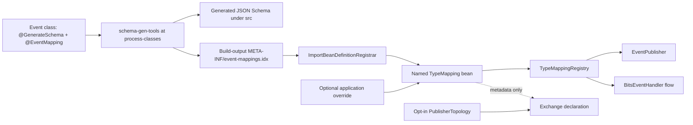

# 13 — Annotation-driven event mappings with a build-generated index

**Status:** Proposed · **Type:** Architecture / developer experience  
**Review:** Eng review approved direction; registration, naming, and index lifecycle locked below.

## What to build

Replace the seven hand-written `TypeMapping` `@Bean` methods with declarative metadata on each
event class. Keep schema generation, runtime mapping registration, and publisher-owned exchange
declaration as separate concerns:

- `@GenerateSchema` marks an event class for build-time JSON Schema generation.
- New `@EventMapping` describes its schema identity and AMQP route.
- `schema-gen-tools` validates both annotations and writes a deterministic event index during
  `process-classes`.
- Contracts auto-configuration reads the index and registers one named `TypeMapping` bean per
  event via `ImportBeanDefinitionRegistrar`.
- `*PublisherTopology` remains opt-in and remains the only exchange declaration path.

Do not perform runtime classpath scanning. Do not change `schema-messaging-core`: it continues to
inject `List<TypeMapping>`, select mappings, and build `TypeMappingRegistry`.

## Annotation contract

Add this domain-agnostic annotation in `event-contract-kit`:

```java
@Documented
@Retention(RUNTIME)
@Target(TYPE)
public @interface EventMapping {
    String groupId();
    String exchange();
    String routingKey();
    String artifactId() default "";
    SchemaType schemaType() default SchemaType.JSON;
}
```

Example:

```java
@GenerateSchema
@EventMapping(
        groupId = "events.orders",
        exchange = OrderEventRouting.EXCHANGE,
        routingKey = OrderEventRouting.CREATED_ROUTING_KEY)
public final class OrderCreated { ... }
```

Rules:

- Empty `artifactId` means `javaType.getSimpleName()`.
- `groupId`, `exchange`, and `routingKey` are required and must be non-blank.
- Reuse `*EventRouting` constants for exchange and routing values. Do not derive them from class
  names. (Convention + review only — build cannot prove a constant was used.)
- Keep `@EventMapping` free of Spring annotations and behavior.
- Do not add queue, DLQ, retry, TTL, consumer, service, durability, or schema-version fields.
- Keep one mapping per Java type. Do not make the annotation repeatable.
- Annotation metadata never declares an exchange.
- Annotated types must be top-level public immutable classes. Reject nested, local, abstract, interface,
  enum, Java record types, and non-public types.

## Build-time index

Extend `SchemaGeneratorCli` and `GenerateSchemaScanner` in `schema-gen-tools`. The existing
contracts-module `exec-maven-plugin` execution already runs at `process-classes` with the compiled
classes directory and base package. During that execution:

1. Discover `@GenerateSchema` event classes under the configured package.
2. Load classes without static initialization.
3. Require a paired `@EventMapping`.
4. Validate effective metadata (including type shape and bean-name uniqueness).
5. Generate JSON Schemas as today.
6. Atomically replace `${project.build.outputDirectory}/META-INF/event-mappings.idx`.

### Index lifecycle

- Index is **build output only**. Write it under `${project.build.outputDirectory}/META-INF/`.
- Do **not** commit the index under `src/main/resources`.
- Regenerate on every `process-classes`. Packaging/IT asserts the jar contains the index.
- No `git diff` drift gate for the index (unlike committed schemas under
  `src/main/resources/schemas/`).

Index format:

- UTF-8.
- One event FQCN per line.
- Lexically sorted.
- Final trailing newline.
- No timestamps or machine-specific paths.

Keep `schema-gen-tools` free of compile dependencies on contracts and `event-contract-kit`.
Continue matching annotations by FQCN and read `@EventMapping` attributes reflectively.

Build-time validation must reject:

- Missing `@GenerateSchema` / `@EventMapping` pairing.
- Blank required attributes.
- Unsupported or invalid annotated types (see type-shape rule above).
- Duplicate Java types.
- Duplicate effective `(groupId, artifactId)` coordinates within a contracts module.
- Deterministic mapping-bean name collisions.

## Runtime registration

Add an index reader and reusable registrar in `event-contract-kit`.

### Spring hook (locked)

- Each `*TypeMappingAutoConfiguration` stays `@AutoConfiguration` and `@Import`s a shared
  `ImportBeanDefinitionRegistrar` (or a thin domain-scoped subclass that supplies the exact
  event package).
- Registrar algorithm per indexed type in that package:
  1. Compute bean name (see below).
  2. If `registry.containsBeanDefinition(beanName)`, **skip** — programmatic equivalent of
     `@ConditionalOnMissingBean(name = …)`. App/user beans win; contracts auto-config must not
     overwrite.
  3. Otherwise `registerBeanDefinition` a singleton `TypeMapping` built from the annotation.
- Do not use runtime package scanning. Do not invent a second registration path.

### Index load and merge

1. Enumerate all classpath resources named `META-INF/event-mappings.idx`.
2. Parse each resource; fail startup on missing resource for an active contracts auto-config,
   malformed content, or empty effective set when the package should have events.
3. Merge across jars:
   - Same FQCN appearing in multiple indexes: **de-duplicate** (identical entry; first-wins by
     deterministic resource URL order). Conflicting content for the same FQCN is impossible
     while the index stores only FQCNs — still fail if the same FQCN loads two different
     `@EventMapping` effective values after class load (annotation/index mismatch path).
   - Duplicate effective `(groupId, artifactId)` across different FQCNs from any loaded jar:
     **fail startup**.
4. Each contracts auto-configuration filters entries with
   `class.getPackageName().equals(expectedPackage)` — **exact package match**, not `startsWith`.
   Event classes must remain in that package (documented invariant).
5. Load each indexed class and read its typed `@EventMapping`.
6. Convert metadata to `TypeMapping` **only** via
   `Mappings.forDomain(groupId, exchange).json(javaType, artifactId, routingKey)` (or the
   overload that preserves explicit `SchemaType` if/when non-JSON is added). Do not construct
   `TypeMapping` / `SchemaCoordinates` ad hoc in the registrar.
7. Register one bean per event (subject to the skip-if-present rule).

### Bean-name algorithm (locked)

```
beanName = java.beans.Introspector.decapitalize(simpleName) + "Mapping"
```

Examples (must stay compatible):

- `OrderCreated` → `orderCreatedMapping`
- `CustomerAddressAdded` → `customerAddressAddedMapping`

Build-time and unit tests must cover `Introspector.decapitalize` edge cases (e.g. names with a
leading acronym run such as `URLEvent` → `URLEventMapping`).

Fail startup on a missing/malformed index, duplicate coordinates across loaded jars, or
annotation/index mismatch. Do not silently fall back to runtime package scanning.

### Interaction with `TypeMappingSelection`

Unchanged. `events.mappings.include` / `exclude` match simple name, FQCN, or `groupId:artifactId`
— **not** Spring bean names. Bean-name overrides and selection filters are different knobs.

## Contracts changes

- Annotate all four order event classes and all three customer event classes.
- Replace manual methods in `OrderTypeMappingAutoConfiguration` and
  `CustomerTypeMappingAutoConfiguration` with `@Import` of the indexed registrar scoped to
  `com.example.contracts.orders` and `com.example.contracts.customers` respectively.
- Keep both auto-configuration import files.
- Keep `OrderEventRouting`, `CustomerEventRouting`, `OrderPublisherTopology`, and
  `CustomerPublisherTopology`.
- Keep `Mappings` in `event-contract-kit` — still the single conversion path (and useful for
  app-level overrides / tests).
- Keep publisher topology opt-in. A contracts jar alone must not declare exchanges.

## Data flow



## Tests

### `schema-gen-tools`

- Deterministic sorted index with trailing newline.
- Atomic stale-index replacement.
- No static initialization during discovery.
- Paired-annotation enforcement.
- Blank metadata and every duplicate/collision failure.
- Unsupported type-shape failures (nested, Java record, etc.).
- Bean-name algorithm + `Introspector.decapitalize` edge cases at build time.
- Existing schema output remains byte-for-byte unchanged.
- Index is written under outputDirectory only (not under `src/main/resources`).

### `event-contract-kit`

- Multi-jar index-resource merging and FQCN de-duplication.
- Exact package filtering (`equals`, not prefix).
- Missing and malformed index failures.
- Duplicate `(groupId, artifactId)` across jars fails startup.
- Annotation-to-`TypeMapping` conversion goes through `Mappings`.
- Default and explicit artifact IDs.
- Deterministic bean names including decapitalize edge cases.
- Existing application bean override: `registry.containsBeanDefinition` skip.
- Spring context test: app `@Bean("orderCreatedMapping")` wins; other generated mappings still
  present.

### Contracts and core

- All seven indexed events produce exact expected coordinates, schema types, routing keys, and
  exchanges.
- Packaged order/customer jars contain their expected indexes under `META-INF/`.
- Existing `TypeMappingSelection`, registry, handler scanner, publisher, and topology tests remain
  green.
- Architecture coverage proves indexed mapping registration declares no exchanges and preserves
  `core ↛ contracts`.

## Documentation

- Add an ADR that **partially supersedes** ADR-0007's manual per-event `@Bean` decision while
  retaining named override semantics, `Mappings`, and ADR-0008 exchange ownership.
- Update `CONTEXT.md`, `README.md`, and `docs/TUTORIAL.md`.
- Document new-event onboarding: create an event class in the domain event package, add both annotations
  (reuse `*EventRouting` constants), build, commit generated schema. No mapping `@Bean` method.
  Index is regenerated automatically — do not commit it.
- Document index generation, deterministic format, override behavior, exact-package invariant,
  `TypeMappingSelection` vs bean-name overrides, and build/startup failures.

## Acceptance criteria

- [ ] All seven event classes carry `@GenerateSchema` and `@EventMapping`.
- [ ] `process-classes` generates schemas and one deterministic index per contracts module under
      build output (not committed under `src/main/resources`).
- [ ] Registration uses `ImportBeanDefinitionRegistrar` + `containsBeanDefinition` skip.
- [ ] Bean names use `Introspector.decapitalize(simpleName) + "Mapping"`.
- [ ] Annotation → `TypeMapping` goes through `Mappings`.
- [ ] No runtime classpath package scan exists.
- [ ] No manual per-event `TypeMapping` bean methods remain.
- [ ] Existing bean names and per-event override behavior are preserved.
- [ ] `schema-messaging-core` has no contracts dependency and requires no mapping-discovery change.
- [ ] Consumers never declare exchanges; publisher topology stays opt-in.
- [ ] Schema regeneration creates no unexpected schema diff.
- [ ] Focused module tests pass:
      `./mvnw -pl schema-gen-tools,event-contract-kit,order-contracts,customer-contracts,schema-messaging-core -am test`.
- [ ] Packaged indexes are verified:
      `./mvnw -pl order-contracts,customer-contracts -am package -DskipTests`.
- [ ] Full unit suite passes: `./mvnw test`.

## Phasing

Same design, one PR preferred. If splitting for reviewability: land `event-contract-kit` +
`schema-gen-tools` + one contracts module first; migrate the second once green. Do not ship
annotation-without-index or keep manual beans as a half-step.

## Blocked by

None.
