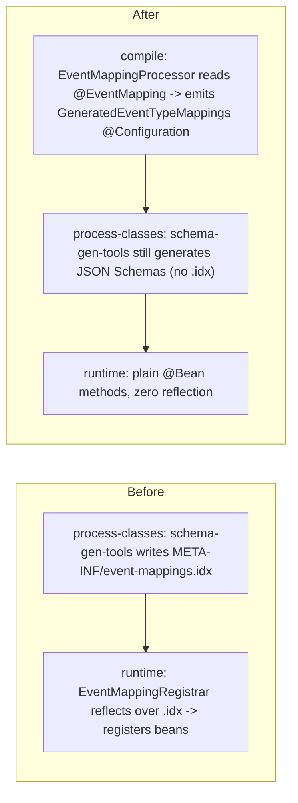

# 15 — Build-generated `TypeMapping` config via an annotation processor

**Status:** Proposed · **Type:** Architecture / build tooling
**Supersedes (in part):** Spec 13 / ADR-0010 — the runtime index-driven registration
(`@RegisterEventMappings` + `EventMappingRegistrar` + `IndexedEventMappings` +
`EventMappingIndexReader`/`Writer`).
**Obsoletes:** Spec 14 (memoize the merged event-mapping index) — the index it optimizes is removed.

## Problem

`TypeMapping` beans are registered at runtime by reflection: each `*TypeMappingAutoConfiguration`
is meta-annotated `@RegisterEventMappings("pkg")`, which imports `EventMappingRegistrar`
(an `ImportBeanDefinitionRegistrar`). At context refresh it reads the build-time
`META-INF/event-mappings.idx`, `Class.forName`s every FQCN, reads `@EventMapping` reflectively,
builds a `TypeMapping` via `Mappings`, and registers one bean per record
([EventMappingRegistrar.java](../event-contract-kit/src/main/java/com/example/amqp/topology/mapping/EventMappingRegistrar.java),
[IndexedEventMappings.java](../event-contract-kit/src/main/java/com/example/amqp/topology/mapping/IndexedEventMappings.java)).

This works but pays for it at runtime: reflection, a classpath resource merge, `Class.forName`
across all domains, and per-loader index loading (the reason Spec 14 exists at all). The mapping
data is fully known at build time — it need not be rediscovered when the app boots.

## What to build

Move registration to **build time**. An annotation processor (APT) reads `@EventMapping` during
each contracts module's own `compile` and emits an explicit `@Configuration` of `@Bean TypeMapping`
methods, which javac compiles in the same build. At runtime there is **no reflection, no index
read** — just plain Spring `@Bean` methods.

Preserve every externally-visible semantic:

- Deterministic bean name `Introspector.decapitalize(simpleName) + "Mapping"`.
- `@ConditionalOnMissingBean(name = ...)` per method — application overrides still win.
- `TypeMapping` built **only** via `Mappings.forDomain(group, exchange).json(type, artifactId, routingKey)`.
- Both roles auto-load mappings; mapping registration never declares an exchange.
- Build fails on blank `groupId`/`exchange`/`routingKey`, `schemaType != JSON`, and within-module
  duplicate coordinates or bean names.

JSON Schema generation (`@GenerateSchema` + `schema-gen-tools` at `process-classes`) is unchanged.
Only the `.idx` writing is removed.

## Design

### Flow: before vs after



### Processor

Lives in `schema-gen-tools` — build-only, never on a runtime classpath, already reads
`@EventMapping` by FQCN so it keeps **no** compile dependency on `event-contract-kit`.

- `EventMappingProcessor extends AbstractProcessor`,
  `@SupportedAnnotationTypes("com.example.amqp.topology.mapping.EventMapping")`,
  source version `RELEASE_25`; registered via
  `META-INF/services/javax.annotation.processing.Processor`.
- Reads each annotated `TypeElement`'s `@EventMapping` values through `AnnotationMirror` (constant
  refs like `CustomerEventRouting.EXCHANGE` are resolved to their string values by javac).
- Fails via `Diagnostic.Kind.ERROR` on: blank `groupId`/`exchange`/`routingKey`,
  `schemaType != JSON`, within-module duplicate `(groupId, artifactId)` or bean name.
- Emits **one** `@Configuration` per module via `Filer` into `<eventPackage>.topology`
  (customers → `com.example.contracts.customers.topology.GeneratedEventTypeMappings`), methods
  sorted by FQCN for byte-stable output:

```java
@Bean
@ConditionalOnMissingBean(name = "customerRegisteredMapping")
TypeMapping customerRegisteredMapping() {
    return Mappings.forDomain("events.customers", "events.customers.exchange")
        .json(com.example.contracts.customers.CustomerRegistered.class,
              "CustomerRegistered", "customer.registered");
}
```

### Registration wiring

Keep the hand-written `@AutoConfiguration` markers (already in each module's
`AutoConfiguration.imports`); swap `@RegisterEventMappings("...")` for
`@Import(GeneratedEventTypeMappings.class)`. The `.imports` resource is untouched. A
same-compilation forward reference to a generated type is the standard MapStruct/Dagger pattern —
javac's multi-round processing compiles the generated class first; works in Maven and in IDEs with
annotation processing enabled.

### Build wiring

Add `annotationProcessorPaths` → `schema-gen-tools` to `maven-compiler-plugin` in each contracts
module. The processor uses only JDK APT + `java.*`; `schema-gen-tools`' victools deps ride the
processor path but are unused by codegen and isolated from the compile classpath.

### Accepted trade-off

The runtime **cross-jar bean-name-collision** guard in `IndexedEventMappings` is removed.
`TypeMappingRegistry` still throws on cross-jar duplicate **coordinates** and duplicate
**javaType** at construction; two domains sharing a Java simple name would now silently drop one
mapping (the `@ConditionalOnMissingBean` skip) and surface as a lookup miss, not a startup abort.
Documented in the new ADR.

## Changes

New:

- `schema-gen-tools/src/main/java/com/example/schemagen/EventMappingProcessor.java`
- `schema-gen-tools/src/main/resources/META-INF/services/javax.annotation.processing.Processor`

Edit:

- [OrderTypeMappingAutoConfiguration.java](../order-contracts/src/main/java/com/example/contracts/orders/topology/OrderTypeMappingAutoConfiguration.java),
  [CustomerTypeMappingAutoConfiguration.java](../customer-contracts/src/main/java/com/example/contracts/customers/topology/CustomerTypeMappingAutoConfiguration.java)
  — `@RegisterEventMappings` → `@Import(GeneratedEventTypeMappings.class)`.
- [order-contracts/pom.xml](../order-contracts/pom.xml), [customer-contracts/pom.xml](../customer-contracts/pom.xml)
  — add `annotationProcessorPaths` → `schema-gen-tools`.
- [SchemaGeneratorCli.java](../schema-gen-tools/src/main/java/com/example/schemagen/SchemaGeneratorCli.java)
  — drop the `EventMappingIndexWriter.write(...)` call (keep schema gen + `EventMappingValidator`
  fail-fast).

Delete (runtime machinery + tests/fixtures):

- `event-contract-kit`: `RegisterEventMappings`, `EventMappingRegistrar`, `IndexedEventMappings`,
  `EventMappingIndexReader`, `EventMappingRegistrationException`, and tests
  `IndexedEventMappingsTest`, `EventMappingRegistrarTest`, `EventMappingIndexReaderTest`,
  `IndexClassLoaders`, `indexfixtures/**`.
- `schema-gen-tools`: `EventMappingIndexWriter` + `EventMappingIndexWriterTest`.
- contracts: `OrderEventMappingIndexTest`, `CustomerEventMappingIndexTest`.

Delete (superseded planning):

- `spec/14-memoize-event-mapping-index-per-classloader.md`, `.scratch/memoize-event-mapping-index/`.
  The uncommitted memoization edits to `EventMappingRegistrar`/`IndexedEventMappings`/
  `IndexedEventMappingsTest` become moot (files removed).

Docs:

- New `docs/adr/ADR-0011-build-generated-type-mapping-config.md`.
- Mark [ADR-0010](../docs/adr/ADR-0010-annotation-driven-event-mappings.md) runtime-registration
  section Superseded.
- Update `CLAUDE.md`, `CONTEXT.md`, `docs/TUTORIAL.md` references to the index/registrar.

## Tests

- **Processor unit test** (in-JVM compile). Default: hand-rolled with
  `ToolProvider.getSystemJavaCompiler()` (no new dependency). Alternative:
  `com.google.testing.compile:compile-testing` (test scope) for richer assertions — decide before
  building. Assert generated source content and ERROR diagnostics on blank/non-JSON/duplicate.
- **Contracts context tests** — `ApplicationContextRunner` asserting `orderCreatedMapping` /
  `customerRegisteredMapping` etc. beans exist with correct coordinates + routing, and that an
  application `@Bean` of the same name wins (app-override-wins).

## Risks / gotchas

- **Processor path resolution.** `annotationProcessorPaths` resolves `schema-gen-tools` from the
  reactor/local repo (not the `target/classes` hack the exec-plugin uses). Full reactor builds it
  first; a stale `~/.m2` copy could shadow it. Mitigate via `./mvnw clean install`; note in POMs.
- **Two validation sites.** Processor (at `compile`) and `EventMappingValidator` (at
  `process-classes`, still needed for schema gen) overlap on annotation checks. Redundant but both
  fail-fast — acceptable.

## Acceptance criteria

- [ ] `@RegisterEventMappings` and the runtime index machinery are gone; nothing reads
      `META-INF/event-mappings.idx` at runtime (the file is no longer written).
- [ ] Each contracts module compiles a generated `@Configuration` with one
      `@Bean @ConditionalOnMissingBean(name=...) TypeMapping` per `@EventMapping` record, built via
      `Mappings`, with the locked `…Mapping` bean names.
- [ ] Build fails on blank required attrs, `schemaType != JSON`, within-module duplicate
      coordinates/bean names.
- [ ] App-override-wins preserved (context test).
- [ ] Spec 14 + `.scratch/memoize-event-mapping-index/` removed; no dangling references.
- [ ] ADR-0011 added; ADR-0010/CLAUDE.md/CONTEXT.md/TUTORIAL updated.
- [ ] `./mvnw clean install` green; producer/consumer boot with generated beans.
- [ ] Focused suite passes:
      `./mvnw -pl event-contract-kit,order-contracts,customer-contracts,schema-messaging-core -am test`.

## Phasing

Single PR. Processor + wiring + deletions + docs land together (the runtime path and the codegen
path are mutually exclusive — no half state).

## Blocked by

None.
