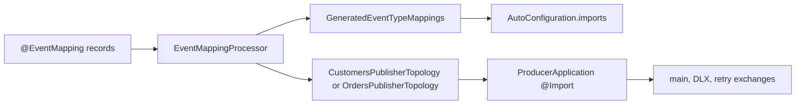

# 16 — Build-generated publisher topology

**Status:** Proposed · **Type:** Architecture / build tooling  
**Extends:** Spec 15 / ADR-0011 build-time `@EventMapping` processing  
**Preserves:** ADR-0008 publisher-owned, opt-in exchange declaration

## Goal

Generate each contracts module's repeated `*PublisherTopology` Spring configuration from its
existing `@EventMapping` metadata. Keep domain exchanges publisher-owned and explicitly imported.

## Locked decisions

- One domain and one main exchange per `*-contracts` module.
- Reuse aggregated `@EventMapping` metadata. Add no domain annotation or Gradle processor option.
- Derive the generated class name from the event package's final segment:
  - `com.example.contracts.customers` → `CustomersPublisherTopology`
  - `com.example.contracts.orders` → `OrdersPublisherTopology`
- Derive the Spring bean prefix from the `groupId` final segment:
  - `events.customers` → `customersExchange`, `customersDlx`, `customersRetryExchange`
- Keep hand-written `CustomerEventRouting` and `OrderEventRouting`. They remain the source of
  exchange and routing-key constants referenced by event annotations.
- Generate plain `@Configuration`, never `@AutoConfiguration`.
- Never list a generated publisher topology in `AutoConfiguration.imports`.

## Architecture

`EventMappingProcessor` already aggregates every `@EventMapping` record in a contracts module and
emits `GeneratedEventTypeMappings`. Extend the same validated generation pass to emit a second,
opt-in source file.



The mapping configuration continues to self-activate. The publisher topology does not. A contracts
jar on a consumer classpath still declares no exchanges.

## Processor design

### Domain metadata

After existing per-event validation, collect the effective `groupId` and `exchange` values from all
sorted `MappingDescriptor` instances.

Compilation fails if:

- mappings contain more than one `groupId`;
- mappings contain more than one `exchange`;
- the final `groupId` segment is not a valid lower-camel Java identifier;
- the final event-package segment is not a valid Java identifier;
- no valid descriptor remains.

Diagnostics name both conflicting event types and values. On any error, emit neither generated
source nor `AutoConfiguration.imports`.

Use a focused immutable descriptor:

```java
record DomainDescriptor(
        String groupId,
        String exchange,
        String beanPrefix,
        String publisherTopologySimpleName) {}
```

Derivation rules:

```java
beanPrefix = lastSegment(groupId);
publisherTopologySimpleName = capitalize(lastSegment(eventPackage))
        + "PublisherTopology";
```

No singularization. This keeps naming deterministic for arbitrary domains.

### Generated source

For customers, emit
`com.example.contracts.customers.topology.CustomersPublisherTopology`:

```java
package com.example.contracts.customers.topology;

import com.example.amqp.topology.DomainExchanges;
import com.example.amqp.topology.DomainTopology;
import org.springframework.amqp.core.TopicExchange;
import org.springframework.boot.autoconfigure.condition.ConditionalOnMissingBean;
import org.springframework.context.annotation.Bean;
import org.springframework.context.annotation.Configuration;

/**
 * Generated publisher-owned exchange topology. Import explicitly from the sole publisher.
 * Do not edit — regenerated on every compile.
 */
@Configuration
public class CustomersPublisherTopology {

    private static final DomainExchanges EX =
            DomainTopology.of("events.customers.exchange");

    @Bean("customersExchange")
    @ConditionalOnMissingBean(name = "customersExchange")
    public TopicExchange customersExchange() {
        return EX.main();
    }

    @Bean("customersDlx")
    @ConditionalOnMissingBean(name = "customersDlx")
    public TopicExchange customersDlx() {
        return EX.dlx();
    }

    @Bean("customersRetryExchange")
    @ConditionalOnMissingBean(name = "customersRetryExchange")
    public TopicExchange customersRetryExchange() {
        return EX.retry();
    }
}
```

`OrdersPublisherTopology` follows the same template with `orders*` bean names and
`events.orders.exchange`.

The generated code delegates all exchange construction and DLX/retry naming to
`DomainTopology.of(exchange)`. The processor must not duplicate `TopologyNaming` rules.

### Output and resource rules

- Generate both source files through `Filer#createSourceFile`, using every annotated event type as
  an originating element.
- Keep output byte-stable: no timestamp; deterministic package, class, method, and import order.
- `writeImports(...)` receives only `GeneratedEventTypeMappings`.
- Do not create another Spring imports resource.
- Keep `schema-gen-tools` free of compile dependencies on Spring, contracts, core, and
  `event-contract-kit`; generated types are referenced by FQCN strings.

## Implementation plan

### Task 1 — Processor tests and domain validation

**Files**

- Modify `schema-gen-tools/src/test/java/com/example/schemagen/EventMappingProcessorTest.java`
- Modify `schema-gen-tools/src/main/java/com/example/schemagen/EventMappingProcessor.java`

Steps:

1. Extend the in-memory compiler stubs with `DomainExchanges`, `DomainTopology`, `TopicExchange`,
   and `Configuration`.
2. Add a happy-path assertion for
   `demo.events.topology.EventsPublisherTopology`, including its three exact bean names and
   `DomainTopology.of("events.demo.exchange")`.
3. Assert `AutoConfiguration.imports` contains only
   `demo.events.topology.GeneratedEventTypeMappings`.
4. Add failure tests for mixed `groupId`, mixed `exchange`, and invalid derived Java identifiers.
5. Run:

   ```bash
   ./gradlew :schema-gen-tools:test --tests EventMappingProcessorTest
   ```

   Expected: new tests fail before implementation, then pass after implementation.

6. Refactor `generate()` into validation plus two render/write paths:

   ```java
   writeSource(mappingFqcn, renderMappings(packageName, descriptors));
   writeSource(topologyFqcn, renderPublisherTopology(packageName, domain));
   writeImports(mappingFqcn);
   ```

7. Keep the existing all-or-nothing behavior. Validate fully before the first `Filer` write.

### Task 2 — Contracts and producer migration

**Files**

- Delete `customer-contracts/src/main/java/com/example/contracts/customers/topology/CustomerPublisherTopology.java`
- Delete `order-contracts/src/main/java/com/example/contracts/orders/topology/OrderPublisherTopology.java`
- Modify `producer-service/src/main/java/com/example/producer/ProducerApplication.java`
- Modify `customer-contracts/src/test/java/com/example/contracts/customers/topology/CustomerTypeMappingRegistrationTest.java`
- Modify `order-contracts/src/test/java/com/example/contracts/orders/topology/OrderTypeMappingRegistrationTest.java`
- Modify `consumer-service/src/test/java/com/example/consumer/support/PublisherOwnedExchanges.java`

Replace producer imports with:

```java
import com.example.contracts.customers.topology.CustomersPublisherTopology;
import com.example.contracts.orders.topology.OrdersPublisherTopology;

@Import({OrdersPublisherTopology.class, CustomersPublisherTopology.class})
```

Update topology context tests to import the generated classes and assert:

- exactly three `TopicExchange` beans per domain;
- existing bean names remain unchanged;
- main/DLX/retry names remain unchanged;
- an application bean with the same name wins;
- mapping auto-configuration alone declares zero exchanges.

Run:

```bash
./gradlew :customer-contracts:test :order-contracts:test :producer-service:test
```

Expected: all tests pass with no hand-written publisher topology class.

### Task 3 — Ownership regression tests and docs

**Files**

- Verify `schema-messaging-core/src/test/java/com/example/messaging/core/config/ContractsJarDeclaresNoTopologyWithoutHandlersTest.java`
- Verify `schema-messaging-core/src/test/java/com/example/messaging/core/config/ServiceQueueTopologyDeclaresNoExchangesTest.java`
- Modify `docs/adr/ADR-0011-build-generated-type-mapping-config.md`
- Modify `docs/adr/ADR-0008-publisher-owned-messaging-topology.md`
- Modify `README.md`
- Modify `docs/TUTORIAL.md`
- Modify `CONTEXT.md`
- Modify `CLAUDE.md`

Document the two processor outputs and their different activation rules:

- `GeneratedEventTypeMappings`: auto-loaded through `AutoConfiguration.imports`.
- `*sPublisherTopology`: never auto-loaded; explicit publisher `@Import` only.

Update onboarding examples to import `OrdersPublisherTopology` and
`CustomersPublisherTopology`.

Run:

```bash
./gradlew test
./gradlew check
```

Expected: fast unit suite and Testcontainers integration suite pass.

## Acceptance criteria

- [ ] Every contracts module with valid `@EventMapping` records gets one generated publisher
      topology.
- [ ] Generated topology class names use the plural event-package segment.
- [ ] Existing exchange bean names and broker exchange names do not change.
- [ ] Mixed `groupId` or mixed `exchange` values fail compilation before any output is emitted.
- [ ] Generated publisher topology is plain `@Configuration`.
- [ ] `AutoConfiguration.imports` lists only `GeneratedEventTypeMappings`.
- [ ] Contracts jars alone still declare no exchanges.
- [ ] Producer explicitly imports generated topology classes.
- [ ] Consumer imports no publisher topology.
- [ ] `schema-gen-tools` gains no forbidden module or Spring dependency.
- [ ] Generated output is deterministic.
- [ ] Hand-written `CustomerPublisherTopology` and `OrderPublisherTopology` are removed.
- [ ] `./gradlew test` and `./gradlew check` pass.

## Phasing

Single change set. Processor output, tests, producer imports, hand-written class deletion, and docs
must land together. A partial migration leaves imports unresolved or risks duplicate configuration.

## Out of scope

- Multiple domains or exchanges in one contracts module.
- Generating `*EventRouting`.
- Auto-loading publisher topology.
- Queue, DLQ, binding, or retry-ladder generation changes.
- Runtime schema-registry behavior.

## Blocked by

None.
