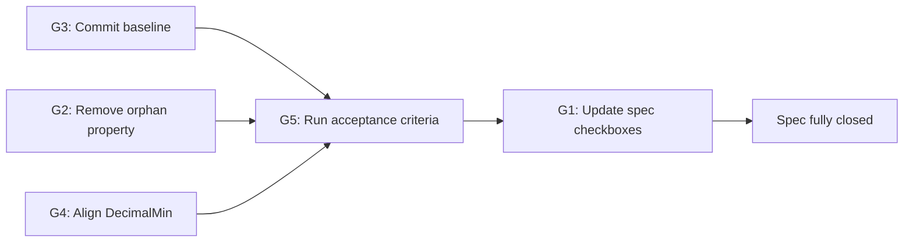

# Gap Analysis: Code-First Schema Spec vs Current Codebase

**Date:** 2026-07-07  
**Spec:** [`spec/code-first-schema.md`](code-first-schema.md)  
**Status:** Implementation largely complete; documentation, cleanup, and verification remain.

---

## Summary

The code-first migration (Phases R0–5) is implemented in the working tree. Six event records, generated schemas, `schema-gen-tools`, core AMQP topology, producer/consumer wiring, governance profiles, and data-driven CI workflows are all present. The main gaps are:

1. Spec task checkboxes not updated (Phases 2–4 still unchecked)
2. One dead `jsonschema2pojo` property in the root POM
3. All Phase 2–4 work uncommitted
4. One `@DecimalMin` semantics mismatch vs the spec
5. Acceptance criteria not yet verified

---

## G1 — Spec task checkboxes stale (documentation gap)

**Severity:** Low  
**Spec reference:** Tasks section, Phases 2–4

Phases 2, 3, and 4 remain `[ ]` (unchecked) in `code-first-schema.md`, but the implementation is complete. Phase 5 (docs/CI) is marked `[x]` while the tasks it depends on were never ticked.

| Task | Description | Actual state |
|------|-------------|--------------|
| T-2.1 | Author three order records | Done — `OrderCreated`, `OrderShipped`, `OrderCancelled` |
| T-2.2 | Author three customer records + `Address` + `CustomerTier` | Done |
| T-2.3 | Remove `jsonschema2pojo` + old schemas from contract POMs | Mostly done — see G2 |
| T-2.4 | Generate + commit all six `*.schema.json` | Done in working tree — see G3 |
| T-3.1 | Slim `*EventRouting` to per-event String constants | Done |
| T-3.2 | Move AMQP topology into `schema-messaging-core` | Done |
| T-3.3 | TypeMapping beans (producer + consumer) for all six | Done |
| T-3.4 | Producer endpoint per event; drop manual validation | Done |
| T-3.5 | Consumer listener per queue; registry-driven health | Done |
| T-4.1 | Hoist apicurio plugin + profiles into parent POM | Done |
| T-4.2 | Re-seed v1 + attach FORWARD rules (bootstrap) | Done — workflow exists |

**Fix:** Check off T-2.1 through T-4.2 in `code-first-schema.md`.

---

## G2 — Root POM orphan property (T-2.3 incomplete)

**Severity:** Medium  
**Spec reference:** T-2.3 — "Remove `jsonschema2pojo` … contracts pure"

Contract POMs are clean: no `jsonschema2pojo` plugin, only Jackson + Jakarta Validation on the compile classpath. The root `pom.xml` still declares an unused property:

```xml
<jsonschema2pojo-maven-plugin.version>1.2.2</jsonschema2pojo-maven-plugin.version>
```

Nothing in the codebase references this property. It contradicts the "contracts pure / jsonschema2pojo removed" intent.

**Fix:** Delete the `jsonschema2pojo-maven-plugin.version` property from the root `pom.xml`.

---

## G3 — All work uncommitted (git state gap)

**Severity:** High  
**Spec reference:** Acceptance criteria 3–4; D2 (committed generated schemas)

The entire Phase 2–4 implementation sits in the working tree, not committed:

- **Untracked (`??`):** all six event records, all six `*.schema.json`, `schema-gen-tools/`, core AMQP classes (`EventExchanges`, `EventTopologyAutoConfiguration`, `RetryTopologyFactory`), contract tests, `CONTEXT.md`, ADR, `spec/code-first-schema.md`
- **Modified (` M`):** producer/consumer configs, listeners, health check, CI workflows, `README.md`, presentation assets

The drift gate (`git diff --exit-code -- '*-contracts/src/main/resources/schemas/'`) requires schemas to be **committed**. On a clean checkout today, the six schema files would be absent — the gate would fail for missing files, not for drift.

Acceptance criteria blocked:

- **#3** — "build twice → `git status` clean the second time"
- **#4** — "edit a record → committed schema changes; revert only the schema → `git diff` fails"

**Fix:** Stage and commit all Phase 2–4 artifacts to establish a committed baseline.

---

## G4 — `@DecimalMin` inclusive flag deviation

**Severity:** Low  
**Spec reference:** Domain Model — `OrderCreated.totalAmount`

The spec says:

> `totalAmount (@NotNull @DecimalMin("0.01") BigDecimal)`

With no `inclusive` attribute, Jakarta Validation defaults to `inclusive = true` (≥ 0.01).

The implementation uses:

```java
@DecimalMin(value = "0.01", inclusive = false)
```

That means strictly **greater than** 0.01 — the value `0.01` itself would be rejected.

**Fix:** Either remove `inclusive = false` from `OrderCreated.java`, or update the spec to document `inclusive = false` explicitly.

---

## G5 — Acceptance criteria unverified

**Severity:** Deferred (blocked by G3 for some items)  
**Spec reference:** Acceptance / Verification section

| # | Criterion | Status |
|---|-----------|--------|
| 1 | `./mvnw clean install` — six schemas generate, determinism green, enforcer passes | Not run |
| 2 | Generated schema shows `uuid`, `exclusiveMinimum`, `pattern`, `enum`, nested `address`, descriptions, `required` | Not run |
| 3 | Determinism: build twice → `git status` clean | Not run — blocked by G3 |
| 4 | Drift gate: edit record → committed schema changes | Not run — blocked by G3 |
| 5 | Compat gate: optional field add passes; type change fails | Not run |
| 6 | End-to-end: `docker compose up`, six endpoints, `/api/orders/poison` → DLQ | Not run |
| 7 | `grep -ri payment` returns nothing | Not run |

**Fix:** Run verification after G3 is resolved. Suggested order:

```bash
./mvnw clean install
./mvnw -pl schema-gen-tools -am process-classes
git diff --exit-code -- '*-contracts/src/main/resources/schemas/'
grep -ri payment .
```

Then, with registry up:

```bash
./mvnw -pl order-contracts,customer-contracts verify -Pcompat-check
# E2E: docker compose up, bootstrap workflow, producer :8081 + consumer :8082
```

---

## What is already compliant

The following spec requirements are implemented and match the design:

| Area | Evidence |
|------|----------|
| **D1 — `schema-gen-tools`** | `SchemaGenerator`, `GeneratedSchemas.ALL`, `SchemaGeneratorCli`, `SchemaDeterminismTest`, `exec-maven-plugin` at `process-classes` |
| **D2 — Generated artifacts** | Six `*.schema.json` files; old `*.json` schemas removed; one `*-incompatible.schema.json` per domain |
| **D3 — Runtime wiring** | Pure routing constants in contracts; topology in `schema-messaging-core`; six TypeMapping beans; six producer endpoints; six consumer listeners; registry-driven `QueueDepthHealthIndicator` |
| **D4 — Governance** | Parent POM `pluginManagement` + `compat-check` / `incompatible-demo` profiles; per-artifact coords in contract POMs |
| **D5 — CI** | Data-driven module discovery in compat/register workflows; drift via `schema-gen-tools`; data-driven `ARTIFACTS` list in bootstrap |
| **D6 — Documentation** | `CONTEXT.md`, `docs/adr/0001-code-first-schema-generation.md`, updated `CLAUDE.md` / `README.md` |
| **Phase R0** | `payment-contracts` / `payment-schema-tools` removed; payment scrubbed from CI and docs |
| **Phase 1** | `schema-gen-tools` module complete |
| **Phase 5** | CI workflows, tests, docs updated |

---

## Recommended fix order



1. **G3** — Commit all implementation artifacts (unblocks drift/determinism verification)
2. **G2** — Remove `jsonschema2pojo-maven-plugin.version` from root POM
3. **G4** — Align `@DecimalMin` semantics (code or spec)
4. **G5** — Run full acceptance verification
5. **G1** — Check off Phases 2–4 tasks in `code-first-schema.md`

---

## Gap severity matrix

| Gap | Severity | Category | Fix effort |
|-----|----------|----------|------------|
| G3 — work uncommitted | High | Process | One commit |
| G2 — root POM orphan property | Medium | Cleanup | One-line delete |
| G4 — `@DecimalMin` inclusive | Low | Spec/code alignment | One annotation or one spec line |
| G1 — stale task boxes | Low | Documentation | Checkbox updates |
| G5 — unverified acceptance | Deferred | Verification | Full test run after G3 |
