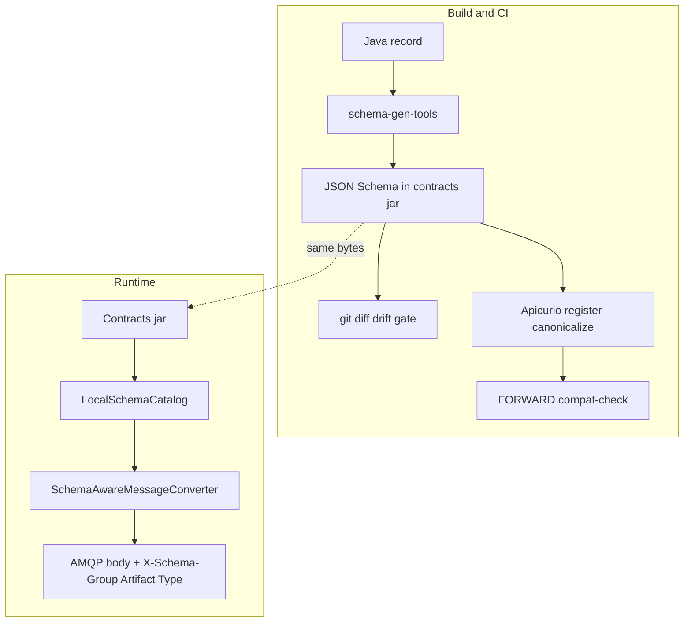

# Schema versioning — production hardening spec

**Severity:** High · **Type:** Architecture + implementation  
**Depends on:** [12-schema-versioning.md](12-schema-versioning.md), [ADR-0004](../docs/adr/0004-local-schema-validation.md), [ADR-0009](../docs/adr/ADR-0009-schema-versioning-model.md)  
**Status:** Ready to implement

## What to build

Harden the existing split so it is production-safe:

| Concern | Owner | Mechanism |
|---------|--------|-----------|
| Schema **versioning** | Apicurio | Auto integer versions on content change; `FIND_OR_CREATE_VERSION` + canonicalize |
| Schema **governance** | Apicurio + CI | FORWARD rule; register + compat-check merge gate; optional version state `DEPRECATED` |
| Schema **authoring** | Domain contracts | Java records / POJOs + `@GenerateSchema` |
| Schema **artifact** | Generated JSON Schema in `*-contracts` jar | `schema-gen-tools` at `process-classes` |
| Runtime **validation** | Classpath only | `LocalSchemaCatalog` + converter; **no Apicurio call at runtime** |

### Locked decisions

- **Apicurio** = versioning + governance (CI only).
- **Domain contracts JSON Schema** (generated from Java records) = runtime validation.
- **No wire hash required** for correctness.
- **No runtime Apicurio client.**
- **Tier 1 only:** compatible evolution via expand/contract. Breaking change = new artifact (Phase 4), never same-artifact major under FORWARD.

### Do you need a hash?

**No** — not for validation or governance correctness.

| Identifier | Needed? | Role |
|------------|---------|------|
| `X-Schema-GroupId` / `ArtifactId` / `Type` | **Yes** | Dispatch + validate against local schema |
| Apicurio integer version | **Yes in registry/CI** | Governance history; not on wire |
| `contentHash` on wire | **No for correctness** | Optional later: forensic drift for deprecation evidence |
| `globalId` / `contentId` | **No** | Require runtime registry client — conflicts with classpath validation |

**Rule:** Ship without hash. Add advisory `contentHash` only when fleet drift dashboards are needed before `DEPRECATED` / field removal. Never gate on it.



---

## Worked example — add a field safely (expand/contract)

**Goal:** Add `priority` to `OrderCreated` without breaking lagging consumers.

### Step A — Expand (additive, FORWARD-compatible)

Today [`OrderCreated.java`](../order-contracts/src/main/java/com/example/contracts/orders/OrderCreated.java) has required business fields only. Change:

```java
public record OrderCreated(
    String orderId,
    String customerId,
    // ... existing fields ...
    String priority  // NEW — optional in JSON Schema terms: not in "required" array
) {}
```

- Regenerate: `./mvnw -pl order-contracts -am process-classes`
- Commit updated `order-created.schema.json`
- CI: `compat-check` passes (property add = FORWARD under Apicurio JSON rules)
- Deploy **producer** first (emits `priority` when set)
- Old consumers: validate (extra props allowed) + Jackson ignores unknown → **success**

Wire message (illustrative):

```json
{
  "orderId": "ord-1",
  "customerId": "cust-1",
  "priority": "HIGH"
}
```

Headers (unchanged identity model):

- `X-Schema-GroupId: events.orders`
- `X-Schema-ArtifactId: OrderCreated`
- `X-Schema-Type: JSON`

No new version header. Apicurio may create integer version N+1 in the registry; runtime does not read it.

### Step B — Migrate readers

- Consumer teams bump `order-contracts` dependency, map `priority` in handlers.
- Until then, lagging consumers still work (Step A).

### Step C — Contract (remove old field later)

Only when **all** known handlers no longer need the old field (if replacing one):

1. Mark Java field `@Deprecated` for one release
2. Confirm no producer emits it / no handler reads it (inventory + deploy versions)
3. Remove field in a follow-up PR; FORWARD may reject some removals — if Apicurio rejects, that removal is a **Tier 2** candidate, not a silent break

**Anti-example (do not do):** rename `orderId` → `id` in place. Compat gate must fail. Correct path: add `id`, dual-write, migrate, then remove `orderId` if gate allows — or new artifact `OrderCreatedV2` (Phase 4).

---

## Threat → solution → delivery

| ID | Threat | Solution | Phase |
|----|--------|----------|-------|
| T1 | App `ObjectMapper` kills tolerant reader | Dedicated messaging mapper | 1a–1b |
| T2 | `additionalProperties: false` mass DLQ | Generator CI assert | 1c |
| T3 | Git ≠ Apicurio bytes | Drift gate + canonicalize | 1d |
| T4 | Inverse skew (consumer stricter) | Optional-first + playbook | 2 |
| T5 | Expand/contract fatigue / false V2 | Playbook + Tier 2 criteria | 2 / 4 |
| T6 | `DEPRECATED` invisible at runtime | CI/human playbook only | 2–3 |
| T7 | Bootstrap `ARTIFACTS` drift | Discover from contracts | 2 |
| T8 | Docs say done, code open | ADR Open work + Phase 1 DoD | 2 |
| T9 | Polyglot / Draft-07 / DLQ ops | Docs + runbooks; hash optional | 3 |
| T10 | Forced hard break | New artifact dual-publish | 4 on demand |

### Architectural anti-patterns to refuse

| Refuse | Do instead |
|--------|------------|
| Gate on wire version/hash | Resolve `(group, artifact)` + tolerant reader; hash advisory only |
| Runtime Apicurio pin/fetch | Contracts jar = schema; CI register = governance |
| Same-artifact major under FORWARD | Expand/contract, or new artifact (Tier 2) |
| Tighten schema for “security” cold | Optional fields first; fleet then rare tighten |

---

## Phase 1 — Release blockers (code)

**DoD:** Additive producer bump cannot DLQ a consumer that defines a strict app `ObjectMapper`. Re-register of unchanged schema creates no spurious version.

**Architect rule:** Phase 1 incomplete ⇒ do not call schema versioning “production ready,” regardless of ADR status.

### 1a — Dedicated messaging ObjectMapper

**Problem today:** [`SchemaMessagingAutoConfiguration`](../schema-messaging-core/src/main/java/com/example/messaging/core/config/SchemaMessagingAutoConfiguration.java) lines 55–69:

```java
@Bean
@ConditionalOnMissingBean(ObjectMapper.class)
public ObjectMapper objectMapper() { /* FAIL_ON_UNKNOWN_PROPERTIES=false */ }

@Bean
public JsonSchemaStrategy jsonSchemaStrategy(ObjectMapper objectMapper) {
    return new JsonSchemaStrategy(objectMapper, true);
}
```

Any app `@Bean ObjectMapper` with default `FAIL_ON_UNKNOWN_PROPERTIES=true` displaces the fallback → additive fields DLQ.

**Change (decided — factory-internal mapper, not a named bean):**

Construct the tolerant `ObjectMapper` **inside** the `JsonSchemaStrategy` factory and never expose
it as a bean. This is the only shape that cannot be displaced: with no messaging `ObjectMapper`
bean on the context, there is nothing for an app `@Bean ObjectMapper` to override, so the
deserialization posture is owned by core by construction rather than by bean-ordering luck. A named
`messagingObjectMapper` bean was rejected — a bean can still be shadowed or mis-injected, and it
leaks a messaging concern into the context.

- Build the mapper in the `jsonSchemaStrategy()` factory; do **not** inject an `ObjectMapper` bean.
- `JsonSchemaStrategy` uses that one instance for validate + serialize + deserialize.
- App stays free to own its own `ObjectMapper` for REST; messaging never touches it.

**Shape:**

```java
@Bean
@ConditionalOnMissingBean(JsonSchemaStrategy.class)
public JsonSchemaStrategy jsonSchemaStrategy() {
    ObjectMapper messagingMapper = new ObjectMapper();
    messagingMapper.findAndRegisterModules();
    messagingMapper.configure(DeserializationFeature.FAIL_ON_UNKNOWN_PROPERTIES, false);
    messagingMapper.disable(SerializationFeature.WRITE_DATES_AS_TIMESTAMPS);
    messagingMapper.setSerializationInclusion(JsonInclude.Include.NON_NULL);
    return new JsonSchemaStrategy(messagingMapper, true);
}
```

Keep the existing `@ConditionalOnMissingBean(ObjectMapper.class)` fallback bean **only** for
non-messaging Jackson 2 needs (e.g. other beans that expect a Jackson 2 mapper). Messaging must
**not** inject it. After this change, `jsonSchemaStrategy` takes no `ObjectMapper` parameter — the
old `jsonSchemaStrategy(ObjectMapper objectMapper)` signature that couples the strategy to the
shared bean is removed.

### 1b — E2E test (QUAL-003)

**New test** (prefer Failsafe IT or Spring Boot test in `schema-messaging-core` / `consumer-service`):

1. Define `@TestConfiguration` with:

```java
@Bean
@Primary
ObjectMapper strictAppMapper() {
    return new ObjectMapper()
        .configure(DeserializationFeature.FAIL_ON_UNKNOWN_PROPERTIES, true);
}
```

2. Build JSON for `OrderCreated` **plus** `"unexpectedField":"x"`.
3. Run through real `SchemaAwareMessageConverter.fromMessage` (or full listener).
4. **Assert:** deserializes; no `SchemaValidationException` / no DLQ path.

Also keep unit tests, but stop hand-setting the flag as the *only* defense — the auto-config path must prove it.

### 1c — Generator invariant

**File:** [`SchemaGenerator.java`](../schema-gen-tools/src/main/java/com/example/schemagen/SchemaGenerator.java) (`OptionPreset.PLAIN_JSON` today).

**Change (decided — emit `additionalProperties: true` explicitly; assert via parse tree):**

Two parts, both primary — not "optional harden":

1. **Generator emits `"additionalProperties": true`** on every object node (via the victools
   `Option`), so the tolerant-reader intent is **visible in the committed JSON** rather than
   resting on JSON Schema's implicit default. A future reader of the schema sees the decision.
2. **Test asserts by walking the parsed tree**, not by substring match. A substring check like
   `doesNotContain("\"additionalProperties\": false")` is whitespace/formatting-sensitive and
   misses nested or differently-serialized nodes. Parse the schema to a `JsonNode`, recurse every
   object node, and assert each carries `additionalProperties == true` (equivalently: none carries
   `false`).

**Example assertion:**

```java
void generatedSchema_allowsAdditionalPropertiesEverywhere() throws Exception {
    JsonNode root = new ObjectMapper().readTree(Files.readString(schemaPath));
    assertNoAdditionalPropertiesFalse(root);
}

// recurse every node; fail if any "additionalProperties" is literally false
static void assertNoAdditionalPropertiesFalse(JsonNode node) {
    if (node.isObject()) {
        JsonNode ap = node.get("additionalProperties");
        assertThat(ap == null || !ap.isBoolean() || ap.booleanValue())
            .as("additionalProperties must not be false at %s", node)
            .isTrue();
        node.fields().forEachRemaining(e -> assertNoAdditionalPropertiesFalse(e.getValue()));
    } else if (node.isArray()) {
        node.forEach(JsonSchemaGeneratorTest::assertNoAdditionalPropertiesFalse);
    }
}
```

### 1d — Apicurio canonicalize

**Files:** [`order-contracts/pom.xml`](../order-contracts/pom.xml), [`customer-contracts/pom.xml`](../customer-contracts/pom.xml) (and parent `pluginManagement` if shared).

Today each artifact has `ifExists=FIND_OR_CREATE_VERSION` without canonicalize → raw-byte match.

**Change** under plugin `<configuration>` (or per artifact):

```xml
<canonicalize>true</canonicalize>
```

**Verify:**

```bash
./mvnw -pl order-contracts,customer-contracts apicurio-registry:register \
  -Dapicurio.registry.url=http://localhost:8080
# run twice — second run must not create new versions for unchanged schemas
```

Keep existing offline drift gate:

```bash
./mvnw -pl order-contracts,customer-contracts -am process-classes
git diff --exit-code -- '*-contracts/src/main/resources/schemas/*'
```

---

## Phase 2 — Governance process (docs + CI hygiene)

### 2a — Expand/contract playbook

**New doc:** `docs/EXPAND-CONTRACT.md` (short).

Content (with the OrderCreated `priority` example above):

1. Add optional field → regenerate → commit schema → compat-check → producer first
2. Consumers adopt
3. Deprecate / remove only with ACK from all handler owners

**PR template checklist** for contracts PRs: FORWARD? optional? producer deploy order? consumers listed?

### 2b — ADR-0009 honesty

Add **Open work** to [ADR-0009](../docs/adr/ADR-0009-schema-versioning-model.md):

- QUAL-003 / dedicated mapper — link Phase 1
- Status note: “Accepted architecture; runtime hardening tracked”

### 2c — Bootstrap ARTIFACTS

**File:** [`.github/workflows/schema-governance-bootstrap.yml`](../.github/workflows/schema-governance-bootstrap.yml)

- Remove stale `GeneratedSchemas.ALL` instruction
- Discover artifacts from `*-contracts` POM `<artifacts>` or `schemas/*.schema.json` directories

### 2d — Deprecation without runtime fetch

Playbook step:

```bash
# CI/human only — runtime never calls this
curl -X PUT "$REGISTRY/apis/registry/v3/groups/events.orders/artifacts/OrderCreated/versions/3/state" \
  -H 'Content-Type: application/json' \
  -d '{"state":"DEPRECATED"}'
```

Signal owners via ticket + CODEOWNERS — not via consumer JVM.

---

## Phase 3 — Ops polish (after Phase 1 green)

| Item | Action |
|------|--------|
| [`CLAUDE.md`](../CLAUDE.md) | Remove stale “Schema Version Pinning” / `StartupSchemaValidator` |
| DLQ | Document alert on queue depth; poison drill via `POST /api/orders/poison` |
| Field census | Quarterly: `@Deprecated` fields + handler list from `@BitsEventHandler` |
| Polyglot (if needed) | Publish same JSON Schema files as CI artifacts; validate outside JVM |
| **contentHash** | **Defer.** Only if field-removal evidence needs wire drift. Advisory header + counter; **never reject** |

**Example optional later header (not Phase 1):**

```
X-Schema-ContentHash: <sha from schema bytes at build>
```

Consumer logs/metrics on miss; continues validate against local schema.

---

## Phase 4 — Tier 2 escape hatch (on demand only)

**Trigger criteria (all documented before use):**

- Partner/regulator forces incompatible shape by date, **and**
- Expand/contract cannot dual-write optional fields, **and**
- Explicit ADR approved

**Pattern example:**

| | Old | New |
|--|-----|-----|
| Artifact | `events.orders:OrderCreated` | `events.orders:OrderCreatedV2` |
| Java type | `OrderCreated` | `OrderCreatedV2` |
| Routing key | `orders.created` | `orders.created.v2` |
| Handlers | existing | new `@BitsEventHandler` |
| Publish | dual-publish during window | cut over; stop old |

Do **not** register breaking content as version 2 of the same artifact under FORWARD.

---

## Out of scope (track separately)

- Handler idempotency (at-least-once duplicates) — use business id / `X-Correlation-Id`
- Runtime Apicurio SerDes (`globalId` / `contentId`) — reverses ADR-0004
- Gradle migration
- Restoring all deleted ADRs (0003/5/6) — useful hygiene, not traffic safety

---

## Verification matrix

| Check | Command / test |
|-------|----------------|
| Unit | `./mvnw -pl schema-messaging-core,schema-gen-tools test` |
| Tolerant reader E2E | New test from Phase 1b |
| Schema drift | `process-classes` + `git diff --exit-code` on schemas |
| Compat | `./mvnw -pl order-contracts,customer-contracts verify -Pcompat-check` |
| Canonicalize | Double register; no new version if unchanged |
| Full IT | `./mvnw verify` (Testcontainers) |

---

## Acceptance criteria

### Phase 1

- [ ] Messaging deserialization uses a dedicated tolerant `ObjectMapper` (app `@Bean ObjectMapper` cannot displace it)
- [ ] E2E/auto-config test: strict app mapper + payload with extra field → successful consume
- [ ] Generator emits `"additionalProperties": true` on every object node; `schema-gen-tools` test walks the parsed tree and fails if any node carries `"additionalProperties": false`
- [ ] `<canonicalize>true</canonicalize>` on order-contracts and customer-contracts Apicurio register config
- [ ] Double `apicurio-registry:register` on unchanged schemas creates no new versions
- [ ] `./mvnw -pl order-contracts,customer-contracts -am process-classes` then `git diff --exit-code` on schemas still clean

### Phase 2

- [ ] `docs/EXPAND-CONTRACT.md` exists with OrderCreated-style example
- [ ] ADR-0009 has Open work pointing at Phase 1 / QUAL-003
- [ ] Bootstrap workflow no longer references deleted `GeneratedSchemas.ALL`; artifacts discovered from contracts

### Phase 3

- [ ] Stale Schema Version Pinning / `StartupSchemaValidator` removed from `CLAUDE.md`
- [ ] Deprecation + DLQ runbook notes documented
- [ ] contentHash explicitly deferred (or implemented as advisory-only if ops requests it)

### Phase 4

- [ ] Only when trigger criteria met: Tier 2 ADR + dual-publish pattern documented before use

---

## Rollout order

1. Phase 1a–1d in one PR (or stacked: mapper+test, then gen assert, then canonicalize)
2. Phase 2 docs/CI in follow-up PR
3. Phase 3 as ops capacity allows
4. Phase 4 never speculative — only with trigger criteria

## Related

- Findings / deferred list origin: [12-schema-versioning.md](12-schema-versioning.md)
- Architecture ADRs: [0004](../docs/adr/0004-local-schema-validation.md), [0009](../docs/adr/ADR-0009-schema-versioning-model.md)
- Glossary: [CONTEXT.md](../CONTEXT.md) (`tolerant reader`, `contentHash`, `FORWARD`, expand/contract)
